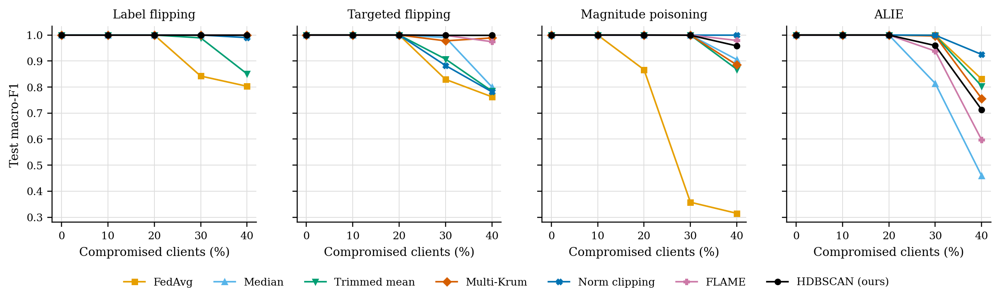

# GraMa

Federated intrusion detection for in-vehicle CAN traffic, using graph attention and Mamba, with an
HDBSCAN-based defence against poisoned clients.

Each vehicle trains a local detector. The detector turns every window of CAN messages into a graph
of message IDs, encodes it with a graph attention network, and models the sequence of windows with
a Mamba state-space model. Vehicles share only model updates. The server clusters the updates with
HDBSCAN in a learned latent space and leaves out those that fall outside the main cluster.

An interactive explanation of the whole system is at
[ramadhanadam.github.io/grama](https://ramadhanadam.github.io/grama/explainer.html).

## Requirements

- Python 3.10 or newer
- PyTorch 2.1 or newer
- A CUDA GPU is recommended for the full experiments. Everything also runs on a CPU, more slowly.
- Optional: `mamba-ssm` for the fused Mamba kernel. Without it, a pure PyTorch implementation is used.

## Installation

```bash
git clone https://github.com/RamadhanAdam/grama.git
cd grama
pip install -r requirements.txt
```

## Data

The experiments use [CIC-IoV2024](https://www.unb.ca/cic/datasets/iov-dataset-2024.html)
(Neto et al., 2024), which requires a free registration on the CIC website. Download the six CSV
files from the `decimal` folder (or the full `CICIoV2024.tar.xz`) and place them in `data/raw/`.
To check that the files are complete:

```bash
PYTHONPATH=src python -m grama.data.download
```

Each file is split into blocks of 1,000 messages, and every fifth block is held out for testing.
See [docs/notes.md](docs/notes.md) for why a chronological split is not used on this dataset.

### Other datasets

Two more datasets can be used: [ROAD](https://doi.org/10.5281/zenodo.10462796) (Verma et al., 2024),
one car with real injections and masquerade attacks, and
[can-train-and-test](https://data.dtu.dk/articles/dataset/can-train-and-test/24805533) (Lampe and Meng,
2023), four cars with test sets for unknown cars and unknown attacks. Both are plain downloads. Leave
the zip in its folder; the files are read straight from it:

```bash
mkdir -p data/raw/road data/raw/can-train-and-test
curl -L -o data/raw/road/road.zip "https://zenodo.org/records/10462796/files/road.zip?download=1"
curl -L -o data/raw/can-train-and-test/can-train-and-test.zip "https://ndownloader.figshare.com/files/43632393"
make check-data SOURCE=road
make check-data SOURCE=can_train_test
```

They are split their own way, not in blocks. ROAD: each attack was recorded three times, so the first
two recordings train and the third tests, and some normal recordings are held out whole. ROAD labels
time intervals, so a frame counts as an attack when it falls in the interval and carries the injected
ID and bytes. can-train-and-test: the dataset's own training folder trains, and its four test folders
test. Its unknown attacks have names training never saw, so the task there is attack or not. Details
are at the top of `src/grama/data/road.py` and `src/grama/data/can_train_test.py`.

## Usage

Run all experiments of a profile:

```bash
python scripts/run_experiments.py --profile quick
```

| Profile | Description | Runs | Time (one A100) |
|---|---|---|---|
| `smoke` | synthetic CAN traffic, checks the pipeline end to end | 19 | about 5 min (CPU) |
| `quick` | CIC-IoV2024, short runs, one seed | 77 | about 1.5 h |
| `full` | the setting used in the paper | 291 | about 12 h |
| `road` | `full`'s setting on ROAD: main comparison (five seeds), targeted flipping and ALIE | 61 | about 11 h |
| `cantt1` | the same on can-train-and-test, set 1 | 61 | about 4.5 h |
| `cantt2`–`cantt4` | sets 2 to 4, main comparison only | 15 each | about 1 h each |
| `cic_adaptive` | the adaptive attack on CIC-IoV2024, against FedAvg, norm clipping, FLAME and HDBSCAN | 16 (+8 copied) | about 1 h |
| `cantt1_adaptive` | the same on can-train-and-test, set 1 | 16 (+8 copied) | about 1.5 h |

Finished runs are saved as they complete, so an interrupted profile resumes where it stopped when the
same command is run again. For long runs, start it in the background, for example with
`nohup ... &` or inside `tmux`. Profiles are defined in `config/experiments.yaml`.
`make others-background` runs `road` and then `cantt1` to `cantt4`, logging to `results/others.log`.
`make extra-background` runs the two adaptive profiles and the extra `road` and `cantt1` seeds,
logging to `results/extra.log`. A profile with `reuse_runs_from` copies the runs it shares with
another profile (same data file and federated setting) instead of training them again.

The same pipeline can be run from the notebook `GraMa.ipynb`. To train and evaluate a single
configuration:

```bash
python scripts/run_federated_train.py --profile quick --aggregator hdbscan --attack label_flip --fraction 0.2
```

## Results

The full run (291 training runs) is in [`results/full/`](results/full/summary.md): all tables and
figures in `summary.md`, the tables as CSV, and one record per run in `runs.jsonl`. The trained
weights are on Hugging Face: [RamadhanZome/grama](https://huggingface.co/RamadhanZome/grama).



Each profile writes to `results/<profile>/`:

- `summary.md`: all tables and figures on one page
- `tables/`: CSV files for every table
- `figures/`: PDF and PNG figures
- `runs.jsonl`: one record per run, including per-round metrics

To rebuild the tables and figures from saved runs:

```bash
PYTHONPATH=src python -m grama.experiments.report results/quick
```

To put a profile's results and model weights on the Hugging Face Hub, with a model card built from
`summary.md`:

```bash
python scripts/publish_hf.py --profile full
```

The repo is created private unless you add `--public`. This needs `huggingface_hub` and a login
(`huggingface-cli login`).

## Experiments

- Main comparison: GraMa against a CNN-BiGRU detector, with FedAvg and with the HDBSCAN defence,
  plus a centralised model as a reference.
- Non-IID data: client data split with a Dirichlet distribution, alpha from 0.05 to 100.
- Poisoning: label flipping, targeted label flipping, magnitude poisoning and ALIE, with 10 to 40%
  of clients compromised, against FedAvg, coordinate-wise median, trimmed mean, Multi-Krum, norm
  clipping, FLAME and the HDBSCAN defence.
- Adaptive attack: the attackers know the defence. Each round they send the strongest targeted
  poison the aggregation rule still accepts, found by running an exact copy of the rule
  (`src/grama/attacks/poisoning.py`).
- Ablation: residual connections, CAN-ID embeddings, attention pooling, edge type, and the
  temporal model, each removed or replaced in turn.
- Efficiency: parameters, model size, latency and throughput.

Metrics: accuracy, macro precision, recall and F1, ROC-AUC, detection rate, false alarm rate,
per-class F1 and confusion matrices. For defences that reject clients, the share of compromised and
honest updates rejected is also reported.

## Project structure

```
config/        data, model and federated settings; experiment profiles
src/grama/
  data/        dataset builder, ROAD and can-train-and-test readers, sequence dataset,
               data check, Dirichlet split
  models/      GAT encoder, Mamba block, GraMa model, CNN-BiGRU baseline
  federated/   client, server, HDBSCAN aggregator, baseline aggregators
  attacks/     poisoning attacks
  eval/        metrics, latency benchmark
  experiments/ experiment runner and report
scripts/       command-line entry points
tests/         unit tests (CPU only; the few that read real files skip when the data isn't there)
docs/          explainer, implementation notes, mapping to the concept note
```

## Tests

```bash
python -m pytest
```

## Citation

A paper describing GraMa is in preparation. Until it is published, please cite this repository.

The dataset:

> E. C. P. Neto, H. Taslimasa, S. Dadkhah, S. Iqbal, P. Xiong, T. Rahman and A. A. Ghorbani.
> CICIoV2024: Advancing realistic IDS approaches against DoS and spoofing attack in IoV CAN bus.
> *Internet of Things* 26 (2024) 101209.

## License

MIT. See [LICENSE](LICENSE).
