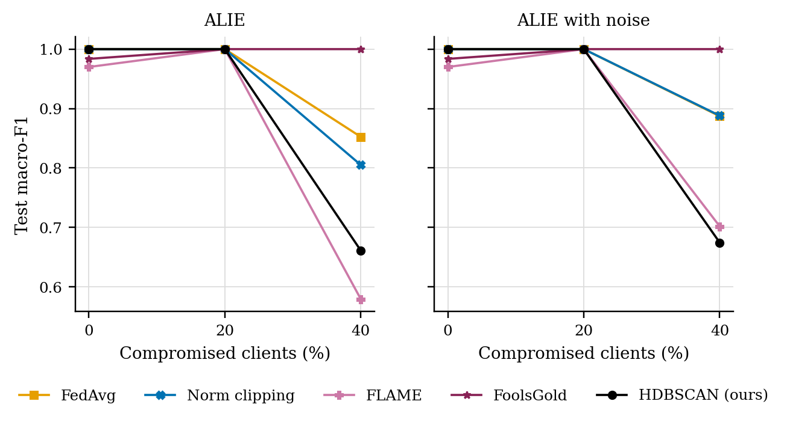
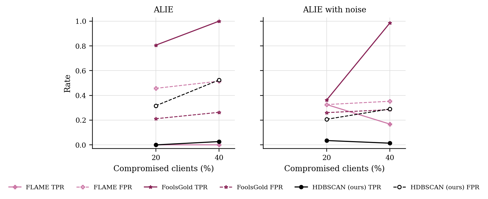

# GraMa results: `alie_duplicates` profile

Generated 2026-10-09 06:26 from 75 runs.

- Data: real (`cic_iov2024_1427a6ad.pt`), 78 CAN-ID nodes, windows of 64 frames (stride 32), sequences of 8 windows, edges: transition.
- Federated setting: 20 clients, 10 per round, 30 rounds, 2 local epoch(s), batch 64, lr 0.001, Dirichlet alpha 0.5 unless stated.
- Hardware: NVIDIA A100 80GB PCIe (79 GB).
- Seeds: [0, 1, 2]. Cells are mean ± std over seeds where there is more than one.

Sequences per class:

| Split | benign | DoS | spoofing-GAS | spoofing-RPM | spoofing-SPEED | spoofing-STEERING_WHEEL |
|---|---|---|---|---|---|---|
| train | 4720 | 885 | 118 | 649 | 295 | 236 |
| test | 960 | 174 | 23 | 130 | 59 | 47 |

## 3. Poisoning (Sec 6.2.3)

GraMa, Dirichlet alpha 0.5. Columns are the share of compromised clients; 0 is the clean run.

### ALIE (crafted to look honest): Macro-F1

| Aggregator | 0% | 20% | 40% |
|---|---|---|---|
| FedAvg | 1.0000 ± 0.0000 | 1.0000 ± 0.0000 | 0.8524 ± 0.1416 |
| Norm clipping | 1.0000 ± 0.0000 | 1.0000 ± 0.0000 | 0.8051 ± 0.1806 |
| FLAME | 0.9699 ± 0.0425 | 1.0000 ± 0.0000 | 0.5795 ± 0.0715 |
| FoolsGold | 0.9836 ± 0.0232 | 1.0000 ± 0.0000 | 1.0000 ± 0.0000 |
| HDBSCAN (ours) | 1.0000 ± 0.0000 | 1.0000 ± 0.0000 | 0.6611 ± 0.1411 |

### ALIE (crafted to look honest): Detection rate

| Aggregator | 0% | 20% | 40% |
|---|---|---|---|
| FedAvg | 1.0000 ± 0.0000 | 1.0000 ± 0.0000 | 1.0000 ± 0.0000 |
| Norm clipping | 1.0000 ± 0.0000 | 1.0000 ± 0.0000 | 1.0000 ± 0.0000 |
| FLAME | 1.0000 ± 0.0000 | 1.0000 ± 0.0000 | 1.0000 ± 0.0000 |
| FoolsGold | 1.0000 ± 0.0000 | 1.0000 ± 0.0000 | 1.0000 ± 0.0000 |
| HDBSCAN (ours) | 1.0000 ± 0.0000 | 1.0000 ± 0.0000 | 1.0000 ± 0.0000 |

### ALIE with noise (attackers differ): Macro-F1

| Aggregator | 0% | 20% | 40% |
|---|---|---|---|
| FedAvg | 1.0000 ± 0.0000 | 1.0000 ± 0.0000 | 0.8872 ± 0.1596 |
| Norm clipping | 1.0000 ± 0.0000 | 1.0000 ± 0.0000 | 0.8880 ± 0.0805 |
| FLAME | 0.9699 ± 0.0425 | 1.0000 ± 0.0000 | 0.7018 ± 0.1947 |
| FoolsGold | 0.9836 ± 0.0232 | 1.0000 ± 0.0000 | 1.0000 ± 0.0000 |
| HDBSCAN (ours) | 1.0000 ± 0.0000 | 1.0000 ± 0.0000 | 0.6745 ± 0.2482 |

### ALIE with noise (attackers differ): Detection rate

| Aggregator | 0% | 20% | 40% |
|---|---|---|---|
| FedAvg | 1.0000 ± 0.0000 | 1.0000 ± 0.0000 | 1.0000 ± 0.0000 |
| Norm clipping | 1.0000 ± 0.0000 | 1.0000 ± 0.0000 | 1.0000 ± 0.0000 |
| FLAME | 1.0000 ± 0.0000 | 1.0000 ± 0.0000 | 1.0000 ± 0.0000 |
| FoolsGold | 1.0000 ± 0.0000 | 1.0000 ± 0.0000 | 1.0000 ± 0.0000 |
| HDBSCAN (ours) | 1.0000 ± 0.0000 | 1.0000 ± 0.0000 | 1.0000 ± 0.0000 |

### Rejected updates

TPR: share of compromised clients' updates rejected. FPR: share of honest clients' updates rejected. Median, trimmed mean and norm clipping reject no client as a whole, so they are not listed.

| Attack | Aggregator | 20% TPR / FPR | 40% TPR / FPR |
|---|---|---|---|
| ALIE | FLAME | 0.00 / 0.46 | 0.00 / 0.52 |
| ALIE | FoolsGold | 0.81 / 0.21 | 1.00 / 0.26 |
| ALIE | HDBSCAN (ours) | 0.00 / 0.32 | 0.03 / 0.52 |
| ALIE with noise | FLAME | 0.33 / 0.33 | 0.17 / 0.35 |
| ALIE with noise | FoolsGold | 0.36 / 0.26 | 0.99 / 0.28 |
| ALIE with noise | HDBSCAN (ours) | 0.04 / 0.21 | 0.01 / 0.29 |

## 5. Efficiency (Sec 6.1, 8.1)

One sequence covers 288 CAN frames. Latency is for one sequence at a time; throughput is for batches of 256 on the run's device.

| Model | Params | Size (KB) | Upload per client per round (KB) | CPU latency, 1 thread (ms/sequence) | GPU latency (ms/sequence) | Throughput (sequences/s) |
|---|---|---|---|---|---|---|
| GraMa | 78,587 | 307.0 | 307.0 | 3.97 | 2.39 | 16,263 |
| CNN-BiGRU | 39,431 | 154.0 | 154.0 | 1.16 | 0.64 | 381,262 |

## Figures

PNG to look at, PDF with the same name for LaTeX.

**Macro-F1 under poisoning**

**How often compromised (TPR) and honest (FPR) updates were rejected**

## Notes

- Split: every fifth block of 1000 rows in each file tests, the rest trains; windows never cross a block boundary.
- The CNN-BiGRU baseline is our implementation of that model family on the same sequences, trained with FedAvg; the original adaptive weighting (AWI) is not reproduced.
- The centralised row trains one model on all the training data with the same number of passes over the data as a federated run. It is a reference, not a federated method.
