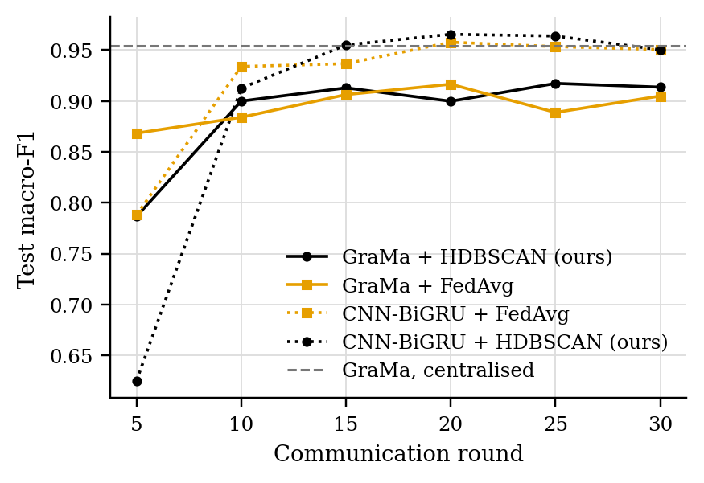
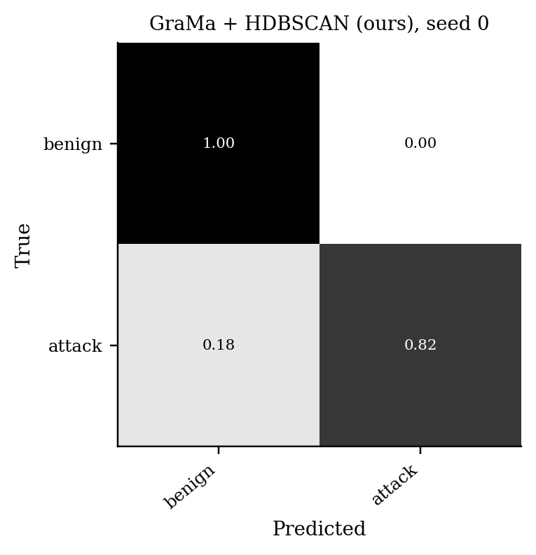
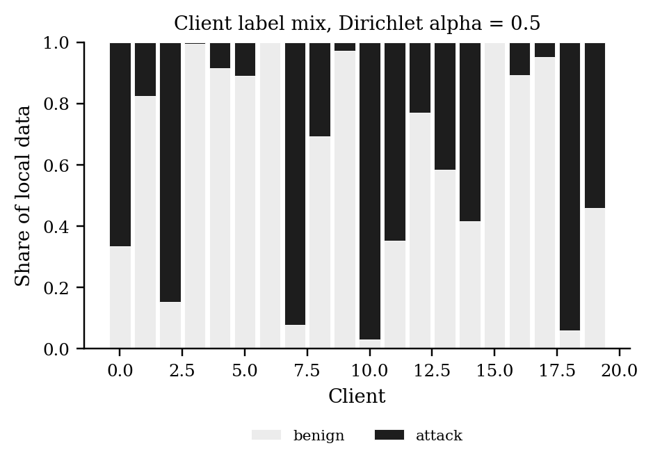
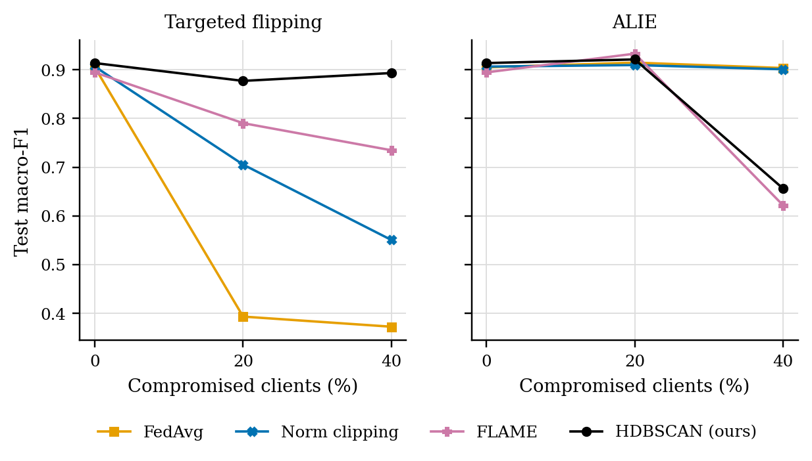
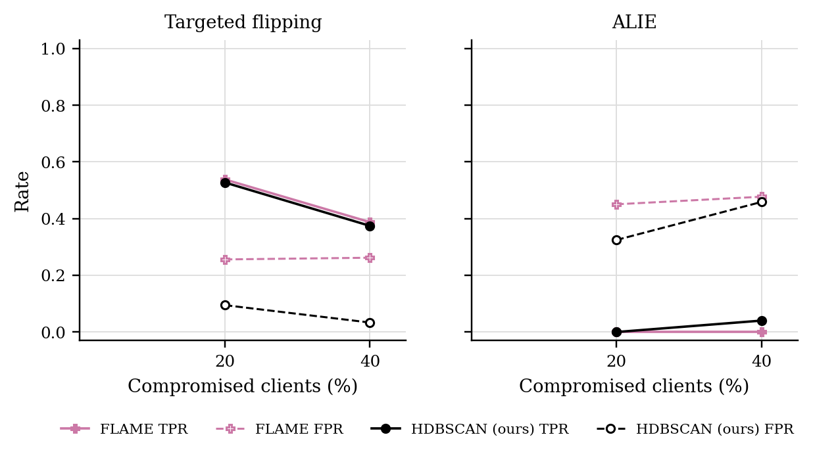

# GraMa results: `cantt1` profile

Generated 2026-10-05 10:18 from 61 runs.

- Data: can-train-and-test (`cantt_set_01_b0e5a072.pt`), 53 CAN-ID nodes, windows of 64 frames (stride 32), sequences of 8 windows, edges: transition.
- Federated setting: 20 clients, 10 per round, 30 rounds, 2 local epoch(s), batch 64, lr 0.001, Dirichlet alpha 0.5 unless stated.
- Hardware: NVIDIA A100 80GB PCIe (79 GB).
- Seeds: [0, 1, 2, 3, 4]. Cells are mean ± std over seeds where there is more than one.

Sequences per class:

| Split | benign | attack |
|---|---|---|
| train | 9059 | 2543 |
| test | 3852 | 2635 |
| unknown_vehicle | 5673 | 1868 |
| unknown_attack | 7449 | 3324 |
| unknown_vehicle_and_attack | 7824 | 1881 |

## 1. Main comparison, no attack (Sec 6.2.1)

| Method | Accuracy | Macro-P | Macro-R | Macro-F1 | ROC-AUC | Detection rate | False alarm rate | Params | Train time (s) |
|---|---|---|---|---|---|---|---|---|---|
| GraMa + HDBSCAN (ours) | 0.9198 ± 0.0122 | 0.9398 ± 0.0077 | 0.9017 ± 0.0151 | 0.9136 ± 0.0138 | 0.9801 ± 0.0072 | 0.8049 ± 0.0310 | 0.0016 ± 0.0018 | 78,255 | 209 |
| GraMa + FedAvg | 0.9123 ± 0.0149 | 0.9357 ± 0.0097 | 0.8920 ± 0.0184 | 0.9049 ± 0.0169 | 0.9853 ± 0.0036 | 0.7843 ± 0.0367 | 0.0002 ± 0.0002 | 78,255 | 184 |
| CNN-BiGRU + FedAvg | 0.9539 ± 0.0345 | 0.9650 ± 0.0243 | 0.9436 ± 0.0427 | 0.9506 ± 0.0378 | 0.9963 ± 0.0015 | 0.8882 ± 0.0864 | 0.0011 ± 0.0015 | 38,899 | 40 |
| CNN-BiGRU + HDBSCAN (ours) | 0.9538 ± 0.0365 | 0.9648 ± 0.0257 | 0.9435 ± 0.0451 | 0.9503 ± 0.0400 | 0.9945 ± 0.0033 | 0.8886 ± 0.0910 | 0.0016 ± 0.0009 | 38,899 | 76 |
| GraMa, centralised | 0.9571 ± 0.0102 | 0.9662 ± 0.0076 | 0.9473 ± 0.0125 | 0.9546 ± 0.0109 | 0.9868 ± 0.0033 | 0.8953 ± 0.0248 | 0.0006 ± 0.0003 | 78,255 | 113 |

Detection rate = attack sequences flagged as any attack; false alarm rate = benign sequences flagged as an attack.

### Other test sets

The same models, tested on the extra sets. Macro scores are averaged over the classes each set contains. Frames with a CAN ID training never saw: test 0%, unknown car, known attacks 61%, known car, unknown attacks 0%, unknown car, unknown attacks 29%.

| Method | Unknown car, known attacks: Macro-F1 | Unknown car, known attacks: Detection rate | Unknown car, known attacks: False alarm rate | Known car, unknown attacks: Macro-F1 | Known car, unknown attacks: Detection rate | Known car, unknown attacks: False alarm rate | Unknown car, unknown attacks: Macro-F1 | Unknown car, unknown attacks: Detection rate | Unknown car, unknown attacks: False alarm rate |
|---|---|---|---|---|---|---|---|---|---|
| GraMa + HDBSCAN (ours) | 0.2911 ± 0.1133 | 0.6002 ± 0.4896 | 0.6001 ± 0.4898 | 0.4283 ± 0.0301 | 0.0194 ± 0.0304 | 0.0004 ± 0.0008 | 0.3260 ± 0.1699 | 0.6313 ± 0.4274 | 0.5971 ± 0.4595 |
| GraMa + FedAvg | 0.2450 ± 0.0922 | 0.7994 ± 0.3997 | 0.7996 ± 0.3998 | 0.4144 ± 0.0073 | 0.0053 ± 0.0069 | 0.0000 ± 0.0000 | 0.4569 ± 0.2039 | 0.5766 ± 0.3502 | 0.4203 ± 0.4090 |
| CNN-BiGRU + FedAvg | 0.2908 ± 0.1131 | 0.6000 ± 0.4899 | 0.6000 ± 0.4899 | 0.4434 ± 0.0299 | 0.0341 ± 0.0298 | 0.0001 ± 0.0002 | 0.4481 ± 0.1646 | 0.5580 ± 0.3274 | 0.4430 ± 0.3819 |
| CNN-BiGRU + HDBSCAN (ours) | 0.2913 ± 0.1136 | 0.6006 ± 0.4891 | 0.6009 ± 0.4888 | 0.4438 ± 0.0293 | 0.0343 ± 0.0290 | 0.0000 ± 0.0000 | 0.4061 ± 0.1798 | 0.6085 ± 0.3354 | 0.5250 ± 0.4179 |
| GraMa, centralised | 0.2000 ± 0.0029 | 0.9998 ± 0.0004 | 0.9987 ± 0.0027 | 0.4587 ± 0.0463 | 0.0505 ± 0.0479 | 0.0002 ± 0.0002 | 0.3589 ± 0.2440 | 0.7001 ± 0.3719 | 0.6003 ± 0.4895 |

### Per-class F1

| Method | benign | attack |
|---|---|---|
| GraMa + HDBSCAN (ours) | 0.9368 | 0.8905 |
| GraMa + FedAvg | 0.9313 | 0.8785 |
| CNN-BiGRU + FedAvg | 0.9634 | 0.9377 |
| CNN-BiGRU + HDBSCAN (ours) | 0.9633 | 0.9373 |
| GraMa, centralised | 0.9652 | 0.9441 |

## 3. Poisoning (Sec 6.2.3)

GraMa, Dirichlet alpha 0.5. Columns are the share of compromised clients; 0 is the clean run.

### Targeted flipping (attack -> benign): Macro-F1

| Aggregator | 0% | 20% | 40% |
|---|---|---|---|
| FedAvg | 0.9049 ± 0.0169 | 0.3933 ± 0.0084 | 0.3726 ± 0.0000 |
| Norm clipping | 0.9064 ± 0.0340 | 0.7053 ± 0.1928 | 0.5505 ± 0.1725 |
| FLAME | 0.8945 ± 0.0608 | 0.7903 ± 0.1136 | 0.7347 ± 0.1487 |
| HDBSCAN (ours) | 0.9136 ± 0.0138 | 0.8770 ± 0.0348 | 0.8932 ± 0.0464 |

### Targeted flipping (attack -> benign): Detection rate

| Aggregator | 0% | 20% | 40% |
|---|---|---|---|
| FedAvg | 0.7843 ± 0.0367 | 0.0194 ± 0.0080 | 0.0000 ± 0.0000 |
| Norm clipping | 0.7888 ± 0.0738 | 0.4564 ± 0.3125 | 0.2207 ± 0.2157 |
| FLAME | 0.7672 ± 0.1304 | 0.5721 ± 0.2093 | 0.4860 ± 0.2518 |
| HDBSCAN (ours) | 0.8049 ± 0.0310 | 0.7268 ± 0.0732 | 0.8175 ± 0.1548 |

### ALIE (crafted to look honest): Macro-F1

| Aggregator | 0% | 20% | 40% |
|---|---|---|---|
| FedAvg | 0.9049 ± 0.0169 | 0.9145 ± 0.0322 | 0.9034 ± 0.0091 |
| Norm clipping | 0.9064 ± 0.0340 | 0.9095 ± 0.0310 | 0.9008 ± 0.0021 |
| FLAME | 0.8945 ± 0.0608 | 0.9329 ± 0.0391 | 0.6216 ± 0.2682 |
| HDBSCAN (ours) | 0.9136 ± 0.0138 | 0.9211 ± 0.0280 | 0.6560 ± 0.2295 |

### ALIE (crafted to look honest): Detection rate

| Aggregator | 0% | 20% | 40% |
|---|---|---|---|
| FedAvg | 0.7843 ± 0.0367 | 0.8061 ± 0.0706 | 0.7992 ± 0.0349 |
| Norm clipping | 0.7888 ± 0.0738 | 0.7953 ± 0.0677 | 0.7867 ± 0.0011 |
| FLAME | 0.7672 ± 0.1304 | 0.8539 ± 0.0937 | 0.8732 ± 0.1146 |
| HDBSCAN (ours) | 0.8049 ± 0.0310 | 0.8207 ± 0.0620 | 0.4137 ± 0.3552 |

### Rejected updates

TPR: share of compromised clients' updates rejected. FPR: share of honest clients' updates rejected. Median, trimmed mean and norm clipping reject no client as a whole, so they are not listed.

| Attack | Aggregator | 20% TPR / FPR | 40% TPR / FPR |
|---|---|---|---|
| Targeted flipping | FLAME | 0.54 / 0.26 | 0.39 / 0.26 |
| Targeted flipping | HDBSCAN (ours) | 0.53 / 0.09 | 0.37 / 0.03 |
| ALIE | FLAME | 0.00 / 0.45 | 0.00 / 0.48 |
| ALIE | HDBSCAN (ours) | 0.00 / 0.32 | 0.04 / 0.46 |

## 5. Efficiency (Sec 6.1, 8.1)

One sequence covers 288 CAN frames. Latency is for one sequence at a time; throughput is for batches of 256 on the run's device.

| Model | Params | Size (KB) | Upload per client per round (KB) | CPU latency, 1 thread (ms/sequence) | GPU latency (ms/sequence) | Throughput (sequences/s) |
|---|---|---|---|---|---|---|
| GraMa | 78,255 | 305.7 | 305.7 | 3.07 | 4.75 | 37,432 |
| CNN-BiGRU | 38,899 | 151.9 | 151.9 | 1.24 | 2.54 | 364,924 |

## Figures

PNG to look at, PDF with the same name for LaTeX.

**Test macro-F1 per round, no attack**

**Confusion matrix (row-normalised)**

**Label mix per client**

**Macro-F1 under poisoning**

**How often compromised (TPR) and honest (FPR) updates were rejected**

## Notes

- Split: the dataset's own folders for set_01: train_01 trains, test_01 (known car, known attacks) tests, test_02-04 are the extra test sets.
- The CNN-BiGRU baseline is our implementation of that model family on the same sequences, trained with FedAvg; the original adaptive weighting (AWI) is not reproduced.
- The centralised row trains one model on all the training data with the same number of passes over the data as a federated run. It is a reference, not a federated method.
