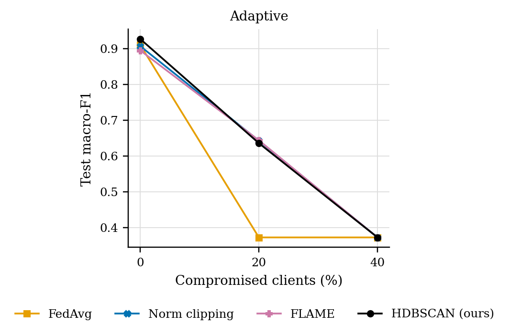
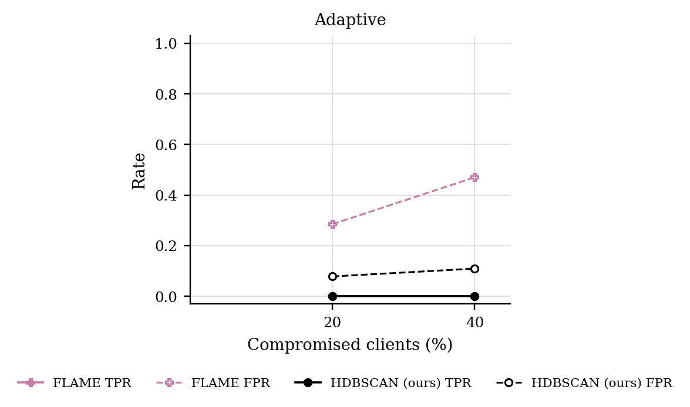

# GraMa results: `cantt1_adaptive` profile

Generated 2026-10-05 08:56 from 24 runs.

- Data: can-train-and-test (`cantt_set_01_b0e5a072.pt`), 53 CAN-ID nodes, windows of 64 frames (stride 32), sequences of 8 windows, edges: transition.
- Federated setting: 20 clients, 10 per round, 30 rounds, 2 local epoch(s), batch 64, lr 0.001, Dirichlet alpha 0.5 unless stated.
- Hardware: NVIDIA A100 80GB PCIe (79 GB).
- Seeds: [0, 1]. Cells are mean ± std over seeds where there is more than one.

Sequences per class:

| Split | benign | attack |
|---|---|---|
| train | 9059 | 2543 |
| test | 3852 | 2635 |
| unknown_vehicle | 5673 | 1868 |
| unknown_attack | 7449 | 3324 |
| unknown_vehicle_and_attack | 7824 | 1881 |

## 3. Poisoning (Sec 6.2.3)

GraMa, Dirichlet alpha 0.5. Columns are the share of compromised clients; 0 is the clean run.

### Adaptive (knows the defence): Macro-F1

| Aggregator | 0% | 20% | 40% |
|---|---|---|---|
| FedAvg | 0.9098 ± 0.0233 | 0.3726 ± 0.0000 | 0.3726 ± 0.0000 |
| Norm clipping | 0.9064 ± 0.0340 | 0.6426 ± 0.2560 | 0.3726 ± 0.0000 |
| FLAME | 0.8945 ± 0.0608 | 0.6435 ± 0.2561 | 0.3726 ± 0.0000 |
| HDBSCAN (ours) | 0.9264 ± 0.0042 | 0.6356 ± 0.2630 | 0.3726 ± 0.0000 |

### Adaptive (knows the defence): Detection rate

| Aggregator | 0% | 20% | 40% |
|---|---|---|---|
| FedAvg | 0.7951 ± 0.0505 | 0.0000 ± 0.0000 | 0.0000 ± 0.0000 |
| Norm clipping | 0.7888 ± 0.0738 | 0.3915 ± 0.3786 | 0.0000 ± 0.0000 |
| FLAME | 0.7672 ± 0.1304 | 0.3930 ± 0.3793 | 0.0000 ± 0.0000 |
| HDBSCAN (ours) | 0.8321 ± 0.0082 | 0.3850 ± 0.3850 | 0.0000 ± 0.0000 |

### Rejected updates

TPR: share of compromised clients' updates rejected. FPR: share of honest clients' updates rejected. Median, trimmed mean and norm clipping reject no client as a whole, so they are not listed.

| Attack | Aggregator | 20% TPR / FPR | 40% TPR / FPR |
|---|---|---|---|
| Adaptive | FLAME | 0.00 / 0.29 | 0.00 / 0.47 |
| Adaptive | HDBSCAN (ours) | 0.00 / 0.08 | 0.00 / 0.11 |

### Adaptive attack: how much poison got through

Mean poison scale the attackers sent while every one of their updates was still accepted, over rounds and seeds. 1 is plain targeted flipping, 0 is no poison. Rules that reject no client accept any scale, so they get the maximum the attack tries.

| Aggregator | 20% | 40% |
|---|---|---|
| FedAvg | 10.00 | 10.00 |
| Norm clipping | 10.00 | 10.00 |
| FLAME | 3.18 | 3.82 |
| HDBSCAN (ours) | 1.50 | 5.24 |

## 5. Efficiency (Sec 6.1, 8.1)

One sequence covers 288 CAN frames. Latency is for one sequence at a time; throughput is for batches of 256 on the run's device.

| Model | Params | Size (KB) | Upload per client per round (KB) | CPU latency, 1 thread (ms/sequence) | GPU latency (ms/sequence) | Throughput (sequences/s) |
|---|---|---|---|---|---|---|
| GraMa | 78,255 | 305.7 | 305.7 | 3.05 | 2.96 | 31,576 |
| CNN-BiGRU | 38,899 | 151.9 | 151.9 | 1.18 | 0.65 | 378,372 |

## Figures

PNG to look at, PDF with the same name for LaTeX.

**Macro-F1 under poisoning**

**How often compromised (TPR) and honest (FPR) updates were rejected**

## Notes

- Split: the dataset's own folders for set_01: train_01 trains, test_01 (known car, known attacks) tests, test_02-04 are the extra test sets.
- The CNN-BiGRU baseline is our implementation of that model family on the same sequences, trained with FedAvg; the original adaptive weighting (AWI) is not reproduced.
- The centralised row trains one model on all the training data with the same number of passes over the data as a federated run. It is a reference, not a federated method.
