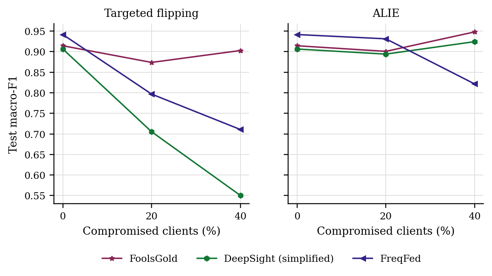
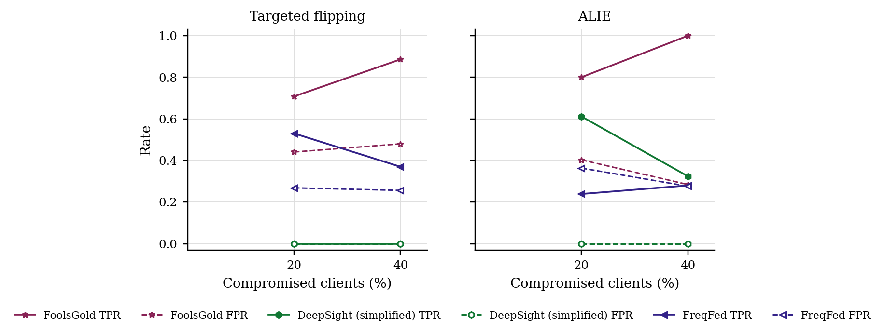

# GraMa results: `cantt1_new_baselines` profile

Generated 2026-10-10 06:00 from 30 runs.

- Data: can-train-and-test (`cantt_set_01_b0e5a072.pt`), 53 CAN-ID nodes, windows of 64 frames (stride 32), sequences of 8 windows, edges: transition.
- Federated setting: 20 clients, 10 per round, 30 rounds, 2 local epoch(s), batch 64, lr 0.001, Dirichlet alpha 0.5 unless stated.
- Hardware: NVIDIA A100 80GB PCIe (79 GB).
- Seeds: [0, 1]. Cells are mean ± std over seeds where there is more than one.

Sequences per class:

| Split | benign | attack |
|---|---|---|
| train | 9059 | 2543 |
| test | 3852 | 2635 |
| unknown_vehicle | 5673 | 1868 |
| unknown_attack | 7449 | 3324 |
| unknown_vehicle_and_attack | 7824 | 1881 |

## 3. Poisoning (Sec 6.2.3)

GraMa, Dirichlet alpha 0.5. Columns are the share of compromised clients; 0 is the clean run.

### Targeted flipping (attack -> benign): Macro-F1

| Aggregator | 0% | 20% | 40% |
|---|---|---|---|
| FoolsGold | 0.9143 ± 0.0453 | 0.8738 ± 0.0415 | 0.9026 ± 0.0003 |
| DeepSight (simplified) | 0.9064 ± 0.0340 | 0.7053 ± 0.1928 | 0.5505 ± 0.1725 |
| FreqFed | 0.9415 ± 0.0298 | 0.7968 ± 0.1545 | 0.7108 ± 0.1368 |

### Targeted flipping (attack -> benign): Detection rate

| Aggregator | 0% | 20% | 40% |
|---|---|---|---|
| FoolsGold | 0.8080 ± 0.0987 | 0.7205 ± 0.0863 | 0.7791 ± 0.0004 |
| DeepSight (simplified) | 0.7888 ± 0.0738 | 0.4564 ± 0.3125 | 0.2207 ± 0.2157 |
| FreqFed | 0.8713 ± 0.0725 | 0.6000 ± 0.2884 | 0.4414 ± 0.2228 |

### ALIE (crafted to look honest): Macro-F1

| Aggregator | 0% | 20% | 40% |
|---|---|---|---|
| FoolsGold | 0.9143 ± 0.0453 | 0.9007 ± 0.0147 | 0.9479 ± 0.0006 |
| DeepSight (simplified) | 0.9064 ± 0.0340 | 0.8940 ± 0.0417 | 0.9243 ± 0.0199 |
| FreqFed | 0.9415 ± 0.0298 | 0.9312 ± 0.0397 | 0.8215 ± 0.0847 |

### ALIE (crafted to look honest): Detection rate

| Aggregator | 0% | 20% | 40% |
|---|---|---|---|
| FoolsGold | 0.8080 ± 0.0987 | 0.7753 ± 0.0319 | 0.9258 ± 0.0461 |
| DeepSight (simplified) | 0.7888 ± 0.0738 | 0.7630 ± 0.0894 | 0.8414 ± 0.0493 |
| FreqFed | 0.8713 ± 0.0725 | 0.8472 ± 0.0920 | 0.8805 ± 0.0596 |

### Rejected updates

TPR: share of compromised clients' updates rejected. FPR: share of honest clients' updates rejected. Median, trimmed mean and norm clipping reject no client as a whole, so they are not listed.

| Attack | Aggregator | 20% TPR / FPR | 40% TPR / FPR |
|---|---|---|---|
| Targeted flipping | FoolsGold | 0.71 / 0.44 | 0.89 / 0.48 |
| Targeted flipping | DeepSight (simplified) | 0.00 / 0.00 | 0.00 / 0.00 |
| Targeted flipping | FreqFed | 0.53 / 0.27 | 0.37 / 0.26 |
| ALIE | FoolsGold | 0.80 / 0.40 | 1.00 / 0.28 |
| ALIE | DeepSight (simplified) | 0.61 / 0.00 | 0.32 / 0.00 |
| ALIE | FreqFed | 0.24 / 0.36 | 0.28 / 0.28 |

## 5. Efficiency (Sec 6.1, 8.1)

One sequence covers 288 CAN frames. Latency is for one sequence at a time; throughput is for batches of 256 on the run's device.

| Model | Params | Size (KB) | Upload per client per round (KB) | CPU latency, 1 thread (ms/sequence) | GPU latency (ms/sequence) | Throughput (sequences/s) |
|---|---|---|---|---|---|---|
| GraMa | 78,255 | 305.7 | 305.7 | 2.98 | 2.38 | 29,177 |
| CNN-BiGRU | 38,899 | 151.9 | 151.9 | 1.12 | 0.64 | 377,102 |

## Figures

PNG to look at, PDF with the same name for LaTeX.

**Macro-F1 under poisoning**

**How often compromised (TPR) and honest (FPR) updates were rejected**

## Notes

- Split: the dataset's own folders for set_01: train_01 trains, test_01 (known car, known attacks) tests, test_02-04 are the extra test sets.
- The CNN-BiGRU baseline is our implementation of that model family on the same sequences, trained with FedAvg; the original adaptive weighting (AWI) is not reproduced.
- The centralised row trains one model on all the training data with the same number of passes over the data as a federated run. It is a reference, not a federated method.
