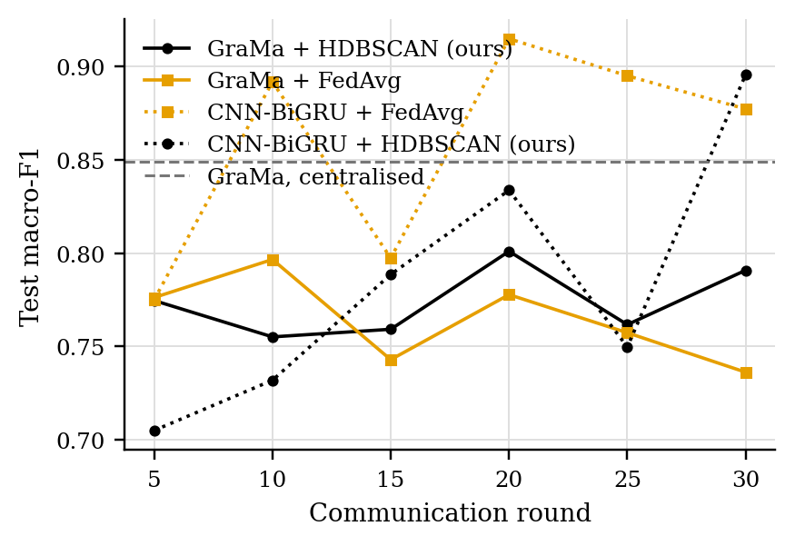
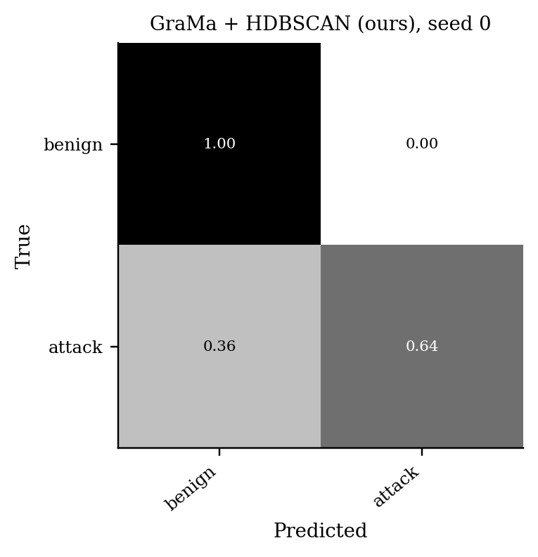
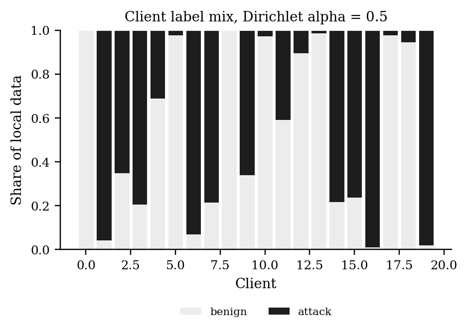

# GraMa results: `cantt2` profile

Generated 2026-10-05 05:11 from 15 runs.

- Data: can-train-and-test (`cantt_set_02_1f30f4c2.pt`), 128 CAN-ID nodes, windows of 64 frames (stride 32), sequences of 8 windows, edges: transition.
- Federated setting: 20 clients, 10 per round, 30 rounds, 2 local epoch(s), batch 64, lr 0.001, Dirichlet alpha 0.5 unless stated.
- Hardware: NVIDIA A100 80GB PCIe (79 GB).
- Seeds: [0, 1, 2]. Cells are mean ± std over seeds where there is more than one.

Sequences per class:

| Split | benign | attack |
|---|---|---|
| train | 10873 | 7688 |
| test | 7824 | 1881 |
| unknown_vehicle | 6567 | 2026 |
| unknown_attack | 7250 | 1351 |
| unknown_vehicle_and_attack | 4665 | 898 |

## 1. Main comparison, no attack (Sec 6.2.1)

| Method | Accuracy | Macro-P | Macro-R | Macro-F1 | ROC-AUC | Detection rate | False alarm rate | Params | Train time (s) |
|---|---|---|---|---|---|---|---|---|---|
| GraMa + HDBSCAN (ours) | 0.8716 ± 0.0419 | 0.8190 ± 0.0989 | 0.7767 ± 0.0302 | 0.7908 ± 0.0554 | 0.8555 ± 0.0441 | 0.6217 ± 0.0112 | 0.0683 ± 0.0494 | 78,855 | 452 |
| GraMa + FedAvg | 0.8392 ± 0.0393 | 0.7867 ± 0.1090 | 0.7276 ± 0.0166 | 0.7362 ± 0.0294 | 0.8488 ± 0.0561 | 0.5453 ± 0.0826 | 0.0901 ± 0.0665 | 78,855 | 477 |
| CNN-BiGRU + FedAvg | 0.9354 ± 0.0350 | 0.9379 ± 0.0087 | 0.8545 ± 0.1024 | 0.8772 ± 0.0818 | 0.9780 ± 0.0123 | 0.7225 ± 0.2124 | 0.0134 ± 0.0077 | 40,099 | 54 |
| CNN-BiGRU + HDBSCAN (ours) | 0.9380 ± 0.0071 | 0.9184 ± 0.0098 | 0.8769 ± 0.0163 | 0.8955 ± 0.0130 | 0.9547 ± 0.0157 | 0.7772 ± 0.0320 | 0.0234 ± 0.0035 | 40,099 | 90 |
| GraMa, centralised | 0.9112 ± 0.0324 | 0.8798 ± 0.0685 | 0.8260 ± 0.0440 | 0.8489 ± 0.0533 | 0.9166 ± 0.0424 | 0.6869 ± 0.0635 | 0.0349 ± 0.0253 | 78,855 | 435 |

Detection rate = attack sequences flagged as any attack; false alarm rate = benign sequences flagged as an attack.

### Other test sets

The same models, tested on the extra sets. Macro scores are averaged over the classes each set contains. Frames with a CAN ID training never saw: test 1%, unknown car, known attacks 92%, known car, unknown attacks 0%, unknown car, unknown attacks 91%.

| Method | Unknown car, known attacks: Macro-F1 | Unknown car, known attacks: Detection rate | Unknown car, known attacks: False alarm rate | Known car, unknown attacks: Macro-F1 | Known car, unknown attacks: Detection rate | Known car, unknown attacks: False alarm rate | Unknown car, unknown attacks: Macro-F1 | Unknown car, unknown attacks: Detection rate | Unknown car, unknown attacks: False alarm rate |
|---|---|---|---|---|---|---|---|---|---|
| GraMa + HDBSCAN (ours) | 0.1908 ± 0.0000 | 1.0000 ± 0.0000 | 1.0000 ± 0.0000 | 0.6933 ± 0.1675 | 0.3975 ± 0.3483 | 0.0218 ± 0.0170 | 0.1390 ± 0.0000 | 1.0000 ± 0.0000 | 1.0000 ± 0.0000 |
| GraMa + FedAvg | 0.1908 ± 0.0000 | 0.9998 ± 0.0002 | 1.0000 ± 0.0000 | 0.6109 ± 0.1282 | 0.2073 ± 0.1769 | 0.0088 ± 0.0097 | 0.1526 ± 0.0193 | 0.9339 ± 0.0934 | 0.9781 ± 0.0309 |
| CNN-BiGRU + FedAvg | 0.1908 ± 0.0000 | 1.0000 ± 0.0000 | 1.0000 ± 0.0000 | 0.4598 ± 0.0024 | 0.0025 ± 0.0025 | 0.0006 ± 0.0006 | 0.1390 ± 0.0000 | 1.0000 ± 0.0000 | 1.0000 ± 0.0000 |
| CNN-BiGRU + HDBSCAN (ours) | 0.1908 ± 0.0000 | 1.0000 ± 0.0000 | 1.0000 ± 0.0000 | 0.5897 ± 0.1325 | 0.1870 ± 0.2087 | 0.0069 ± 0.0089 | 0.1390 ± 0.0000 | 1.0000 ± 0.0000 | 1.0000 ± 0.0000 |
| GraMa, centralised | 0.1908 ± 0.0000 | 1.0000 ± 0.0000 | 1.0000 ± 0.0000 | 0.6571 ± 0.2291 | 0.3378 ± 0.4197 | 0.0019 ± 0.0015 | 0.1390 ± 0.0000 | 1.0000 ± 0.0000 | 1.0000 ± 0.0000 |

### Per-class F1

| Method | benign | attack |
|---|---|---|
| GraMa + HDBSCAN (ours) | 0.9207 | 0.6610 |
| GraMa + FedAvg | 0.9001 | 0.5724 |
| CNN-BiGRU + FedAvg | 0.9615 | 0.7928 |
| CNN-BiGRU + HDBSCAN (ours) | 0.9621 | 0.8290 |
| GraMa, centralised | 0.9459 | 0.7518 |

## 5. Efficiency (Sec 6.1, 8.1)

One sequence covers 288 CAN frames. Latency is for one sequence at a time; throughput is for batches of 256 on the run's device.

| Model | Params | Size (KB) | Upload per client per round (KB) | CPU latency, 1 thread (ms/sequence) | GPU latency (ms/sequence) | Throughput (sequences/s) |
|---|---|---|---|---|---|---|
| GraMa | 78,855 | 308.0 | 308.0 | 6.67 | 6.54 | 4,240 |
| CNN-BiGRU | 40,099 | 156.6 | 156.6 | 1.37 | 2.80 | 91,069 |

## Figures

PNG to look at, PDF with the same name for LaTeX.

**Test macro-F1 per round, no attack**

**Confusion matrix (row-normalised)**

**Label mix per client**

## Notes

- Split: the dataset's own folders for set_02: train_01 trains, test_01 (known car, known attacks) tests, test_02-04 are the extra test sets.
- The CNN-BiGRU baseline is our implementation of that model family on the same sequences, trained with FedAvg; the original adaptive weighting (AWI) is not reproduced.
- The centralised row trains one model on all the training data with the same number of passes over the data as a federated run. It is a reference, not a federated method.
