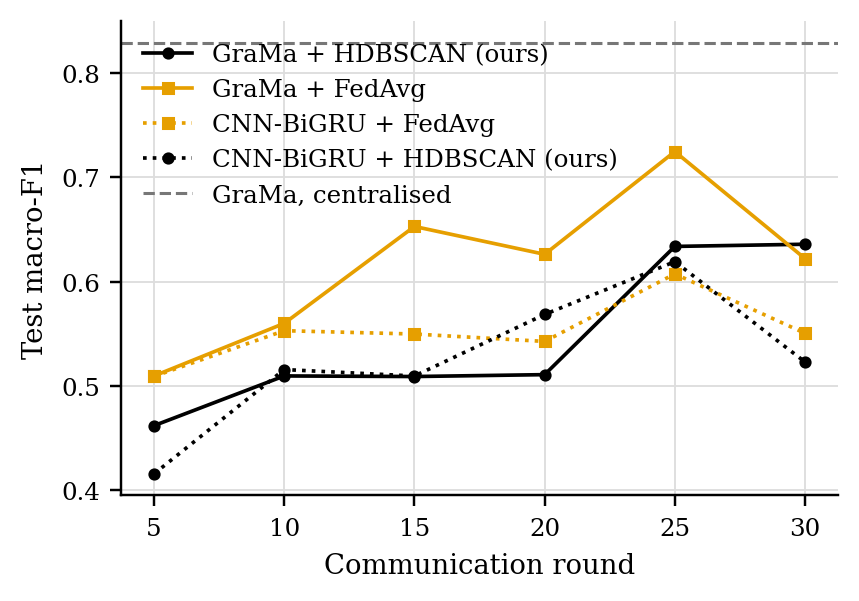
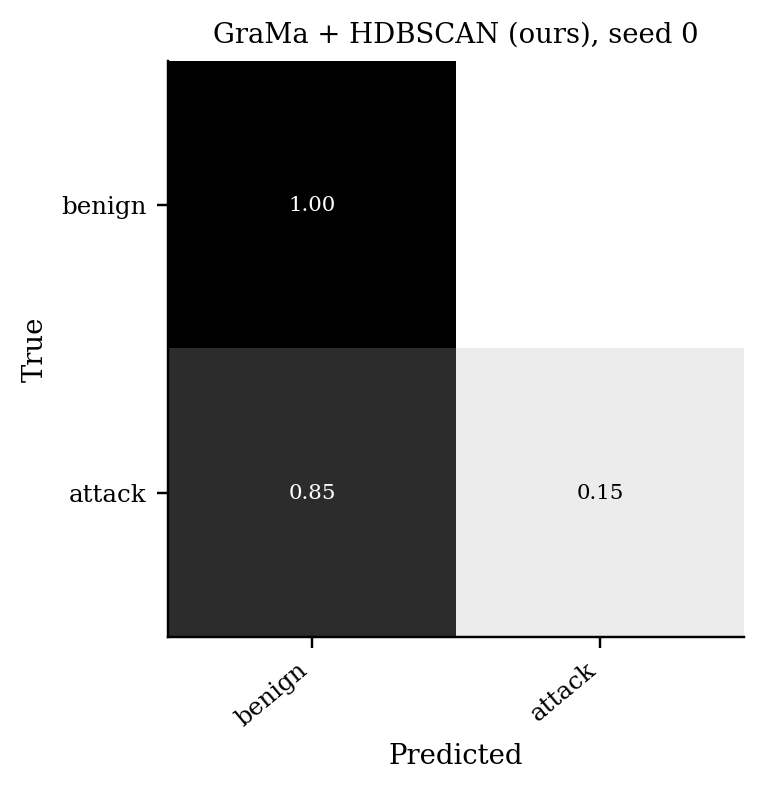
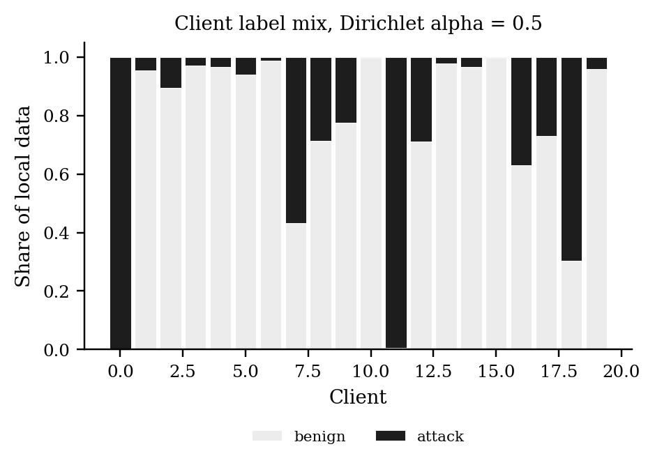

# GraMa results: `cantt3` profile

Generated 2026-10-05 05:59 from 15 runs.

- Data: can-train-and-test (`cantt_set_03_a39d5b2c.pt`), 99 CAN-ID nodes, windows of 64 frames (stride 32), sequences of 8 windows, edges: transition.
- Federated setting: 20 clients, 10 per round, 30 rounds, 2 local epoch(s), batch 64, lr 0.001, Dirichlet alpha 0.5 unless stated.
- Hardware: NVIDIA A100 80GB PCIe (79 GB).
- Seeds: [0, 1, 2]. Cells are mean ± std over seeds where there is more than one.

Sequences per class:

| Split | benign | attack |
|---|---|---|
| train | 11552 | 2012 |
| test | 5628 | 4098 |
| unknown_vehicle | 6047 | 4727 |
| unknown_attack | 10700 | 2884 |
| unknown_vehicle_and_attack | 8715 | 5584 |

## 1. Main comparison, no attack (Sec 6.2.1)

| Method | Accuracy | Macro-P | Macro-R | Macro-F1 | ROC-AUC | Detection rate | False alarm rate | Params | Train time (s) |
|---|---|---|---|---|---|---|---|---|---|
| GraMa + HDBSCAN (ours) | 0.7243 ± 0.1165 | 0.8408 ± 0.0532 | 0.6734 ± 0.1387 | 0.6360 ± 0.1733 | 0.7497 ± 0.1414 | 0.3498 ± 0.2797 | 0.0030 ± 0.0025 | 78,623 | 281 |
| GraMa + FedAvg | 0.7048 ± 0.0531 | 0.8321 ± 0.0202 | 0.6498 ± 0.0631 | 0.6222 ± 0.0901 | 0.8266 ± 0.0932 | 0.2997 ± 0.1263 | 0.0002 ± 0.0001 | 78,623 | 251 |
| CNN-BiGRU + FedAvg | 0.6613 ± 0.0097 | 0.8148 ± 0.0034 | 0.5980 ± 0.0115 | 0.5505 ± 0.0184 | 0.7821 ± 0.1076 | 0.1963 ± 0.0230 | 0.0002 ± 0.0000 | 39,635 | 44 |
| CNN-BiGRU + HDBSCAN (ours) | 0.6422 ± 0.0054 | 0.7714 ± 0.0518 | 0.5779 ± 0.0043 | 0.5230 ± 0.0085 | 0.8229 ± 0.0574 | 0.1695 ± 0.0175 | 0.0137 ± 0.0187 | 39,635 | 64 |
| GraMa, centralised | 0.8537 ± 0.0935 | 0.9017 ± 0.0493 | 0.8273 ± 0.1112 | 0.8294 ± 0.1213 | 0.8400 ± 0.1463 | 0.6593 ± 0.2238 | 0.0047 ± 0.0015 | 78,623 | 259 |

Detection rate = attack sequences flagged as any attack; false alarm rate = benign sequences flagged as an attack.

### Other test sets

The same models, tested on the extra sets. Macro scores are averaged over the classes each set contains. Frames with a CAN ID training never saw: test 6%, unknown car, known attacks 76%, known car, unknown attacks 0%, unknown car, unknown attacks 76%.

| Method | Unknown car, known attacks: Macro-F1 | Unknown car, known attacks: Detection rate | Unknown car, known attacks: False alarm rate | Known car, unknown attacks: Macro-F1 | Known car, unknown attacks: Detection rate | Known car, unknown attacks: False alarm rate | Unknown car, unknown attacks: Macro-F1 | Unknown car, unknown attacks: Detection rate | Unknown car, unknown attacks: False alarm rate |
|---|---|---|---|---|---|---|---|---|---|
| GraMa + HDBSCAN (ours) | 0.3418 ± 0.0260 | 0.3338 ± 0.4711 | 0.3333 ± 0.4714 | 0.4402 ± 0.0004 | 0.0002 ± 0.0003 | 0.0026 ± 0.0030 | 0.3461 ± 0.0461 | 0.3333 ± 0.4714 | 0.3333 ± 0.4714 |
| GraMa + FedAvg | 0.3493 ± 0.0621 | 0.6904 ± 0.4351 | 0.6661 ± 0.4710 | 0.4733 ± 0.0459 | 0.0340 ± 0.0478 | 0.0000 ± 0.0000 | 0.3289 ± 0.0674 | 0.6810 ± 0.4509 | 0.6664 ± 0.4712 |
| CNN-BiGRU + FedAvg | 0.4135 ± 0.0875 | 0.3623 ± 0.3185 | 0.3624 ± 0.4120 | 0.4406 ± 0.0000 | 0.0000 ± 0.0000 | 0.0000 ± 0.0000 | 0.4226 ± 0.0746 | 0.3779 ± 0.3948 | 0.3349 ± 0.4042 |
| CNN-BiGRU + HDBSCAN (ours) | 0.4310 ± 0.1415 | 0.5280 ± 0.4102 | 0.4422 ± 0.4164 | 0.4390 ± 0.0022 | 0.0005 ± 0.0007 | 0.0082 ± 0.0115 | 0.4251 ± 0.1406 | 0.5515 ± 0.4147 | 0.4672 ± 0.4109 |
| GraMa, centralised | 0.3941 ± 0.1268 | 0.7426 ± 0.3604 | 0.6668 ± 0.4712 | 0.5377 ± 0.0007 | 0.1017 ± 0.0006 | 0.0012 ± 0.0006 | 0.3287 ± 0.0679 | 0.6807 ± 0.4503 | 0.6668 ± 0.4712 |

### Per-class F1

| Method | benign | attack |
|---|---|---|
| GraMa + HDBSCAN (ours) | 0.8130 | 0.4589 |
| GraMa + FedAvg | 0.7978 | 0.4465 |
| CNN-BiGRU + FedAvg | 0.7736 | 0.3275 |
| CNN-BiGRU + HDBSCAN (ours) | 0.7613 | 0.2847 |
| GraMa, centralised | 0.8918 | 0.7670 |

## 5. Efficiency (Sec 6.1, 8.1)

One sequence covers 288 CAN frames. Latency is for one sequence at a time; throughput is for batches of 256 on the run's device.

| Model | Params | Size (KB) | Upload per client per round (KB) | CPU latency, 1 thread (ms/sequence) | GPU latency (ms/sequence) | Throughput (sequences/s) |
|---|---|---|---|---|---|---|
| GraMa | 78,623 | 307.1 | 307.1 | 5.09 | 5.00 | 5,721 |
| CNN-BiGRU | 39,635 | 154.8 | 154.8 | 1.30 | 4.04 | 91,035 |

## Figures

PNG to look at, PDF with the same name for LaTeX.

**Test macro-F1 per round, no attack**

**Confusion matrix (row-normalised)**

**Label mix per client**

## Notes

- Split: the dataset's own folders for set_03: train_01 trains, test_01 (known car, known attacks) tests, test_02-04 are the extra test sets.
- The CNN-BiGRU baseline is our implementation of that model family on the same sequences, trained with FedAvg; the original adaptive weighting (AWI) is not reproduced.
- The centralised row trains one model on all the training data with the same number of passes over the data as a federated run. It is a reference, not a federated method.
