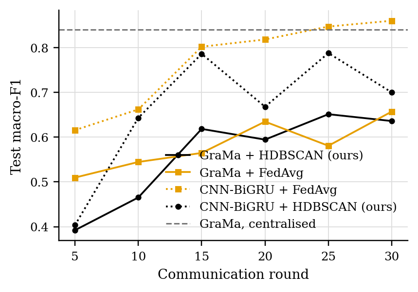
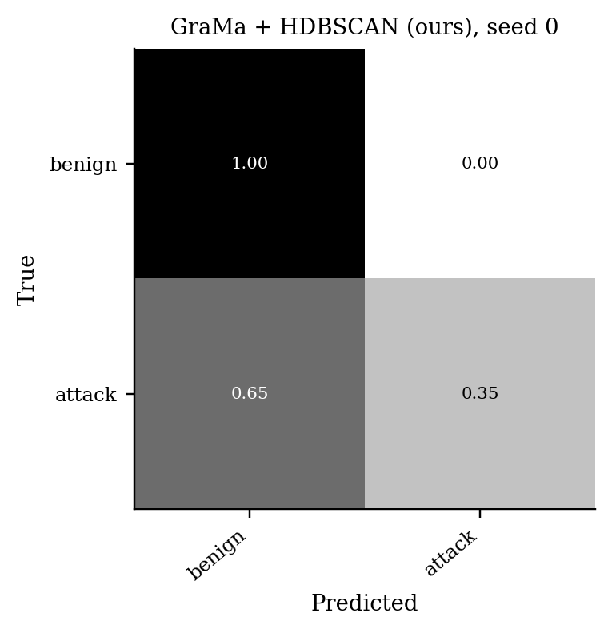
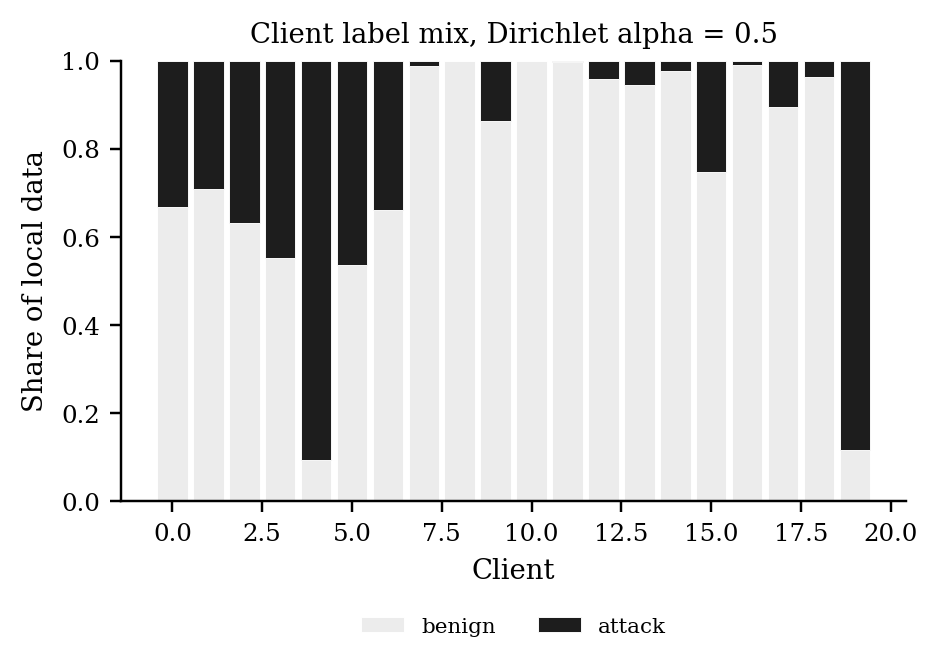

# GraMa results: `cantt4` profile

Generated 2026-10-05 06:30 from 15 runs.

- Data: can-train-and-test (`cantt_set_04_8ab7bf20.pt`), 51 CAN-ID nodes, windows of 64 frames (stride 32), sequences of 8 windows, edges: transition.
- Federated setting: 20 clients, 10 per round, 30 rounds, 2 local epoch(s), batch 64, lr 0.001, Dirichlet alpha 0.5 unless stated.
- Hardware: NVIDIA A100 80GB PCIe (79 GB).
- Seeds: [0, 1, 2]. Cells are mean ± std over seeds where there is more than one.

Sequences per class:

| Split | benign | attack |
|---|---|---|
| train | 11435 | 1757 |
| test | 8715 | 5584 |
| unknown_vehicle | 11147 | 4184 |
| unknown_attack | 6047 | 4727 |
| unknown_vehicle_and_attack | 4504 | 6713 |

## 1. Main comparison, no attack (Sec 6.2.1)

| Method | Accuracy | Macro-P | Macro-R | Macro-F1 | ROC-AUC | Detection rate | False alarm rate | Params | Train time (s) |
|---|---|---|---|---|---|---|---|---|---|
| GraMa + HDBSCAN (ours) | 0.7269 ± 0.0435 | 0.8370 ± 0.0131 | 0.6519 ± 0.0571 | 0.6363 ± 0.0832 | 0.8432 ± 0.0206 | 0.3093 ± 0.1191 | 0.0055 ± 0.0073 | 78,239 | 195 |
| GraMa + FedAvg | 0.7465 ± 0.0825 | 0.8558 ± 0.0348 | 0.6756 ± 0.1058 | 0.6574 ± 0.1376 | 0.8655 ± 0.0470 | 0.3518 ± 0.2123 | 0.0006 ± 0.0007 | 78,239 | 167 |
| CNN-BiGRU + FedAvg | 0.8781 ± 0.0357 | 0.9164 ± 0.0188 | 0.8444 ± 0.0461 | 0.8607 ± 0.0454 | 0.9765 ± 0.0072 | 0.6904 ± 0.0935 | 0.0017 ± 0.0024 | 38,867 | 28 |
| CNN-BiGRU + HDBSCAN (ours) | 0.7647 ± 0.0401 | 0.8610 ± 0.0175 | 0.6989 ± 0.0514 | 0.7003 ± 0.0621 | 0.9415 ± 0.0263 | 0.3982 ± 0.1031 | 0.0004 ± 0.0003 | 38,867 | 68 |
| GraMa, centralised | 0.8642 ± 0.0563 | 0.9099 ± 0.0313 | 0.8263 ± 0.0718 | 0.8407 ± 0.0740 | 0.9182 ± 0.0361 | 0.6536 ± 0.1428 | 0.0009 ± 0.0009 | 78,239 | 138 |

Detection rate = attack sequences flagged as any attack; false alarm rate = benign sequences flagged as an attack.

### Other test sets

The same models, tested on the extra sets. Macro scores are averaged over the classes each set contains. Frames with a CAN ID training never saw: test 1%, unknown car, known attacks 99%, known car, unknown attacks 5%, unknown car, unknown attacks 99%.

| Method | Unknown car, known attacks: Macro-F1 | Unknown car, known attacks: Detection rate | Unknown car, known attacks: False alarm rate | Known car, unknown attacks: Macro-F1 | Known car, unknown attacks: Detection rate | Known car, unknown attacks: False alarm rate | Unknown car, unknown attacks: Macro-F1 | Unknown car, unknown attacks: Detection rate | Unknown car, unknown attacks: False alarm rate |
|---|---|---|---|---|---|---|---|---|---|
| GraMa + HDBSCAN (ours) | 0.3041 ± 0.1311 | 0.8670 ± 0.1637 | 0.8496 ± 0.2126 | 0.8644 ± 0.0270 | 0.7185 ± 0.0624 | 0.0064 ± 0.0072 | 0.4177 ± 0.0736 | 0.8578 ± 0.1486 | 0.8679 ± 0.1868 |
| GraMa + FedAvg | 0.4165 ± 0.0556 | 0.3052 ± 0.3786 | 0.2875 ± 0.3899 | 0.8450 ± 0.0458 | 0.6775 ± 0.0911 | 0.0026 ± 0.0029 | 0.3814 ± 0.0451 | 0.3005 ± 0.3389 | 0.2802 ± 0.3941 |
| CNN-BiGRU + FedAvg | 0.2144 ± 0.0000 | 1.0000 ± 0.0000 | 1.0000 ± 0.0000 | 0.8862 ± 0.0178 | 0.7598 ± 0.0319 | 0.0046 ± 0.0061 | 0.3744 ± 0.0000 | 1.0000 ± 0.0000 | 1.0000 ± 0.0000 |
| CNN-BiGRU + HDBSCAN (ours) | 0.2144 ± 0.0000 | 1.0000 ± 0.0000 | 1.0000 ± 0.0000 | 0.8637 ± 0.0114 | 0.7096 ± 0.0233 | 0.0006 ± 0.0004 | 0.3744 ± 0.0000 | 1.0000 ± 0.0000 | 1.0000 ± 0.0000 |
| GraMa, centralised | 0.3042 ± 0.1270 | 0.6891 ± 0.4396 | 0.6706 ± 0.4658 | 0.8837 ± 0.0215 | 0.7512 ± 0.0445 | 0.0013 ± 0.0008 | 0.3737 ± 0.0009 | 0.6938 ± 0.4326 | 0.6668 ± 0.4712 |

### Per-class F1

| Method | benign | attack |
|---|---|---|
| GraMa + HDBSCAN (ours) | 0.8169 | 0.4556 |
| GraMa + FedAvg | 0.8304 | 0.4844 |
| CNN-BiGRU + FedAvg | 0.9096 | 0.8118 |
| CNN-BiGRU + HDBSCAN (ours) | 0.8388 | 0.5619 |
| GraMa, centralised | 0.9012 | 0.7803 |

## 5. Efficiency (Sec 6.1, 8.1)

One sequence covers 288 CAN frames. Latency is for one sequence at a time; throughput is for batches of 256 on the run's device.

| Model | Params | Size (KB) | Upload per client per round (KB) | CPU latency, 1 thread (ms/sequence) | GPU latency (ms/sequence) | Throughput (sequences/s) |
|---|---|---|---|---|---|---|
| GraMa | 78,239 | 305.6 | 305.6 | 2.97 | 4.84 | 25,795 |
| CNN-BiGRU | 38,867 | 151.8 | 151.8 | 1.22 | 4.44 | 334,693 |

## Figures

PNG to look at, PDF with the same name for LaTeX.

**Test macro-F1 per round, no attack**

**Confusion matrix (row-normalised)**

**Label mix per client**

## Notes

- Split: the dataset's own folders for set_04: train_01 trains, test_01 (known car, known attacks) tests, test_02-04 are the extra test sets.
- The CNN-BiGRU baseline is our implementation of that model family on the same sequences, trained with FedAvg; the original adaptive weighting (AWI) is not reproduced.
- The centralised row trains one model on all the training data with the same number of passes over the data as a federated run. It is a reference, not a federated method.
