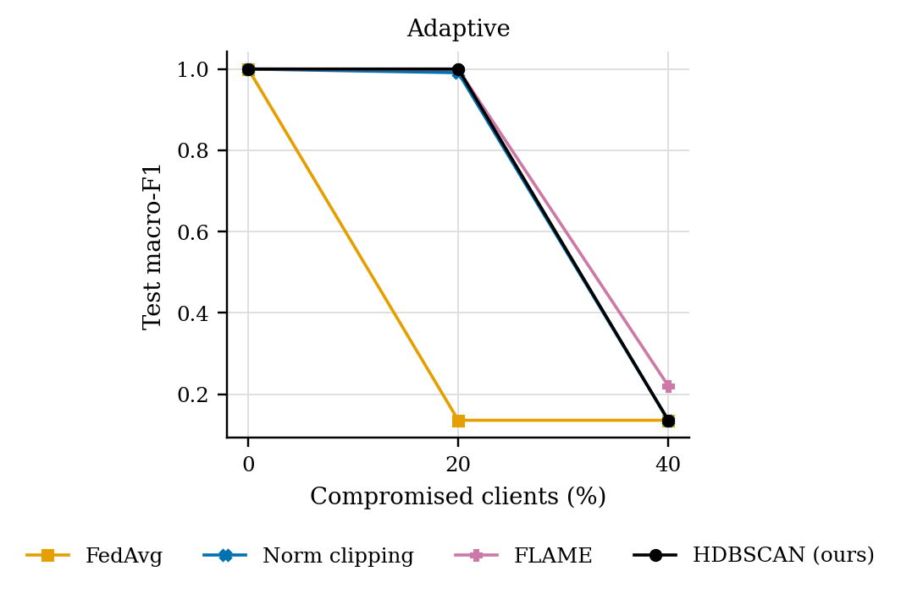
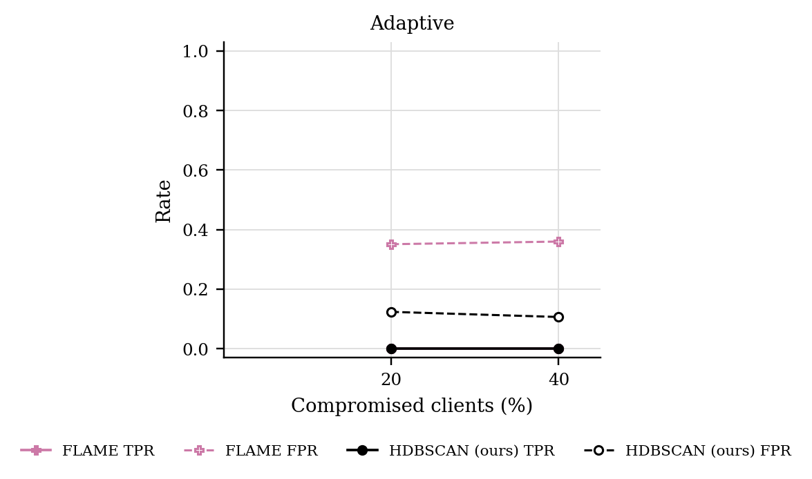

# GraMa results: `cic_adaptive` profile

Generated 2026-10-05 09:55 from 24 runs.

- Data: real (`cic_iov2024_1427a6ad.pt`), 78 CAN-ID nodes, windows of 64 frames (stride 32), sequences of 8 windows, edges: transition.
- Federated setting: 20 clients, 10 per round, 30 rounds, 2 local epoch(s), batch 64, lr 0.001, Dirichlet alpha 0.5 unless stated.
- Hardware: NVIDIA A100 80GB PCIe (79 GB).
- Seeds: [0, 1]. Cells are mean ± std over seeds where there is more than one.

Sequences per class:

| Split | benign | DoS | spoofing-GAS | spoofing-RPM | spoofing-SPEED | spoofing-STEERING_WHEEL |
|---|---|---|---|---|---|---|
| train | 4720 | 885 | 118 | 649 | 295 | 236 |
| test | 960 | 174 | 23 | 130 | 59 | 47 |

## 3. Poisoning (Sec 6.2.3)

GraMa, Dirichlet alpha 0.5. Columns are the share of compromised clients; 0 is the clean run.

### Adaptive (knows the defence): Macro-F1

| Aggregator | 0% | 20% | 40% |
|---|---|---|---|
| FedAvg | 1.0000 ± 0.0000 | 0.1360 ± 0.0000 | 0.1360 ± 0.0000 |
| Norm clipping | 1.0000 ± 0.0000 | 0.9909 ± 0.0091 | 0.1360 ± 0.0000 |
| FLAME | 1.0000 ± 0.0000 | 0.9990 ± 0.0010 | 0.2207 ± 0.0847 |
| HDBSCAN (ours) | 1.0000 ± 0.0000 | 1.0000 ± 0.0000 | 0.1360 ± 0.0000 |

### Adaptive (knows the defence): Detection rate

| Aggregator | 0% | 20% | 40% |
|---|---|---|---|
| FedAvg | 1.0000 ± 0.0000 | 0.0000 ± 0.0000 | 0.0000 ± 0.0000 |
| Norm clipping | 1.0000 ± 0.0000 | 0.9734 ± 0.0266 | 0.0000 ± 0.0000 |
| FLAME | 1.0000 ± 0.0000 | 1.0000 ± 0.0000 | 0.0543 ± 0.0543 |
| HDBSCAN (ours) | 1.0000 ± 0.0000 | 1.0000 ± 0.0000 | 0.0000 ± 0.0000 |

### Rejected updates

TPR: share of compromised clients' updates rejected. FPR: share of honest clients' updates rejected. Median, trimmed mean and norm clipping reject no client as a whole, so they are not listed.

| Attack | Aggregator | 20% TPR / FPR | 40% TPR / FPR |
|---|---|---|---|
| Adaptive | FLAME | 0.00 / 0.35 | 0.00 / 0.36 |
| Adaptive | HDBSCAN (ours) | 0.00 / 0.12 | 0.00 / 0.11 |

### Adaptive attack: how much poison got through

Mean poison scale the attackers sent while every one of their updates was still accepted, over rounds and seeds. 1 is plain targeted flipping, 0 is no poison. Rules that reject no client accept any scale, so they get the maximum the attack tries.

| Aggregator | 20% | 40% |
|---|---|---|
| FedAvg | 10.00 | 10.00 |
| Norm clipping | 10.00 | 10.00 |
| FLAME | 0.53 | 3.66 |
| HDBSCAN (ours) | 1.04 | 4.64 |

## 5. Efficiency (Sec 6.1, 8.1)

One sequence covers 288 CAN frames. Latency is for one sequence at a time; throughput is for batches of 256 on the run's device.

| Model | Params | Size (KB) | Upload per client per round (KB) | CPU latency, 1 thread (ms/sequence) | GPU latency (ms/sequence) | Throughput (sequences/s) |
|---|---|---|---|---|---|---|
| GraMa | 78,587 | 307.0 | 307.0 | 3.98 | 2.81 | 16,401 |
| CNN-BiGRU | 39,431 | 154.0 | 154.0 | 1.26 | 0.65 | 379,564 |

## Figures

PNG to look at, PDF with the same name for LaTeX.

**Macro-F1 under poisoning**

**How often compromised (TPR) and honest (FPR) updates were rejected**

## Notes

- Split: every fifth block of 1000 rows in each file tests, the rest trains; windows never cross a block boundary.
- The CNN-BiGRU baseline is our implementation of that model family on the same sequences, trained with FedAvg; the original adaptive weighting (AWI) is not reproduced.
- The centralised row trains one model on all the training data with the same number of passes over the data as a federated run. It is a reference, not a federated method.
