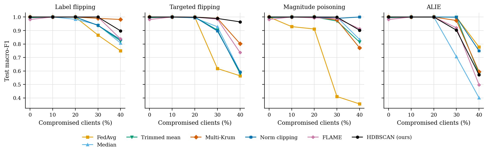
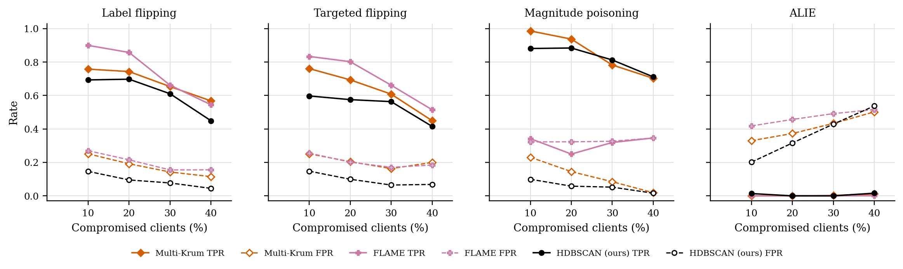

# GraMa results: `cic_seeds` profile

Generated 2026-10-09 15:48 from 483 runs.

- Data: real (`cic_iov2024_1427a6ad.pt`), 78 CAN-ID nodes, windows of 64 frames (stride 32), sequences of 8 windows, edges: transition.
- Federated setting: 20 clients, 10 per round, 30 rounds, 2 local epoch(s), batch 64, lr 0.001, Dirichlet alpha 0.5 unless stated.
- Hardware: NVIDIA A100 80GB PCIe (79 GB).
- Seeds: [0, 1, 2, 3, 4]. Cells are mean ± std over seeds where there is more than one.

Sequences per class:

| Split | benign | DoS | spoofing-GAS | spoofing-RPM | spoofing-SPEED | spoofing-STEERING_WHEEL |
|---|---|---|---|---|---|---|
| train | 4720 | 885 | 118 | 649 | 295 | 236 |
| test | 960 | 174 | 23 | 130 | 59 | 47 |

## 3. Poisoning (Sec 6.2.3)

GraMa, Dirichlet alpha 0.5. Columns are the share of compromised clients; 0 is the clean run.

### Label flipping: Macro-F1

| Aggregator | 0% | 10% | 20% | 30% | 40% |
|---|---|---|---|---|---|
| FedAvg | 1.0000 ± 0.0000 | 1.0000 ± 0.0000 | 1.0000 ± 0.0000 | 0.8664 ± 0.1340 | 0.7500 ± 0.1771 |
| Median | 1.0000 ± 0.0000 | 1.0000 ± 0.0000 | 0.9836 ± 0.0232 | 0.9422 ± 0.1156 | 0.8071 ± 0.2326 |
| Trimmed mean | 0.9957 ± 0.0086 | 1.0000 ± 0.0000 | 1.0000 ± 0.0000 | 0.9379 ± 0.1137 | 0.8234 ± 0.2176 |
| Multi-Krum | 1.0000 ± 0.0000 | 1.0000 ± 0.0000 | 1.0000 ± 0.0000 | 0.9901 ± 0.0197 | 0.9817 ± 0.0367 |
| Norm clipping | 1.0000 ± 0.0000 | 1.0000 ± 0.0000 | 1.0000 ± 0.0000 | 0.9383 ± 0.1139 | 0.8327 ± 0.2214 |
| FLAME | 0.9820 ± 0.0361 | 1.0000 ± 0.0000 | 1.0000 ± 0.0000 | 1.0000 ± 0.0000 | 0.8374 ± 0.1993 |
| HDBSCAN (ours) | 1.0000 ± 0.0000 | 1.0000 ± 0.0000 | 1.0000 ± 0.0000 | 1.0000 ± 0.0000 | 0.8976 ± 0.2047 |

### Label flipping: Detection rate

| Aggregator | 0% | 10% | 20% | 30% | 40% |
|---|---|---|---|---|---|
| FedAvg | 1.0000 ± 0.0000 | 1.0000 ± 0.0000 | 1.0000 ± 0.0000 | 1.0000 ± 0.0000 | 0.9792 ± 0.0416 |
| Median | 1.0000 ± 0.0000 | 1.0000 ± 0.0000 | 1.0000 ± 0.0000 | 1.0000 ± 0.0000 | 0.9995 ± 0.0009 |
| Trimmed mean | 1.0000 ± 0.0000 | 1.0000 ± 0.0000 | 1.0000 ± 0.0000 | 1.0000 ± 0.0000 | 1.0000 ± 0.0000 |
| Multi-Krum | 1.0000 ± 0.0000 | 1.0000 ± 0.0000 | 1.0000 ± 0.0000 | 1.0000 ± 0.0000 | 1.0000 ± 0.0000 |
| Norm clipping | 1.0000 ± 0.0000 | 1.0000 ± 0.0000 | 1.0000 ± 0.0000 | 1.0000 ± 0.0000 | 1.0000 ± 0.0000 |
| FLAME | 1.0000 ± 0.0000 | 1.0000 ± 0.0000 | 1.0000 ± 0.0000 | 1.0000 ± 0.0000 | 1.0000 ± 0.0000 |
| HDBSCAN (ours) | 1.0000 ± 0.0000 | 1.0000 ± 0.0000 | 1.0000 ± 0.0000 | 1.0000 ± 0.0000 | 1.0000 ± 0.0000 |

### Targeted flipping (attack -> benign): Macro-F1

| Aggregator | 0% | 10% | 20% | 30% | 40% |
|---|---|---|---|---|---|
| FedAvg | 1.0000 ± 0.0000 | 0.9998 ± 0.0003 | 0.9993 ± 0.0011 | 0.6181 ± 0.3054 | 0.5645 ± 0.3509 |
| Median | 1.0000 ± 0.0000 | 0.9993 ± 0.0010 | 0.9933 ± 0.0095 | 0.9277 ± 0.1090 | 0.5948 ± 0.3294 |
| Trimmed mean | 0.9957 ± 0.0086 | 1.0000 ± 0.0000 | 0.9993 ± 0.0010 | 0.9037 ± 0.0915 | 0.5815 ± 0.2949 |
| Multi-Krum | 1.0000 ± 0.0000 | 1.0000 ± 0.0000 | 0.9993 ± 0.0010 | 0.9905 ± 0.0176 | 0.8024 ± 0.2675 |
| Norm clipping | 1.0000 ± 0.0000 | 1.0000 ± 0.0000 | 0.9993 ± 0.0010 | 0.8964 ± 0.0891 | 0.5921 ± 0.2700 |
| FLAME | 0.9820 ± 0.0361 | 1.0000 ± 0.0000 | 0.9993 ± 0.0010 | 0.9842 ± 0.0304 | 0.7368 ± 0.2811 |
| HDBSCAN (ours) | 1.0000 ± 0.0000 | 1.0000 ± 0.0000 | 0.9993 ± 0.0010 | 0.9894 ± 0.0193 | 0.9642 ± 0.0308 |

### Targeted flipping (attack -> benign): Detection rate

| Aggregator | 0% | 10% | 20% | 30% | 40% |
|---|---|---|---|---|---|
| FedAvg | 1.0000 ± 0.0000 | 0.9992 ± 0.0011 | 0.9985 ± 0.0022 | 0.5515 ± 0.3470 | 0.5704 ± 0.4022 |
| Median | 1.0000 ± 0.0000 | 1.0000 ± 0.0000 | 0.9823 ± 0.0250 | 0.9497 ± 0.0604 | 0.6194 ± 0.3808 |
| Trimmed mean | 1.0000 ± 0.0000 | 1.0000 ± 0.0000 | 1.0000 ± 0.0000 | 0.8656 ± 0.1758 | 0.5506 ± 0.3907 |
| Multi-Krum | 1.0000 ± 0.0000 | 1.0000 ± 0.0000 | 1.0000 ± 0.0000 | 0.9885 ± 0.0220 | 0.8111 ± 0.3508 |
| Norm clipping | 1.0000 ± 0.0000 | 1.0000 ± 0.0000 | 1.0000 ± 0.0000 | 0.8688 ± 0.2128 | 0.6476 ± 0.3689 |
| FLAME | 1.0000 ± 0.0000 | 1.0000 ± 0.0000 | 1.0000 ± 0.0000 | 1.0000 ± 0.0000 | 0.7510 ± 0.3268 |
| HDBSCAN (ours) | 1.0000 ± 0.0000 | 1.0000 ± 0.0000 | 1.0000 ± 0.0000 | 0.9995 ± 0.0009 | 0.9885 ± 0.0220 |

### Magnitude poisoning: Macro-F1

| Aggregator | 0% | 10% | 20% | 30% | 40% |
|---|---|---|---|---|---|
| FedAvg | 1.0000 ± 0.0000 | 0.9290 ± 0.1003 | 0.9112 ± 0.1091 | 0.4107 ± 0.3011 | 0.3558 ± 0.1964 |
| Median | 1.0000 ± 0.0000 | 1.0000 ± 0.0000 | 1.0000 ± 0.0000 | 0.9996 ± 0.0008 | 0.8337 ± 0.2235 |
| Trimmed mean | 0.9957 ± 0.0086 | 1.0000 ± 0.0000 | 1.0000 ± 0.0000 | 0.9705 ± 0.0579 | 0.8145 ± 0.1807 |
| Multi-Krum | 1.0000 ± 0.0000 | 1.0000 ± 0.0000 | 1.0000 ± 0.0000 | 0.9787 ± 0.0425 | 0.7716 ± 0.3526 |
| Norm clipping | 1.0000 ± 0.0000 | 1.0000 ± 0.0000 | 1.0000 ± 0.0000 | 0.9901 ± 0.0197 | 1.0000 ± 0.0000 |
| FLAME | 0.9820 ± 0.0361 | 1.0000 ± 0.0000 | 0.9934 ± 0.0093 | 0.9896 ± 0.0198 | 0.9131 ± 0.1048 |
| HDBSCAN (ours) | 1.0000 ± 0.0000 | 1.0000 ± 0.0000 | 1.0000 ± 0.0000 | 0.9997 ± 0.0006 | 0.9023 ± 0.1552 |

### Magnitude poisoning: Detection rate

| Aggregator | 0% | 10% | 20% | 30% | 40% |
|---|---|---|---|---|---|
| FedAvg | 1.0000 ± 0.0000 | 1.0000 ± 0.0000 | 0.9908 ± 0.0131 | 0.8000 ± 0.3483 | 0.8286 ± 0.1608 |
| Median | 1.0000 ± 0.0000 | 1.0000 ± 0.0000 | 1.0000 ± 0.0000 | 1.0000 ± 0.0000 | 0.9889 ± 0.0222 |
| Trimmed mean | 1.0000 ± 0.0000 | 1.0000 ± 0.0000 | 1.0000 ± 0.0000 | 1.0000 ± 0.0000 | 0.9995 ± 0.0009 |
| Multi-Krum | 1.0000 ± 0.0000 | 1.0000 ± 0.0000 | 1.0000 ± 0.0000 | 1.0000 ± 0.0000 | 0.9995 ± 0.0009 |
| Norm clipping | 1.0000 ± 0.0000 | 1.0000 ± 0.0000 | 1.0000 ± 0.0000 | 1.0000 ± 0.0000 | 1.0000 ± 0.0000 |
| FLAME | 1.0000 ± 0.0000 | 1.0000 ± 0.0000 | 1.0000 ± 0.0000 | 0.9995 ± 0.0009 | 1.0000 ± 0.0000 |
| HDBSCAN (ours) | 1.0000 ± 0.0000 | 1.0000 ± 0.0000 | 1.0000 ± 0.0000 | 0.9995 ± 0.0009 | 1.0000 ± 0.0000 |

### ALIE (crafted to look honest): Macro-F1

| Aggregator | 0% | 10% | 20% | 30% | 40% |
|---|---|---|---|---|---|
| FedAvg | 1.0000 ± 0.0000 | 0.9989 ± 0.0015 | 1.0000 ± 0.0000 | 0.9997 ± 0.0006 | 0.7778 ± 0.1524 |
| Median | 1.0000 ± 0.0000 | 1.0000 ± 0.0000 | 1.0000 ± 0.0000 | 0.7062 ± 0.1122 | 0.4009 ± 0.1515 |
| Trimmed mean | 0.9957 ± 0.0086 | 1.0000 ± 0.0000 | 1.0000 ± 0.0000 | 0.9990 ± 0.0020 | 0.5772 ± 0.2483 |
| Multi-Krum | 1.0000 ± 0.0000 | 1.0000 ± 0.0000 | 1.0000 ± 0.0000 | 0.9743 ± 0.0294 | 0.5942 ± 0.2202 |
| Norm clipping | 1.0000 ± 0.0000 | 1.0000 ± 0.0000 | 1.0000 ± 0.0000 | 0.9997 ± 0.0006 | 0.7494 ± 0.1768 |
| FLAME | 0.9820 ± 0.0361 | 1.0000 ± 0.0000 | 1.0000 ± 0.0000 | 0.9200 ± 0.0680 | 0.4980 ± 0.1328 |
| HDBSCAN (ours) | 1.0000 ± 0.0000 | 1.0000 ± 0.0000 | 1.0000 ± 0.0000 | 0.9026 ± 0.0983 | 0.5723 ± 0.1573 |

### ALIE (crafted to look honest): Detection rate

| Aggregator | 0% | 10% | 20% | 30% | 40% |
|---|---|---|---|---|---|
| FedAvg | 1.0000 ± 0.0000 | 1.0000 ± 0.0000 | 1.0000 ± 0.0000 | 0.9995 ± 0.0009 | 0.9940 ± 0.0120 |
| Median | 1.0000 ± 0.0000 | 1.0000 ± 0.0000 | 1.0000 ± 0.0000 | 0.9995 ± 0.0009 | 0.9076 ± 0.1848 |
| Trimmed mean | 1.0000 ± 0.0000 | 1.0000 ± 0.0000 | 1.0000 ± 0.0000 | 1.0000 ± 0.0000 | 1.0000 ± 0.0000 |
| Multi-Krum | 1.0000 ± 0.0000 | 1.0000 ± 0.0000 | 1.0000 ± 0.0000 | 1.0000 ± 0.0000 | 1.0000 ± 0.0000 |
| Norm clipping | 1.0000 ± 0.0000 | 1.0000 ± 0.0000 | 1.0000 ± 0.0000 | 0.9995 ± 0.0009 | 1.0000 ± 0.0000 |
| FLAME | 1.0000 ± 0.0000 | 1.0000 ± 0.0000 | 1.0000 ± 0.0000 | 1.0000 ± 0.0000 | 0.9783 ± 0.0434 |
| HDBSCAN (ours) | 1.0000 ± 0.0000 | 1.0000 ± 0.0000 | 1.0000 ± 0.0000 | 1.0000 ± 0.0000 | 0.9783 ± 0.0434 |

### Rejected updates

TPR: share of compromised clients' updates rejected. FPR: share of honest clients' updates rejected. Median, trimmed mean and norm clipping reject no client as a whole, so they are not listed.

| Attack | Aggregator | 10% TPR / FPR | 20% TPR / FPR | 30% TPR / FPR | 40% TPR / FPR |
|---|---|---|---|---|---|
| Label flipping | Multi-Krum | 0.76 / 0.25 | 0.74 / 0.19 | 0.65 / 0.14 | 0.57 / 0.12 |
| Label flipping | FLAME | 0.90 / 0.27 | 0.86 / 0.22 | 0.66 / 0.16 | 0.54 / 0.16 |
| Label flipping | HDBSCAN (ours) | 0.69 / 0.15 | 0.70 / 0.10 | 0.61 / 0.08 | 0.45 / 0.04 |
| Targeted flipping | Multi-Krum | 0.76 / 0.25 | 0.69 / 0.20 | 0.61 / 0.16 | 0.45 / 0.20 |
| Targeted flipping | FLAME | 0.83 / 0.26 | 0.80 / 0.20 | 0.66 / 0.17 | 0.52 / 0.18 |
| Targeted flipping | HDBSCAN (ours) | 0.60 / 0.15 | 0.58 / 0.10 | 0.56 / 0.06 | 0.42 / 0.07 |
| Magnitude poisoning | Multi-Krum | 0.99 / 0.23 | 0.94 / 0.14 | 0.78 / 0.08 | 0.70 / 0.02 |
| Magnitude poisoning | FLAME | 0.34 / 0.32 | 0.25 / 0.32 | 0.32 / 0.33 | 0.35 / 0.35 |
| Magnitude poisoning | HDBSCAN (ours) | 0.88 / 0.10 | 0.88 / 0.06 | 0.81 / 0.05 | 0.71 / 0.02 |
| ALIE | Multi-Krum | 0.00 / 0.33 | 0.00 / 0.37 | 0.00 / 0.43 | 0.01 / 0.50 |
| ALIE | FLAME | 0.00 / 0.42 | 0.00 / 0.46 | 0.00 / 0.49 | 0.00 / 0.52 |
| ALIE | HDBSCAN (ours) | 0.01 / 0.20 | 0.00 / 0.32 | 0.00 / 0.43 | 0.02 / 0.54 |

## 5. Efficiency (Sec 6.1, 8.1)

One sequence covers 288 CAN frames. Latency is for one sequence at a time; throughput is for batches of 256 on the run's device.

| Model | Params | Size (KB) | Upload per client per round (KB) | CPU latency, 1 thread (ms/sequence) | GPU latency (ms/sequence) | Throughput (sequences/s) |
|---|---|---|---|---|---|---|
| GraMa | 78,587 | 307.0 | 307.0 | 3.93 | 2.38 | 8,808 |
| CNN-BiGRU | 39,431 | 154.0 | 154.0 | 1.15 | 0.64 | 373,572 |

## Figures

PNG to look at, PDF with the same name for LaTeX.

**Macro-F1 under poisoning**

**How often compromised (TPR) and honest (FPR) updates were rejected**

## Notes

- Split: every fifth block of 1000 rows in each file tests, the rest trains; windows never cross a block boundary.
- The CNN-BiGRU baseline is our implementation of that model family on the same sequences, trained with FedAvg; the original adaptive weighting (AWI) is not reproduced.
- The centralised row trains one model on all the training data with the same number of passes over the data as a federated run. It is a reference, not a federated method.
