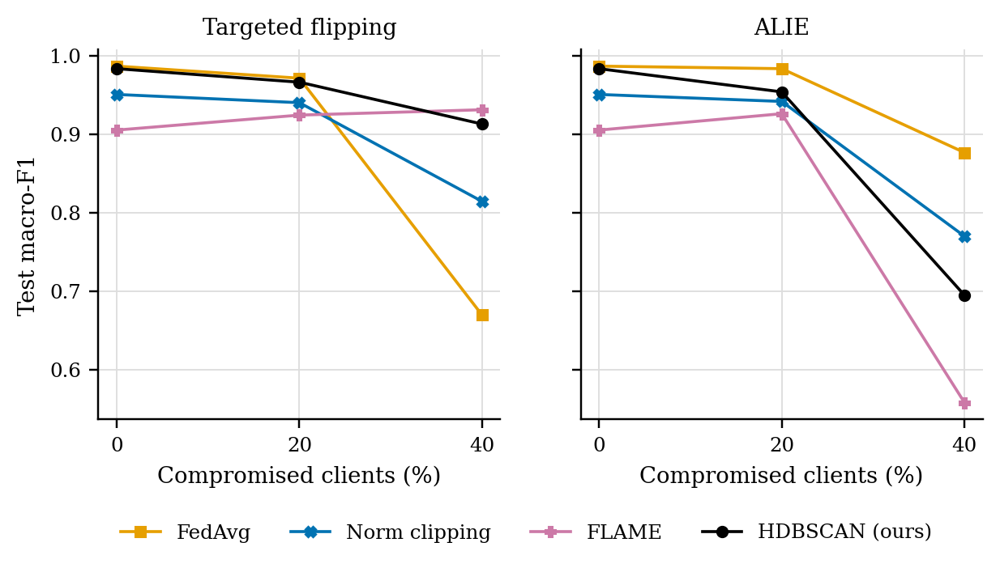
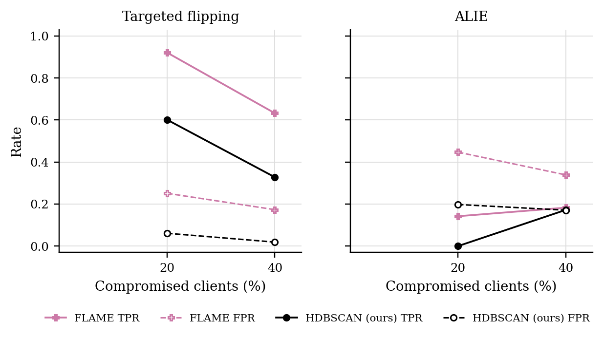

# GraMa results: `clients40` profile

Generated 2026-10-09 21:53 from 60 runs.

- Data: real (`cic_iov2024_1427a6ad.pt`), 78 CAN-ID nodes, windows of 64 frames (stride 32), sequences of 8 windows, edges: transition.
- Federated setting: 40 clients, 20 per round, 30 rounds, 2 local epoch(s), batch 64, lr 0.001, Dirichlet alpha 0.5 unless stated.
- Hardware: NVIDIA A100 80GB PCIe (79 GB).
- Seeds: [0, 1, 2]. Cells are mean ± std over seeds where there is more than one.

Sequences per class:

| Split | benign | DoS | spoofing-GAS | spoofing-RPM | spoofing-SPEED | spoofing-STEERING_WHEEL |
|---|---|---|---|---|---|---|
| train | 4720 | 885 | 118 | 649 | 295 | 236 |
| test | 960 | 174 | 23 | 130 | 59 | 47 |

## 3. Poisoning (Sec 6.2.3)

GraMa, Dirichlet alpha 0.5. Columns are the share of compromised clients; 0 is the clean run.

### Targeted flipping (attack -> benign): Macro-F1

| Aggregator | 0% | 20% | 40% |
|---|---|---|---|
| FedAvg | 0.9868 ± 0.0186 | 0.9714 ± 0.0209 | 0.6694 ± 0.2535 |
| Norm clipping | 0.9507 ± 0.0000 | 0.9402 ± 0.0132 | 0.8143 ± 0.0330 |
| FLAME | 0.9053 ± 0.0115 | 0.9244 ± 0.0252 | 0.9312 ± 0.0276 |
| HDBSCAN (ours) | 0.9836 ± 0.0232 | 0.9663 ± 0.0238 | 0.9130 ± 0.0250 |

### Targeted flipping (attack -> benign): Detection rate

| Aggregator | 0% | 20% | 40% |
|---|---|---|---|
| FedAvg | 1.0000 ± 0.0000 | 1.0000 ± 0.0000 | 0.7121 ± 0.4072 |
| Norm clipping | 1.0000 ± 0.0000 | 1.0000 ± 0.0000 | 0.9546 ± 0.0626 |
| FLAME | 1.0000 ± 0.0000 | 1.0000 ± 0.0000 | 0.9992 ± 0.0011 |
| HDBSCAN (ours) | 1.0000 ± 0.0000 | 1.0000 ± 0.0000 | 0.9985 ± 0.0011 |

### ALIE (crafted to look honest): Macro-F1

| Aggregator | 0% | 20% | 40% |
|---|---|---|---|
| FedAvg | 0.9868 ± 0.0186 | 0.9836 ± 0.0232 | 0.8766 ± 0.0631 |
| Norm clipping | 0.9507 ± 0.0000 | 0.9418 ± 0.0126 | 0.7699 ± 0.1875 |
| FLAME | 0.9053 ± 0.0115 | 0.9261 ± 0.0264 | 0.5579 ± 0.0845 |
| HDBSCAN (ours) | 0.9836 ± 0.0232 | 0.9540 ± 0.0046 | 0.6947 ± 0.1968 |

### ALIE (crafted to look honest): Detection rate

| Aggregator | 0% | 20% | 40% |
|---|---|---|---|
| FedAvg | 1.0000 ± 0.0000 | 1.0000 ± 0.0000 | 1.0000 ± 0.0000 |
| Norm clipping | 1.0000 ± 0.0000 | 1.0000 ± 0.0000 | 1.0000 ± 0.0000 |
| FLAME | 1.0000 ± 0.0000 | 1.0000 ± 0.0000 | 1.0000 ± 0.0000 |
| HDBSCAN (ours) | 1.0000 ± 0.0000 | 1.0000 ± 0.0000 | 1.0000 ± 0.0000 |

### Rejected updates

TPR: share of compromised clients' updates rejected. FPR: share of honest clients' updates rejected. Median, trimmed mean and norm clipping reject no client as a whole, so they are not listed.

| Attack | Aggregator | 20% TPR / FPR | 40% TPR / FPR |
|---|---|---|---|
| Targeted flipping | FLAME | 0.92 / 0.25 | 0.63 / 0.17 |
| Targeted flipping | HDBSCAN (ours) | 0.60 / 0.06 | 0.33 / 0.02 |
| ALIE | FLAME | 0.14 / 0.45 | 0.18 / 0.34 |
| ALIE | HDBSCAN (ours) | 0.00 / 0.20 | 0.17 / 0.17 |

## 5. Efficiency (Sec 6.1, 8.1)

One sequence covers 288 CAN frames. Latency is for one sequence at a time; throughput is for batches of 256 on the run's device.

| Model | Params | Size (KB) | Upload per client per round (KB) | CPU latency, 1 thread (ms/sequence) | GPU latency (ms/sequence) | Throughput (sequences/s) |
|---|---|---|---|---|---|---|
| GraMa | 78,587 | 307.0 | 307.0 | 3.91 | 2.39 | 10,263 |
| CNN-BiGRU | 39,431 | 154.0 | 154.0 | 1.15 | 0.65 | 382,801 |

## Figures

PNG to look at, PDF with the same name for LaTeX.

**Macro-F1 under poisoning**

**How often compromised (TPR) and honest (FPR) updates were rejected**

## Notes

- Split: every fifth block of 1000 rows in each file tests, the rest trains; windows never cross a block boundary.
- The CNN-BiGRU baseline is our implementation of that model family on the same sequences, trained with FedAvg; the original adaptive weighting (AWI) is not reproduced.
- The centralised row trains one model on all the training data with the same number of passes over the data as a federated run. It is a reference, not a federated method.
