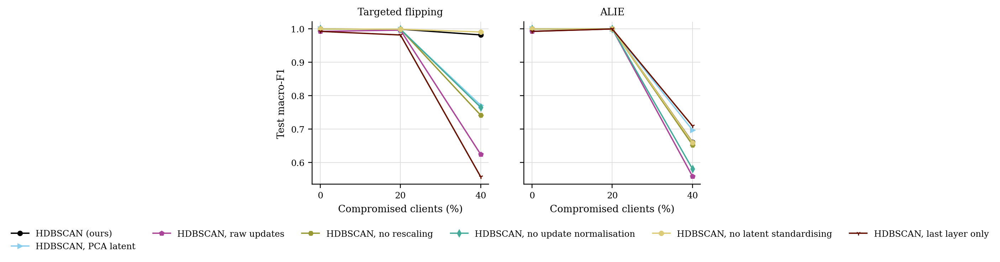
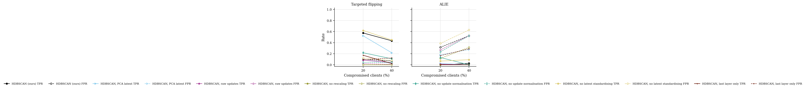

# GraMa results: `def_ablation` profile

Generated 2026-10-09 04:23 from 105 runs.

- Data: real (`cic_iov2024_1427a6ad.pt`), 78 CAN-ID nodes, windows of 64 frames (stride 32), sequences of 8 windows, edges: transition.
- Federated setting: 20 clients, 10 per round, 30 rounds, 2 local epoch(s), batch 64, lr 0.001, Dirichlet alpha 0.5 unless stated.
- Hardware: NVIDIA A100 80GB PCIe (79 GB).
- Seeds: [0, 1, 2]. Cells are mean ± std over seeds where there is more than one.

Sequences per class:

| Split | benign | DoS | spoofing-GAS | spoofing-RPM | spoofing-SPEED | spoofing-STEERING_WHEEL |
|---|---|---|---|---|---|---|
| train | 4720 | 885 | 118 | 649 | 295 | 236 |
| test | 960 | 174 | 23 | 130 | 59 | 47 |

## 3. Poisoning (Sec 6.2.3)

GraMa, Dirichlet alpha 0.5. Columns are the share of compromised clients; 0 is the clean run.

### Targeted flipping (attack -> benign): Macro-F1

| Aggregator | 0% | 20% | 40% |
|---|---|---|---|
| HDBSCAN (ours) | 1.0000 ± 0.0000 | 0.9993 ± 0.0010 | 0.9822 ± 0.0236 |
| HDBSCAN, PCA latent | 1.0000 ± 0.0000 | 0.9985 ± 0.0011 | 0.7717 ± 0.2597 |
| HDBSCAN, raw updates | 0.9928 ± 0.0102 | 0.9965 ± 0.0035 | 0.6247 ± 0.1765 |
| HDBSCAN, no rescaling | 1.0000 ± 0.0000 | 0.9993 ± 0.0011 | 0.7419 ± 0.1620 |
| HDBSCAN, no update normalisation | 1.0000 ± 0.0000 | 0.9993 ± 0.0010 | 0.7654 ± 0.1772 |
| HDBSCAN, no latent standardising | 1.0000 ± 0.0000 | 0.9993 ± 0.0010 | 0.9910 ± 0.0101 |
| HDBSCAN, last layer only | 0.9928 ± 0.0102 | 0.9820 ± 0.0239 | 0.5576 ± 0.2996 |

### Targeted flipping (attack -> benign): Detection rate

| Aggregator | 0% | 20% | 40% |
|---|---|---|---|
| HDBSCAN (ours) | 1.0000 ± 0.0000 | 1.0000 ± 0.0000 | 0.9992 ± 0.0011 |
| HDBSCAN, PCA latent | 1.0000 ± 0.0000 | 1.0000 ± 0.0000 | 0.8276 ± 0.2230 |
| HDBSCAN, raw updates | 1.0000 ± 0.0000 | 0.9915 ± 0.0120 | 0.5597 ± 0.2583 |
| HDBSCAN, no rescaling | 1.0000 ± 0.0000 | 0.9985 ± 0.0022 | 0.8830 ± 0.1655 |
| HDBSCAN, no update normalisation | 1.0000 ± 0.0000 | 1.0000 ± 0.0000 | 0.8083 ± 0.1678 |
| HDBSCAN, no latent standardising | 1.0000 ± 0.0000 | 1.0000 ± 0.0000 | 0.9985 ± 0.0011 |
| HDBSCAN, last layer only | 1.0000 ± 0.0000 | 0.9985 ± 0.0022 | 0.6020 ± 0.4326 |

### ALIE (crafted to look honest): Macro-F1

| Aggregator | 0% | 20% | 40% |
|---|---|---|---|
| HDBSCAN (ours) | 1.0000 ± 0.0000 | 1.0000 ± 0.0000 | 0.6611 ± 0.1411 |
| HDBSCAN, PCA latent | 1.0000 ± 0.0000 | 1.0000 ± 0.0000 | 0.6975 ± 0.1927 |
| HDBSCAN, raw updates | 0.9928 ± 0.0102 | 1.0000 ± 0.0000 | 0.5590 ± 0.1112 |
| HDBSCAN, no rescaling | 1.0000 ± 0.0000 | 1.0000 ± 0.0000 | 0.6529 ± 0.1045 |
| HDBSCAN, no update normalisation | 1.0000 ± 0.0000 | 1.0000 ± 0.0000 | 0.5812 ± 0.2136 |
| HDBSCAN, no latent standardising | 1.0000 ± 0.0000 | 1.0000 ± 0.0000 | 0.6603 ± 0.1943 |
| HDBSCAN, last layer only | 0.9928 ± 0.0102 | 1.0000 ± 0.0000 | 0.7097 ± 0.1647 |

### ALIE (crafted to look honest): Detection rate

| Aggregator | 0% | 20% | 40% |
|---|---|---|---|
| HDBSCAN (ours) | 1.0000 ± 0.0000 | 1.0000 ± 0.0000 | 1.0000 ± 0.0000 |
| HDBSCAN, PCA latent | 1.0000 ± 0.0000 | 1.0000 ± 0.0000 | 0.9992 ± 0.0011 |
| HDBSCAN, raw updates | 1.0000 ± 0.0000 | 1.0000 ± 0.0000 | 1.0000 ± 0.0000 |
| HDBSCAN, no rescaling | 1.0000 ± 0.0000 | 1.0000 ± 0.0000 | 1.0000 ± 0.0000 |
| HDBSCAN, no update normalisation | 1.0000 ± 0.0000 | 1.0000 ± 0.0000 | 1.0000 ± 0.0000 |
| HDBSCAN, no latent standardising | 1.0000 ± 0.0000 | 1.0000 ± 0.0000 | 1.0000 ± 0.0000 |
| HDBSCAN, last layer only | 1.0000 ± 0.0000 | 1.0000 ± 0.0000 | 1.0000 ± 0.0000 |

### Rejected updates

TPR: share of compromised clients' updates rejected. FPR: share of honest clients' updates rejected. Median, trimmed mean and norm clipping reject no client as a whole, so they are not listed.

| Attack | Aggregator | 20% TPR / FPR | 40% TPR / FPR |
|---|---|---|---|
| Targeted flipping | HDBSCAN (ours) | 0.58 / 0.10 | 0.43 / 0.07 |
| Targeted flipping | HDBSCAN, PCA latent | 0.52 / 0.08 | 0.22 / 0.03 |
| Targeted flipping | HDBSCAN, raw updates | 0.09 / 0.02 | 0.04 / 0.01 |
| Targeted flipping | HDBSCAN, no rescaling | 0.00 / 0.00 | 0.00 / 0.00 |
| Targeted flipping | HDBSCAN, no update normalisation | 0.22 / 0.04 | 0.11 / 0.04 |
| Targeted flipping | HDBSCAN, no latent standardising | 0.62 / 0.12 | 0.45 / 0.08 |
| Targeted flipping | HDBSCAN, last layer only | 0.17 / 0.09 | 0.02 / 0.12 |
| ALIE | HDBSCAN (ours) | 0.00 / 0.32 | 0.03 / 0.52 |
| ALIE | HDBSCAN, PCA latent | 0.02 / 0.18 | 0.00 / 0.28 |
| ALIE | HDBSCAN, raw updates | 0.01 / 0.27 | 0.00 / 0.53 |
| ALIE | HDBSCAN, no rescaling | 0.00 / 0.12 | 0.00 / 0.32 |
| ALIE | HDBSCAN, no update normalisation | 0.13 / 0.23 | 0.00 / 0.52 |
| ALIE | HDBSCAN, no latent standardising | 0.07 / 0.39 | 0.09 / 0.63 |
| ALIE | HDBSCAN, last layer only | 0.00 / 0.17 | 0.00 / 0.29 |

## 5. Efficiency (Sec 6.1, 8.1)

One sequence covers 288 CAN frames. Latency is for one sequence at a time; throughput is for batches of 256 on the run's device.

| Model | Params | Size (KB) | Upload per client per round (KB) | CPU latency, 1 thread (ms/sequence) | GPU latency (ms/sequence) | Throughput (sequences/s) |
|---|---|---|---|---|---|---|
| GraMa | 78,587 | 307.0 | 307.0 | 4.07 | 2.68 | 4,640 |
| CNN-BiGRU | 39,431 | 154.0 | 154.0 | 1.22 | 0.90 | 284,748 |

## Figures

PNG to look at, PDF with the same name for LaTeX.

**Macro-F1 under poisoning**

**How often compromised (TPR) and honest (FPR) updates were rejected**

## Notes

- Split: every fifth block of 1000 rows in each file tests, the rest trains; windows never cross a block boundary.
- The CNN-BiGRU baseline is our implementation of that model family on the same sequences, trained with FedAvg; the original adaptive weighting (AWI) is not reproduced.
- The centralised row trains one model on all the training data with the same number of passes over the data as a federated run. It is a reference, not a federated method.
