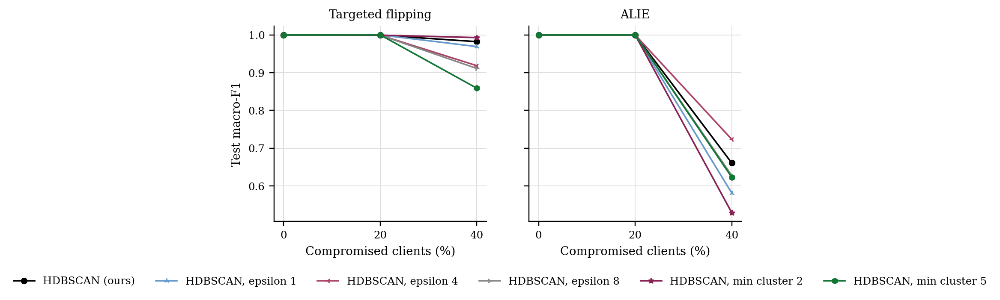
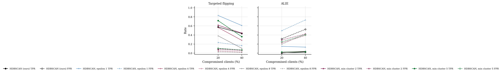

# GraMa results: `def_grid` profile

Generated 2026-10-09 19:17 from 90 runs.

- Data: real (`cic_iov2024_1427a6ad.pt`), 78 CAN-ID nodes, windows of 64 frames (stride 32), sequences of 8 windows, edges: transition.
- Federated setting: 20 clients, 10 per round, 30 rounds, 2 local epoch(s), batch 64, lr 0.001, Dirichlet alpha 0.5 unless stated.
- Hardware: NVIDIA A100 80GB PCIe (79 GB).
- Seeds: [0, 1, 2]. Cells are mean ± std over seeds where there is more than one.

Sequences per class:

| Split | benign | DoS | spoofing-GAS | spoofing-RPM | spoofing-SPEED | spoofing-STEERING_WHEEL |
|---|---|---|---|---|---|---|
| train | 4720 | 885 | 118 | 649 | 295 | 236 |
| test | 960 | 174 | 23 | 130 | 59 | 47 |

## 3. Poisoning (Sec 6.2.3)

GraMa, Dirichlet alpha 0.5. Columns are the share of compromised clients; 0 is the clean run.

### Targeted flipping (attack -> benign): Macro-F1

| Aggregator | 0% | 20% | 40% |
|---|---|---|---|
| HDBSCAN (ours) | 1.0000 ± 0.0000 | 0.9993 ± 0.0010 | 0.9822 ± 0.0236 |
| HDBSCAN, epsilon 1 | 1.0000 ± 0.0000 | 1.0000 ± 0.0000 | 0.9691 ± 0.0420 |
| HDBSCAN, epsilon 4 | 1.0000 ± 0.0000 | 0.9993 ± 0.0010 | 0.9186 ± 0.0277 |
| HDBSCAN, epsilon 8 | 1.0000 ± 0.0000 | 0.9993 ± 0.0010 | 0.9112 ± 0.0783 |
| HDBSCAN, min cluster 2 | 1.0000 ± 0.0000 | 0.9993 ± 0.0010 | 0.9929 ± 0.0089 |
| HDBSCAN, min cluster 5 | 1.0000 ± 0.0000 | 1.0000 ± 0.0000 | 0.8589 ± 0.1601 |

### Targeted flipping (attack -> benign): Detection rate

| Aggregator | 0% | 20% | 40% |
|---|---|---|---|
| HDBSCAN (ours) | 1.0000 ± 0.0000 | 1.0000 ± 0.0000 | 0.9992 ± 0.0011 |
| HDBSCAN, epsilon 1 | 1.0000 ± 0.0000 | 1.0000 ± 0.0000 | 1.0000 ± 0.0000 |
| HDBSCAN, epsilon 4 | 1.0000 ± 0.0000 | 1.0000 ± 0.0000 | 0.9630 ± 0.0523 |
| HDBSCAN, epsilon 8 | 1.0000 ± 0.0000 | 1.0000 ± 0.0000 | 0.9546 ± 0.0642 |
| HDBSCAN, min cluster 2 | 1.0000 ± 0.0000 | 1.0000 ± 0.0000 | 0.9808 ± 0.0256 |
| HDBSCAN, min cluster 5 | 1.0000 ± 0.0000 | 1.0000 ± 0.0000 | 0.8268 ± 0.1575 |

### ALIE (crafted to look honest): Macro-F1

| Aggregator | 0% | 20% | 40% |
|---|---|---|---|
| HDBSCAN (ours) | 1.0000 ± 0.0000 | 1.0000 ± 0.0000 | 0.6611 ± 0.1411 |
| HDBSCAN, epsilon 1 | 1.0000 ± 0.0000 | 1.0000 ± 0.0000 | 0.5816 ± 0.1063 |
| HDBSCAN, epsilon 4 | 1.0000 ± 0.0000 | 1.0000 ± 0.0000 | 0.7236 ± 0.1957 |
| HDBSCAN, epsilon 8 | 1.0000 ± 0.0000 | 1.0000 ± 0.0000 | 0.6278 ± 0.1918 |
| HDBSCAN, min cluster 2 | 1.0000 ± 0.0000 | 1.0000 ± 0.0000 | 0.5295 ± 0.1425 |
| HDBSCAN, min cluster 5 | 1.0000 ± 0.0000 | 1.0000 ± 0.0000 | 0.6232 ± 0.2266 |

### ALIE (crafted to look honest): Detection rate

| Aggregator | 0% | 20% | 40% |
|---|---|---|---|
| HDBSCAN (ours) | 1.0000 ± 0.0000 | 1.0000 ± 0.0000 | 1.0000 ± 0.0000 |
| HDBSCAN, epsilon 1 | 1.0000 ± 0.0000 | 1.0000 ± 0.0000 | 1.0000 ± 0.0000 |
| HDBSCAN, epsilon 4 | 1.0000 ± 0.0000 | 1.0000 ± 0.0000 | 1.0000 ± 0.0000 |
| HDBSCAN, epsilon 8 | 1.0000 ± 0.0000 | 1.0000 ± 0.0000 | 0.9007 ± 0.1404 |
| HDBSCAN, min cluster 2 | 1.0000 ± 0.0000 | 1.0000 ± 0.0000 | 1.0000 ± 0.0000 |
| HDBSCAN, min cluster 5 | 1.0000 ± 0.0000 | 1.0000 ± 0.0000 | 1.0000 ± 0.0000 |

### Rejected updates

TPR: share of compromised clients' updates rejected. FPR: share of honest clients' updates rejected. Median, trimmed mean and norm clipping reject no client as a whole, so they are not listed.

| Attack | Aggregator | 20% TPR / FPR | 40% TPR / FPR |
|---|---|---|---|
| Targeted flipping | HDBSCAN (ours) | 0.58 / 0.10 | 0.43 / 0.07 |
| Targeted flipping | HDBSCAN, epsilon 1 | 0.83 / 0.23 | 0.61 / 0.17 |
| Targeted flipping | HDBSCAN, epsilon 4 | 0.56 / 0.05 | 0.28 / 0.02 |
| Targeted flipping | HDBSCAN, epsilon 8 | 0.38 / 0.02 | 0.11 / 0.02 |
| Targeted flipping | HDBSCAN, min cluster 2 | 0.62 / 0.08 | 0.44 / 0.06 |
| Targeted flipping | HDBSCAN, min cluster 5 | 0.72 / 0.11 | 0.36 / 0.07 |
| ALIE | HDBSCAN (ours) | 0.00 / 0.32 | 0.03 / 0.52 |
| ALIE | HDBSCAN, epsilon 1 | 0.15 / 0.49 | 0.13 / 0.73 |
| ALIE | HDBSCAN, epsilon 4 | 0.02 / 0.22 | 0.04 / 0.39 |
| ALIE | HDBSCAN, epsilon 8 | 0.01 / 0.19 | 0.01 / 0.42 |
| ALIE | HDBSCAN, min cluster 2 | 0.02 / 0.29 | 0.04 / 0.42 |
| ALIE | HDBSCAN, min cluster 5 | 0.02 / 0.25 | 0.03 / 0.40 |

## 5. Efficiency (Sec 6.1, 8.1)

One sequence covers 288 CAN frames. Latency is for one sequence at a time; throughput is for batches of 256 on the run's device.

| Model | Params | Size (KB) | Upload per client per round (KB) | CPU latency, 1 thread (ms/sequence) | GPU latency (ms/sequence) | Throughput (sequences/s) |
|---|---|---|---|---|---|---|
| GraMa | 78,587 | 307.0 | 307.0 | 3.86 | 2.35 | 10,318 |
| CNN-BiGRU | 39,431 | 154.0 | 154.0 | 1.12 | 0.63 | 386,871 |

## Figures

PNG to look at, PDF with the same name for LaTeX.

**Macro-F1 under poisoning**

**How often compromised (TPR) and honest (FPR) updates were rejected**

## Notes

- Split: every fifth block of 1000 rows in each file tests, the rest trains; windows never cross a block boundary.
- The CNN-BiGRU baseline is our implementation of that model family on the same sequences, trained with FedAvg; the original adaptive weighting (AWI) is not reproduced.
- The centralised row trains one model on all the training data with the same number of passes over the data as a federated run. It is a reference, not a federated method.
