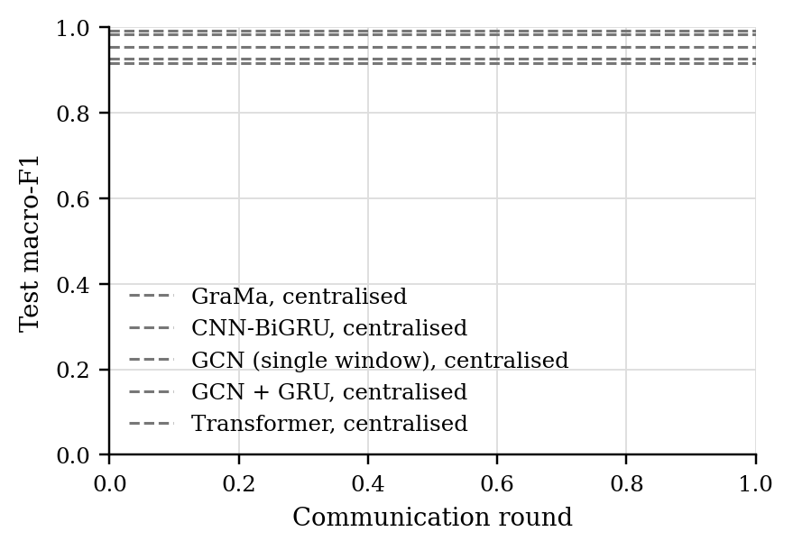
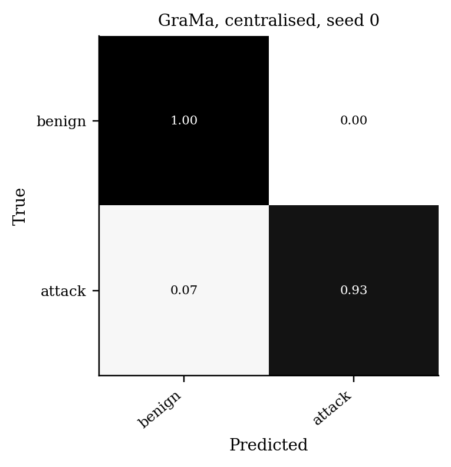

# GraMa results: `det_cantt1` profile

Generated 2026-10-09 01:58 from 25 runs.

- Data: can-train-and-test (`cantt_set_01_b0e5a072.pt`), 53 CAN-ID nodes, windows of 64 frames (stride 32), sequences of 8 windows, edges: transition.
- Federated setting: 20 clients, 10 per round, 30 rounds, 2 local epoch(s), batch 64, lr 0.001, Dirichlet alpha 0.5 unless stated.
- Hardware: NVIDIA A100 80GB PCIe (79 GB).
- Seeds: [0, 1, 2, 3, 4]. Cells are mean ± std over seeds where there is more than one.

Sequences per class:

| Split | benign | attack |
|---|---|---|
| train | 9059 | 2543 |
| test | 3852 | 2635 |
| unknown_vehicle | 5673 | 1868 |
| unknown_attack | 7449 | 3324 |
| unknown_vehicle_and_attack | 7824 | 1881 |

## 1. Main comparison, no attack (Sec 6.2.1)

| Method | Accuracy | Macro-P | Macro-R | Macro-F1 | ROC-AUC | Detection rate | False alarm rate | Params | Train time (s) |
|---|---|---|---|---|---|---|---|---|---|
| GraMa, centralised | 0.9571 ± 0.0102 | 0.9662 ± 0.0076 | 0.9473 ± 0.0125 | 0.9546 ± 0.0109 | 0.9868 ± 0.0033 | 0.8953 ± 0.0248 | 0.0006 ± 0.0003 | 78,255 | 113 |
| CNN-BiGRU, centralised | 0.9914 ± 0.0009 | 0.9926 ± 0.0008 | 0.9897 ± 0.0011 | 0.9911 ± 0.0009 | 0.9983 ± 0.0004 | 0.9805 ± 0.0022 | 0.0011 ± 0.0005 | 38,899 | 80 |
| GCN (single window), centralised | 0.9215 ± 0.0062 | 0.9391 ± 0.0036 | 0.9045 ± 0.0080 | 0.9158 ± 0.0070 | 0.9659 ± 0.0048 | 0.8139 ± 0.0179 | 0.0048 ± 0.0030 | 7,946 | 38 |
| GCN + GRU, centralised | 0.9309 ± 0.0103 | 0.9470 ± 0.0072 | 0.9154 ± 0.0127 | 0.9261 ± 0.0115 | 0.9785 ± 0.0066 | 0.8328 ± 0.0251 | 0.0020 ± 0.0006 | 32,906 | 61 |
| Transformer, centralised | 0.9839 ± 0.0072 | 0.9868 ± 0.0056 | 0.9802 ± 0.0090 | 0.9832 ± 0.0076 | 0.9949 ± 0.0016 | 0.9608 ± 0.0183 | 0.0004 ± 0.0007 | 105,650 | 182 |

Detection rate = attack sequences flagged as any attack; false alarm rate = benign sequences flagged as an attack.

### Other test sets

The same models, tested on the extra sets. Macro scores are averaged over the classes each set contains. Frames with a CAN ID training never saw: test 0%, unknown car, known attacks 61%, known car, unknown attacks 0%, unknown car, unknown attacks 29%.

| Method | Unknown car, known attacks: Macro-F1 | Unknown car, known attacks: Detection rate | Unknown car, known attacks: False alarm rate | Known car, unknown attacks: Macro-F1 | Known car, unknown attacks: Detection rate | Known car, unknown attacks: False alarm rate | Unknown car, unknown attacks: Macro-F1 | Unknown car, unknown attacks: Detection rate | Unknown car, unknown attacks: False alarm rate |
|---|---|---|---|---|---|---|---|---|---|
| GraMa, centralised | 0.2000 ± 0.0029 | 0.9998 ± 0.0004 | 0.9987 ± 0.0027 | 0.4587 ± 0.0463 | 0.0505 ± 0.0479 | 0.0002 ± 0.0002 | 0.3589 ± 0.2440 | 0.7001 ± 0.3719 | 0.6003 ± 0.4895 |
| CNN-BiGRU, centralised | 0.2451 ± 0.0932 | 0.8004 ± 0.3991 | 0.8000 ± 0.4000 | 0.4780 ± 0.0056 | 0.0685 ± 0.0059 | 0.0000 ± 0.0001 | 0.4745 ± 0.2552 | 0.6583 ± 0.2857 | 0.4535 ± 0.4484 |
| GCN (single window), centralised | 0.2860 ± 0.1024 | 0.8907 ± 0.1144 | 0.8763 ± 0.1441 | 0.4528 ± 0.0166 | 0.0439 ± 0.0164 | 0.0034 ± 0.0024 | 0.4649 ± 0.1765 | 0.5498 ± 0.2694 | 0.4300 ± 0.3719 |
| GCN + GRU, centralised | 0.2322 ± 0.0446 | 0.9337 ± 0.1034 | 0.9525 ± 0.0676 | 0.4751 ± 0.0343 | 0.0670 ± 0.0367 | 0.0016 ± 0.0004 | 0.3464 ± 0.1832 | 0.6937 ± 0.3233 | 0.6388 ± 0.3971 |
| Transformer, centralised | 0.3568 ± 0.1341 | 0.5113 ± 0.4478 | 0.4855 ± 0.4481 | 0.4917 ± 0.0481 | 0.0853 ± 0.0527 | 0.0002 ± 0.0004 | 0.4272 ± 0.2274 | 0.5082 ± 0.4117 | 0.3967 ± 0.4859 |

### Per-class F1

| Method | benign | attack |
|---|---|---|
| GraMa, centralised | 0.9652 | 0.9441 |
| CNN-BiGRU, centralised | 0.9928 | 0.9893 |
| GCN (single window), centralised | 0.9378 | 0.8938 |
| GCN + GRU, centralised | 0.9450 | 0.9071 |
| Transformer, centralised | 0.9866 | 0.9797 |

## 5. Efficiency (Sec 6.1, 8.1)

One sequence covers 288 CAN frames. Latency is for one sequence at a time; throughput is for batches of 256 on the run's device.

| Model | Params | Size (KB) | Upload per client per round (KB) | CPU latency, 1 thread (ms/sequence) | GPU latency (ms/sequence) | Throughput (sequences/s) |
|---|---|---|---|---|---|---|
| GraMa | 78,255 | 305.7 | 305.7 | 3.05 | 3.44 | 5,380 |
| CNN-BiGRU | 38,899 | 151.9 | 151.9 | 1.19 | 2.93 | 37,802 |
| GCN (single window) | 7,946 | 31.0 | 31.0 | 0.32 | 2.05 | 318,591 |
| GCN + GRU | 32,906 | 128.5 | 128.5 | 0.77 | 3.27 | 27,117 |
| Transformer | 105,650 | 412.7 | 412.7 | 1.56 | 3.06 | 7,070 |

## Figures

PNG to look at, PDF with the same name for LaTeX.

**Test macro-F1 per round, no attack**

**Confusion matrix (row-normalised)**

## Notes

- Split: the dataset's own folders for set_01: train_01 trains, test_01 (known car, known attacks) tests, test_02-04 are the extra test sets.
- The CNN-BiGRU baseline is our implementation of that model family on the same sequences, trained with FedAvg; the original adaptive weighting (AWI) is not reproduced.
- The centralised row trains one model on all the training data with the same number of passes over the data as a federated run. It is a reference, not a federated method.
