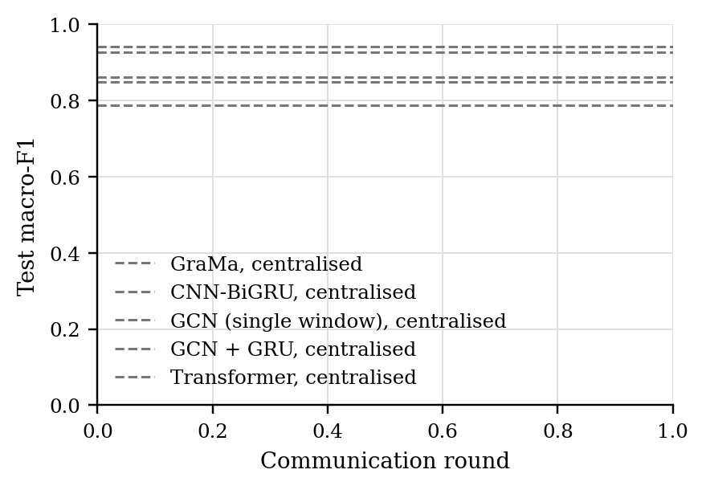
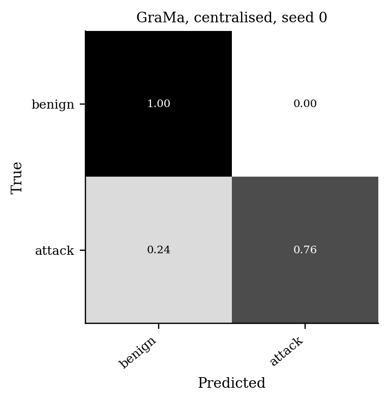

# GraMa results: `det_cantt2` profile

Generated 2026-10-09 03:42 from 25 runs.

- Data: can-train-and-test (`cantt_set_02_1f30f4c2.pt`), 128 CAN-ID nodes, windows of 64 frames (stride 32), sequences of 8 windows, edges: transition.
- Federated setting: 20 clients, 10 per round, 30 rounds, 2 local epoch(s), batch 64, lr 0.001, Dirichlet alpha 0.5 unless stated.
- Hardware: NVIDIA A100 80GB PCIe (79 GB).
- Seeds: [0, 1, 2, 3, 4]. Cells are mean ± std over seeds where there is more than one.

Sequences per class:

| Split | benign | attack |
|---|---|---|
| train | 10873 | 7688 |
| test | 7824 | 1881 |
| unknown_vehicle | 6567 | 2026 |
| unknown_attack | 7250 | 1351 |
| unknown_vehicle_and_attack | 4665 | 898 |

## 1. Main comparison, no attack (Sec 6.2.1)

| Method | Accuracy | Macro-P | Macro-R | Macro-F1 | ROC-AUC | Detection rate | False alarm rate | Params | Train time (s) |
|---|---|---|---|---|---|---|---|---|---|
| GraMa, centralised | 0.9170 ± 0.0267 | 0.8841 ± 0.0558 | 0.8432 ± 0.0401 | 0.8607 ± 0.0443 | 0.9214 ± 0.0334 | 0.7228 ± 0.0671 | 0.0364 ± 0.0222 | 78,855 | 713 |
| CNN-BiGRU, centralised | 0.9662 ± 0.0110 | 0.9758 ± 0.0059 | 0.9161 ± 0.0289 | 0.9419 ± 0.0206 | 0.9844 ± 0.0056 | 0.8343 ± 0.0583 | 0.0021 ± 0.0008 | 40,099 | 140 |
| GCN (single window), centralised | 0.9008 ± 0.0181 | 0.8427 ± 0.0388 | 0.8598 ± 0.0094 | 0.8477 ± 0.0190 | 0.9399 ± 0.0072 | 0.7928 ± 0.0445 | 0.0732 ± 0.0321 | 8,546 | 89 |
| GCN + GRU, centralised | 0.8635 ± 0.0277 | 0.7866 ± 0.0357 | 0.7956 ± 0.0418 | 0.7869 ± 0.0373 | 0.9027 ± 0.0188 | 0.6847 ± 0.0969 | 0.0936 ± 0.0399 | 33,506 | 190 |
| Transformer, centralised | 0.9567 ± 0.0092 | 0.9587 ± 0.0201 | 0.9026 ± 0.0267 | 0.9261 ± 0.0166 | 0.9789 ± 0.0162 | 0.8144 ± 0.0599 | 0.0091 ± 0.0116 | 106,850 | 334 |

Detection rate = attack sequences flagged as any attack; false alarm rate = benign sequences flagged as an attack.

### Other test sets

The same models, tested on the extra sets. Macro scores are averaged over the classes each set contains. Frames with a CAN ID training never saw: test 1%, unknown car, known attacks 92%, known car, unknown attacks 0%, unknown car, unknown attacks 91%.

| Method | Unknown car, known attacks: Macro-F1 | Unknown car, known attacks: Detection rate | Unknown car, known attacks: False alarm rate | Known car, unknown attacks: Macro-F1 | Known car, unknown attacks: Detection rate | Known car, unknown attacks: False alarm rate | Unknown car, unknown attacks: Macro-F1 | Unknown car, unknown attacks: Detection rate | Unknown car, unknown attacks: False alarm rate |
|---|---|---|---|---|---|---|---|---|---|
| GraMa, centralised | 0.2537 ± 0.1259 | 0.8775 ± 0.2450 | 0.8706 ± 0.2589 | 0.5842 ± 0.1989 | 0.2099 ± 0.3611 | 0.0017 ± 0.0014 | 0.2011 ± 0.1242 | 0.8617 ± 0.2766 | 0.8753 ± 0.2493 |
| CNN-BiGRU, centralised | 0.1908 ± 0.0000 | 1.0000 ± 0.0000 | 1.0000 ± 0.0000 | 0.4704 ± 0.0126 | 0.0130 ± 0.0127 | 0.0007 ± 0.0003 | 0.1390 ± 0.0000 | 1.0000 ± 0.0000 | 1.0000 ± 0.0000 |
| GCN (single window), centralised | 0.1908 ± 0.0000 | 1.0000 ± 0.0000 | 1.0000 ± 0.0000 | 0.6783 ± 0.1383 | 0.3634 ± 0.2715 | 0.0276 ± 0.0150 | 0.1390 ± 0.0000 | 1.0000 ± 0.0000 | 1.0000 ± 0.0000 |
| GCN + GRU, centralised | 0.1908 ± 0.0000 | 1.0000 ± 0.0000 | 1.0000 ± 0.0000 | 0.9151 ± 0.0539 | 0.7899 ± 0.1579 | 0.0079 ± 0.0089 | 0.1390 ± 0.0000 | 1.0000 ± 0.0000 | 1.0000 ± 0.0000 |
| Transformer, centralised | 0.1908 ± 0.0000 | 1.0000 ± 0.0000 | 1.0000 ± 0.0000 | 0.5575 ± 0.1976 | 0.1720 ± 0.3415 | 0.0002 ± 0.0004 | 0.1390 ± 0.0000 | 1.0000 ± 0.0000 | 1.0000 ± 0.0000 |

### Per-class F1

| Method | benign | attack |
|---|---|---|
| GraMa, centralised | 0.9492 | 0.7721 |
| CNN-BiGRU, centralised | 0.9795 | 0.9043 |
| GCN (single window), centralised | 0.9375 | 0.7579 |
| GCN + GRU, centralised | 0.9142 | 0.6595 |
| Transformer, centralised | 0.9736 | 0.8786 |

## 5. Efficiency (Sec 6.1, 8.1)

One sequence covers 288 CAN frames. Latency is for one sequence at a time; throughput is for batches of 256 on the run's device.

| Model | Params | Size (KB) | Upload per client per round (KB) | CPU latency, 1 thread (ms/sequence) | GPU latency (ms/sequence) | Throughput (sequences/s) |
|---|---|---|---|---|---|---|
| GraMa | 78,855 | 308.0 | 308.0 | 6.54 | 2.82 | 1,418 |
| CNN-BiGRU | 40,099 | 156.6 | 156.6 | 1.19 | 2.97 | 41,132 |
| GCN (single window) | 8,546 | 33.4 | 33.4 | 0.38 | 3.11 | 45,870 |
| GCN + GRU | 33,506 | 130.9 | 130.9 | 1.25 | 1.03 | 9,801 |
| Transformer | 106,850 | 417.4 | 417.4 | 1.56 | 2.23 | 12,456 |

## Figures

PNG to look at, PDF with the same name for LaTeX.

**Test macro-F1 per round, no attack**

**Confusion matrix (row-normalised)**

## Notes

- Split: the dataset's own folders for set_02: train_01 trains, test_01 (known car, known attacks) tests, test_02-04 are the extra test sets.
- The CNN-BiGRU baseline is our implementation of that model family on the same sequences, trained with FedAvg; the original adaptive weighting (AWI) is not reproduced.
- The centralised row trains one model on all the training data with the same number of passes over the data as a federated run. It is a reference, not a federated method.
