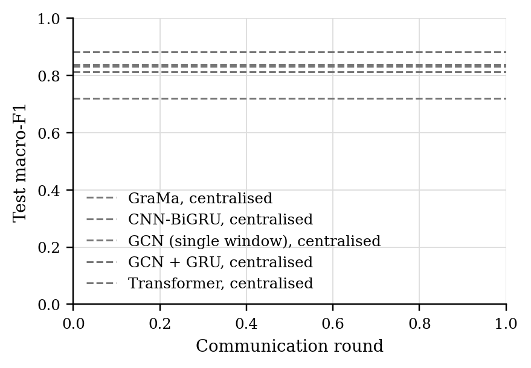
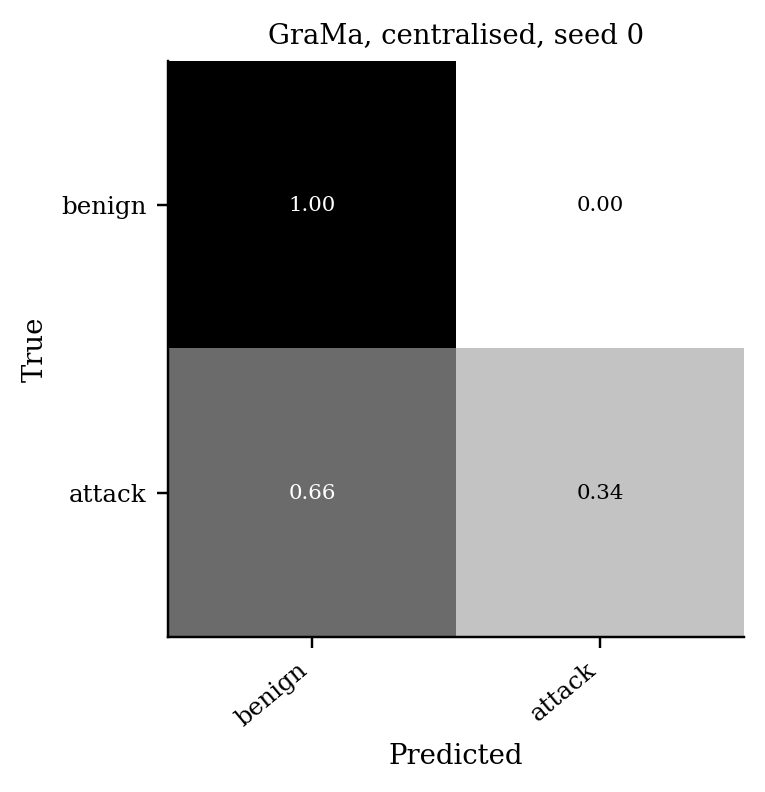

# GraMa results: `det_cantt3` profile

Generated 2026-10-09 04:51 from 25 runs.

- Data: can-train-and-test (`cantt_set_03_a39d5b2c.pt`), 99 CAN-ID nodes, windows of 64 frames (stride 32), sequences of 8 windows, edges: transition.
- Federated setting: 20 clients, 10 per round, 30 rounds, 2 local epoch(s), batch 64, lr 0.001, Dirichlet alpha 0.5 unless stated.
- Hardware: NVIDIA A100 80GB PCIe (79 GB).
- Seeds: [0, 1, 2, 3, 4]. Cells are mean ± std over seeds where there is more than one.

Sequences per class:

| Split | benign | attack |
|---|---|---|
| train | 11552 | 2012 |
| test | 5628 | 4098 |
| unknown_vehicle | 6047 | 4727 |
| unknown_attack | 10700 | 2884 |
| unknown_vehicle_and_attack | 8715 | 5584 |

## 1. Main comparison, no attack (Sec 6.2.1)

| Method | Accuracy | Macro-P | Macro-R | Macro-F1 | ROC-AUC | Detection rate | False alarm rate | Params | Train time (s) |
|---|---|---|---|---|---|---|---|---|---|
| GraMa, centralised | 0.8394 ± 0.0918 | 0.8916 ± 0.0500 | 0.8105 ± 0.1091 | 0.8124 ± 0.1186 | 0.8240 ± 0.1503 | 0.6270 ± 0.2188 | 0.0060 ± 0.0019 | 78,623 | 411 |
| CNN-BiGRU, centralised | 0.7745 ± 0.1062 | 0.8596 ± 0.0570 | 0.7330 ± 0.1257 | 0.7206 ± 0.1449 | 0.7621 ± 0.1481 | 0.4694 ± 0.2495 | 0.0033 ± 0.0041 | 39,635 | 104 |
| GCN (single window), centralised | 0.8900 ± 0.0068 | 0.9171 ± 0.0034 | 0.8704 ± 0.0084 | 0.8818 ± 0.0079 | 0.9309 ± 0.0072 | 0.7457 ± 0.0187 | 0.0050 ± 0.0024 | 8,314 | 61 |
| GCN + GRU, centralised | 0.8582 ± 0.0739 | 0.9045 ± 0.0379 | 0.8319 ± 0.0875 | 0.8379 ± 0.0988 | 0.8596 ± 0.0953 | 0.6643 ± 0.1744 | 0.0005 ± 0.0007 | 33,274 | 123 |
| Transformer, centralised | 0.8495 ± 0.0393 | 0.8968 ± 0.0217 | 0.8216 ± 0.0467 | 0.8323 ± 0.0479 | 0.9263 ± 0.0216 | 0.6448 ± 0.0937 | 0.0015 ± 0.0011 | 106,386 | 247 |

Detection rate = attack sequences flagged as any attack; false alarm rate = benign sequences flagged as an attack.

### Other test sets

The same models, tested on the extra sets. Macro scores are averaged over the classes each set contains. Frames with a CAN ID training never saw: test 6%, unknown car, known attacks 76%, known car, unknown attacks 0%, unknown car, unknown attacks 76%.

| Method | Unknown car, known attacks: Macro-F1 | Unknown car, known attacks: Detection rate | Unknown car, known attacks: False alarm rate | Known car, unknown attacks: Macro-F1 | Known car, unknown attacks: Detection rate | Known car, unknown attacks: False alarm rate | Unknown car, unknown attacks: Macro-F1 | Unknown car, unknown attacks: Detection rate | Unknown car, unknown attacks: False alarm rate |
|---|---|---|---|---|---|---|---|---|---|
| GraMa, centralised | 0.3912 ± 0.1111 | 0.7766 ± 0.3026 | 0.7336 ± 0.3885 | 0.5639 ± 0.0527 | 0.1374 ± 0.0716 | 0.0022 ± 0.0021 | 0.3387 ± 0.0709 | 0.6895 ± 0.3964 | 0.7095 ± 0.3956 |
| CNN-BiGRU, centralised | 0.3724 ± 0.1166 | 0.9254 ± 0.1351 | 0.8789 ± 0.2217 | 0.4710 ± 0.0339 | 0.0313 ± 0.0343 | 0.0019 ± 0.0028 | 0.3327 ± 0.1038 | 0.8958 ± 0.2081 | 0.8792 ± 0.2415 |
| GCN (single window), centralised | 0.3049 ± 0.0000 | 1.0000 ± 0.0000 | 1.0000 ± 0.0000 | 0.5442 ± 0.0102 | 0.1111 ± 0.0131 | 0.0036 ± 0.0016 | 0.2808 ± 0.0000 | 1.0000 ± 0.0000 | 1.0000 ± 0.0000 |
| GCN + GRU, centralised | 0.3497 ± 0.0711 | 0.8901 ± 0.2101 | 0.8900 ± 0.1997 | 0.4434 ± 0.0021 | 0.0027 ± 0.0021 | 0.0004 ± 0.0005 | 0.3311 ± 0.1004 | 0.8894 ± 0.2213 | 0.8764 ± 0.2471 |
| Transformer, centralised | 0.3088 ± 0.0189 | 0.9416 ± 0.0949 | 0.9827 ± 0.0204 | 0.5106 ± 0.0282 | 0.0723 ± 0.0301 | 0.0011 ± 0.0016 | 0.2796 ± 0.0027 | 0.9796 ± 0.0402 | 0.9971 ± 0.0055 |

### Per-class F1

| Method | benign | attack |
|---|---|---|
| GraMa, centralised | 0.8817 | 0.7431 |
| CNN-BiGRU, centralised | 0.8415 | 0.5996 |
| GCN (single window), centralised | 0.9128 | 0.8509 |
| GCN + GRU, centralised | 0.8935 | 0.7823 |
| Transformer, centralised | 0.8856 | 0.7791 |

## 5. Efficiency (Sec 6.1, 8.1)

One sequence covers 288 CAN frames. Latency is for one sequence at a time; throughput is for batches of 256 on the run's device.

| Model | Params | Size (KB) | Upload per client per round (KB) | CPU latency, 1 thread (ms/sequence) | GPU latency (ms/sequence) | Throughput (sequences/s) |
|---|---|---|---|---|---|---|
| GraMa | 78,623 | 307.1 | 307.1 | 5.17 | 3.29 | 2,059 |
| CNN-BiGRU | 39,635 | 154.8 | 154.8 | 1.20 | 3.54 | 33,508 |
| GCN (single window) | 8,314 | 32.5 | 32.5 | 0.34 | 2.42 | 71,539 |
| GCN + GRU | 33,274 | 130.0 | 130.0 | 1.06 | 3.60 | 8,838 |
| Transformer | 106,386 | 415.6 | 415.6 | 1.59 | 2.72 | 7,129 |

## Figures

PNG to look at, PDF with the same name for LaTeX.

**Test macro-F1 per round, no attack**

**Confusion matrix (row-normalised)**

## Notes

- Split: the dataset's own folders for set_03: train_01 trains, test_01 (known car, known attacks) tests, test_02-04 are the extra test sets.
- The CNN-BiGRU baseline is our implementation of that model family on the same sequences, trained with FedAvg; the original adaptive weighting (AWI) is not reproduced.
- The centralised row trains one model on all the training data with the same number of passes over the data as a federated run. It is a reference, not a federated method.
