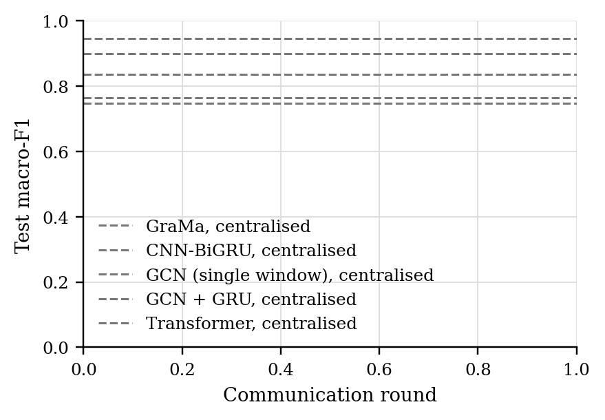
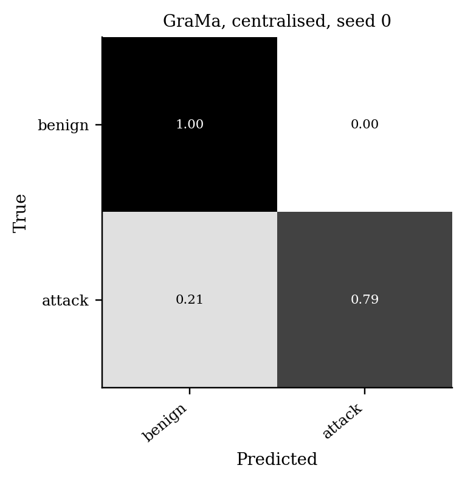

# GraMa results: `det_cantt4` profile

Generated 2026-10-09 05:46 from 25 runs.

- Data: can-train-and-test (`cantt_set_04_8ab7bf20.pt`), 51 CAN-ID nodes, windows of 64 frames (stride 32), sequences of 8 windows, edges: transition.
- Federated setting: 20 clients, 10 per round, 30 rounds, 2 local epoch(s), batch 64, lr 0.001, Dirichlet alpha 0.5 unless stated.
- Hardware: NVIDIA A100 80GB PCIe (79 GB).
- Seeds: [0, 1, 2, 3, 4]. Cells are mean ± std over seeds where there is more than one.

Sequences per class:

| Split | benign | attack |
|---|---|---|
| train | 11435 | 1757 |
| test | 8715 | 5584 |
| unknown_vehicle | 11147 | 4184 |
| unknown_attack | 6047 | 4727 |
| unknown_vehicle_and_attack | 4504 | 6713 |

## 1. Main comparison, no attack (Sec 6.2.1)

| Method | Accuracy | Macro-P | Macro-R | Macro-F1 | ROC-AUC | Detection rate | False alarm rate | Params | Train time (s) |
|---|---|---|---|---|---|---|---|---|---|
| GraMa, centralised | 0.8587 ± 0.0487 | 0.9066 ± 0.0270 | 0.8193 ± 0.0622 | 0.8347 ± 0.0637 | 0.9200 ± 0.0340 | 0.6394 ± 0.1237 | 0.0008 ± 0.0008 | 78,239 | 228 |
| CNN-BiGRU, centralised | 0.9497 ± 0.0111 | 0.9617 ± 0.0079 | 0.9358 ± 0.0142 | 0.9457 ± 0.0123 | 0.9950 ± 0.0023 | 0.8721 ± 0.0283 | 0.0006 ± 0.0005 | 38,867 | 101 |
| GCN (single window), centralised | 0.8027 ± 0.0324 | 0.8596 ± 0.0120 | 0.7523 ± 0.0443 | 0.7636 ± 0.0489 | 0.8978 ± 0.0069 | 0.5222 ± 0.0995 | 0.0177 ± 0.0137 | 7,930 | 53 |
| GCN + GRU, centralised | 0.7930 ± 0.0314 | 0.8626 ± 0.0132 | 0.7374 ± 0.0415 | 0.7477 ± 0.0471 | 0.8872 ± 0.0134 | 0.4839 ± 0.0878 | 0.0090 ± 0.0068 | 32,890 | 91 |
| Transformer, centralised | 0.9094 ± 0.0131 | 0.9349 ± 0.0077 | 0.8842 ± 0.0169 | 0.8997 ± 0.0156 | 0.9683 ± 0.0131 | 0.7691 ± 0.0342 | 0.0008 ± 0.0008 | 105,618 | 243 |

Detection rate = attack sequences flagged as any attack; false alarm rate = benign sequences flagged as an attack.

### Other test sets

The same models, tested on the extra sets. Macro scores are averaged over the classes each set contains. Frames with a CAN ID training never saw: test 1%, unknown car, known attacks 99%, known car, unknown attacks 5%, unknown car, unknown attacks 99%.

| Method | Unknown car, known attacks: Macro-F1 | Unknown car, known attacks: Detection rate | Unknown car, known attacks: False alarm rate | Known car, unknown attacks: Macro-F1 | Known car, unknown attacks: Detection rate | Known car, unknown attacks: False alarm rate | Unknown car, unknown attacks: Macro-F1 | Unknown car, unknown attacks: Detection rate | Unknown car, unknown attacks: False alarm rate |
|---|---|---|---|---|---|---|---|---|---|
| GraMa, centralised | 0.2857 ± 0.1049 | 0.7927 ± 0.3644 | 0.7814 ± 0.3869 | 0.8917 ± 0.0215 | 0.7673 ± 0.0442 | 0.0009 ± 0.0008 | 0.3781 ± 0.0117 | 0.7954 ± 0.3578 | 0.7905 ± 0.3955 |
| CNN-BiGRU, centralised | 0.2144 ± 0.0000 | 1.0000 ± 0.0000 | 1.0000 ± 0.0000 | 0.9064 ± 0.0121 | 0.7970 ± 0.0254 | 0.0004 ± 0.0003 | 0.3744 ± 0.0000 | 1.0000 ± 0.0000 | 1.0000 ± 0.0000 |
| GCN (single window), centralised | 0.2144 ± 0.0001 | 0.9998 ± 0.0004 | 1.0000 ± 0.0000 | 0.9190 ± 0.0040 | 0.8313 ± 0.0098 | 0.0071 ± 0.0050 | 0.3744 ± 0.0000 | 1.0000 ± 0.0001 | 1.0000 ± 0.0000 |
| GCN + GRU, centralised | 0.2160 ± 0.0033 | 0.9945 ± 0.0109 | 0.9977 ± 0.0047 | 0.9016 ± 0.0160 | 0.7895 ± 0.0343 | 0.0026 ± 0.0014 | 0.3671 ± 0.0105 | 0.9689 ± 0.0452 | 0.9997 ± 0.0006 |
| Transformer, centralised | 0.2144 ± 0.0000 | 1.0000 ± 0.0000 | 1.0000 ± 0.0000 | 0.9052 ± 0.0178 | 0.7951 ± 0.0371 | 0.0008 ± 0.0005 | 0.3744 ± 0.0000 | 1.0000 ± 0.0000 | 1.0000 ± 0.0000 |

### Per-class F1

| Method | benign | attack |
|---|---|---|
| GraMa, centralised | 0.8972 | 0.7723 |
| CNN-BiGRU, centralised | 0.9604 | 0.9310 |
| GCN (single window), centralised | 0.8591 | 0.6681 |
| GCN + GRU, centralised | 0.8542 | 0.6413 |
| Transformer, centralised | 0.9308 | 0.8685 |

## 5. Efficiency (Sec 6.1, 8.1)

One sequence covers 288 CAN frames. Latency is for one sequence at a time; throughput is for batches of 256 on the run's device.

| Model | Params | Size (KB) | Upload per client per round (KB) | CPU latency, 1 thread (ms/sequence) | GPU latency (ms/sequence) | Throughput (sequences/s) |
|---|---|---|---|---|---|---|
| GraMa | 78,239 | 305.6 | 305.6 | 2.95 | 3.14 | 5,867 |
| CNN-BiGRU | 38,867 | 151.8 | 151.8 | 1.21 | 3.16 | 41,286 |
| GCN (single window) | 7,930 | 31.0 | 31.0 | 0.32 | 1.31 | 476,808 |
| GCN + GRU | 32,890 | 128.5 | 128.5 | 0.73 | 0.82 | 116,168 |
| Transformer | 105,618 | 412.6 | 412.6 | 1.58 | 1.57 | 15,488 |

## Figures

PNG to look at, PDF with the same name for LaTeX.

**Test macro-F1 per round, no attack**

**Confusion matrix (row-normalised)**

## Notes

- Split: the dataset's own folders for set_04: train_01 trains, test_01 (known car, known attacks) tests, test_02-04 are the extra test sets.
- The CNN-BiGRU baseline is our implementation of that model family on the same sequences, trained with FedAvg; the original adaptive weighting (AWI) is not reproduced.
- The centralised row trains one model on all the training data with the same number of passes over the data as a federated run. It is a reference, not a federated method.
