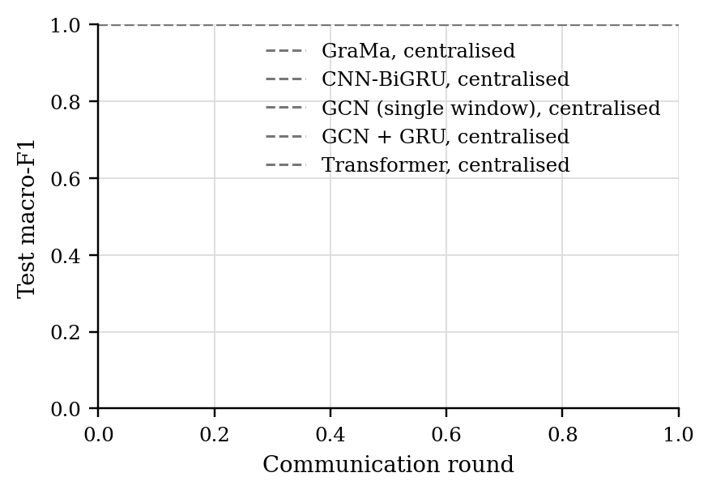
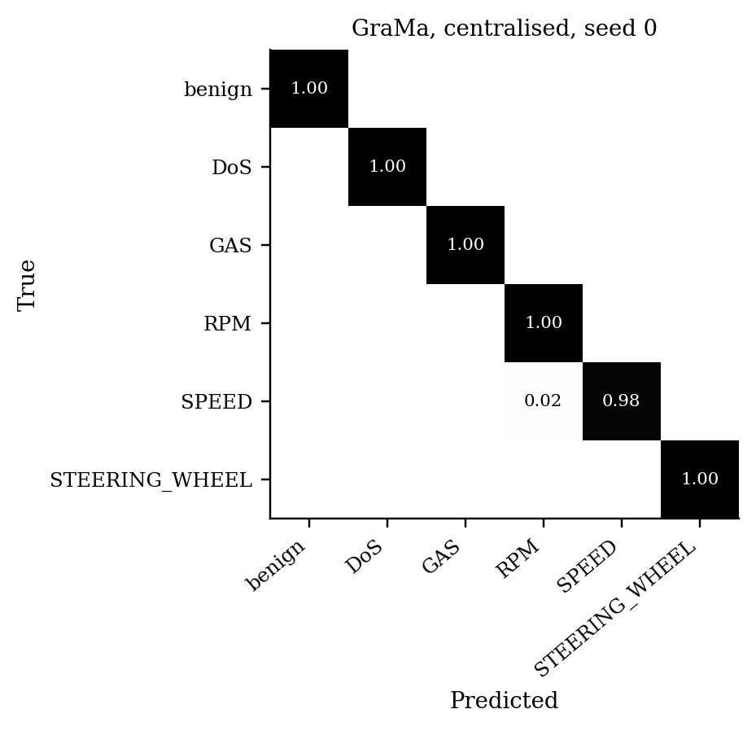

# GraMa results: `det_cic` profile

Generated 2026-10-09 05:59 from 15 runs.

- Data: real (`cic_iov2024_1427a6ad.pt`), 78 CAN-ID nodes, windows of 64 frames (stride 32), sequences of 8 windows, edges: transition.
- Federated setting: 20 clients, 10 per round, 30 rounds, 2 local epoch(s), batch 64, lr 0.001, Dirichlet alpha 0.5 unless stated.
- Hardware: NVIDIA A100 80GB PCIe (79 GB).
- Seeds: [0, 1, 2]. Cells are mean ± std over seeds where there is more than one.

Sequences per class:

| Split | benign | DoS | spoofing-GAS | spoofing-RPM | spoofing-SPEED | spoofing-STEERING_WHEEL |
|---|---|---|---|---|---|---|
| train | 4720 | 885 | 118 | 649 | 295 | 236 |
| test | 960 | 174 | 23 | 130 | 59 | 47 |

## 1. Main comparison, no attack (Sec 6.2.1)

| Method | Accuracy | Macro-P | Macro-R | Macro-F1 | ROC-AUC | Detection rate | False alarm rate | Params | Train time (s) |
|---|---|---|---|---|---|---|---|---|---|
| GraMa, centralised | 0.9998 ± 0.0003 | 0.9996 ± 0.0006 | 0.9991 ± 0.0013 | 0.9993 ± 0.0010 | 1.0000 ± 0.0000 | 1.0000 ± 0.0000 | 0.0000 ± 0.0000 | 78,587 | 108 |
| CNN-BiGRU, centralised | 1.0000 ± 0.0000 | 1.0000 ± 0.0000 | 1.0000 ± 0.0000 | 1.0000 ± 0.0000 | 1.0000 ± 0.0000 | 1.0000 ± 0.0000 | 0.0000 ± 0.0000 | 39,431 | 57 |
| GCN (single window), centralised | 1.0000 ± 0.0000 | 1.0000 ± 0.0000 | 1.0000 ± 0.0000 | 1.0000 ± 0.0000 | 1.0000 ± 0.0000 | 1.0000 ± 0.0000 | 0.0000 ± 0.0000 | 8,278 | 30 |
| GCN + GRU, centralised | 1.0000 ± 0.0000 | 1.0000 ± 0.0000 | 1.0000 ± 0.0000 | 1.0000 ± 0.0000 | 1.0000 ± 0.0000 | 1.0000 ± 0.0000 | 0.0000 ± 0.0000 | 33,238 | 53 |
| Transformer, centralised | 1.0000 ± 0.0000 | 1.0000 ± 0.0000 | 1.0000 ± 0.0000 | 1.0000 ± 0.0000 | 1.0000 ± 0.0000 | 1.0000 ± 0.0000 | 0.0000 ± 0.0000 | 106,182 | 125 |

Detection rate = attack sequences flagged as any attack; false alarm rate = benign sequences flagged as an attack.

### Per-class F1

| Method | benign | DoS | spoofing-GAS | spoofing-RPM | spoofing-SPEED | spoofing-STEERING_WHEEL |
|---|---|---|---|---|---|---|
| GraMa, centralised | 1.0000 | 1.0000 | 1.0000 | 0.9987 | 0.9972 | 1.0000 |
| CNN-BiGRU, centralised | 1.0000 | 1.0000 | 1.0000 | 1.0000 | 1.0000 | 1.0000 |
| GCN (single window), centralised | 1.0000 | 1.0000 | 1.0000 | 1.0000 | 1.0000 | 1.0000 |
| GCN + GRU, centralised | 1.0000 | 1.0000 | 1.0000 | 1.0000 | 1.0000 | 1.0000 |
| Transformer, centralised | 1.0000 | 1.0000 | 1.0000 | 1.0000 | 1.0000 | 1.0000 |

## 5. Efficiency (Sec 6.1, 8.1)

One sequence covers 288 CAN frames. Latency is for one sequence at a time; throughput is for batches of 256 on the run's device.

| Model | Params | Size (KB) | Upload per client per round (KB) | CPU latency, 1 thread (ms/sequence) | GPU latency (ms/sequence) | Throughput (sequences/s) |
|---|---|---|---|---|---|---|
| GraMa | 78,587 | 307.0 | 307.0 | 3.99 | 2.98 | 3,030 |
| CNN-BiGRU | 39,431 | 154.0 | 154.0 | 1.21 | 2.87 | 65,279 |
| GCN (single window) | 8,278 | 32.3 | 32.3 | 0.32 | 2.44 | 272,436 |
| GCN + GRU | 33,238 | 129.8 | 129.8 | 0.93 | 1.60 | 27,871 |
| Transformer | 106,182 | 414.8 | 414.8 | 1.59 | 3.62 | 6,826 |

## Figures

PNG to look at, PDF with the same name for LaTeX.

**Test macro-F1 per round, no attack**

**Confusion matrix (row-normalised)**

## Notes

- Split: every fifth block of 1000 rows in each file tests, the rest trains; windows never cross a block boundary.
- The CNN-BiGRU baseline is our implementation of that model family on the same sequences, trained with FedAvg; the original adaptive weighting (AWI) is not reproduced.
- The centralised row trains one model on all the training data with the same number of passes over the data as a federated run. It is a reference, not a federated method.
