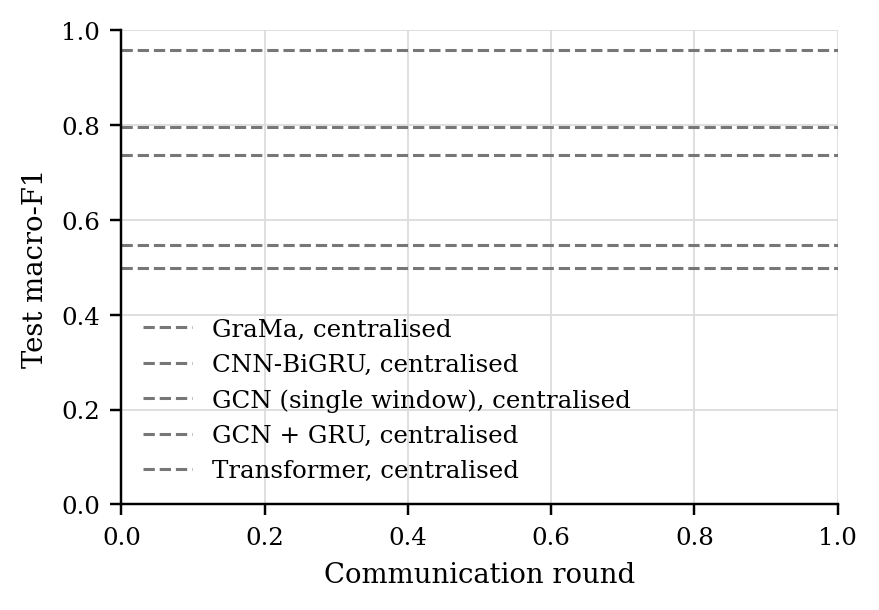
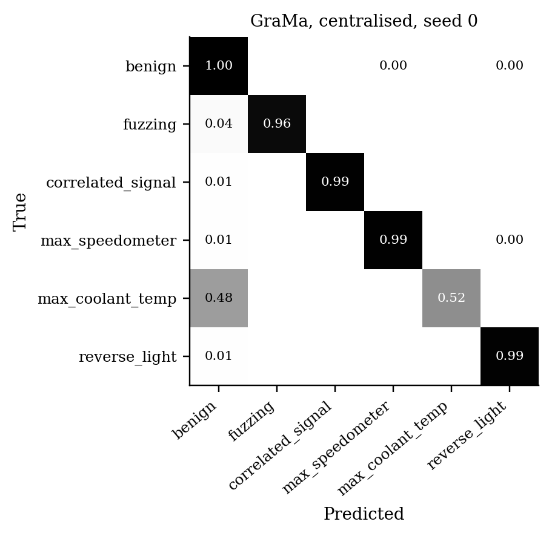

# GraMa results: `det_road_central` profile

Generated 2026-10-08 12:58 from 50 runs.

- Data: ROAD (`road_0bc0ca64.pt`), 107 CAN-ID nodes, windows of 64 frames (stride 32), sequences of 8 windows, edges: transition.
- Federated setting: 20 clients, 10 per round, 30 rounds, 2 local epoch(s), batch 64, lr 0.001, Dirichlet alpha 0.5 unless stated.
- Hardware: NVIDIA A100 80GB PCIe (79 GB).
- Seeds: [0, 1, 2, 3, 4, 5, 6, 7, 8, 9]. Cells are mean ± std over seeds where there is more than one.

Sequences per class:

| Split | benign | fuzzing | correlated_signal | max_speedometer | max_coolant_temp | reverse_light |
|---|---|---|---|---|---|---|
| train | 15570 | 215 | 3225 | 4275 | 42 | 6662 |
| test | 4795 | 27 | 965 | 4659 | 42 | 3651 |
| masquerade | 1383 | 0 | 472 | 2282 | 21 | 1788 |

## 1. Main comparison, no attack (Sec 6.2.1)

| Method | Accuracy | Macro-P | Macro-R | Macro-F1 | ROC-AUC | Detection rate | False alarm rate | Params | Train time (s) |
|---|---|---|---|---|---|---|---|---|---|
| GraMa, centralised | 0.9872 ± 0.0175 | 0.9816 ± 0.0207 | 0.9493 ± 0.0441 | 0.9588 ± 0.0322 | 0.9978 ± 0.0029 | 0.9884 ± 0.0106 | 0.0028 ± 0.0021 | 78,819 | 1048 |
| CNN-BiGRU, centralised | 0.7164 ± 0.0887 | 0.8026 ± 0.0730 | 0.7624 ± 0.0664 | 0.7360 ± 0.0656 | 0.9457 ± 0.0362 | 0.9652 ± 0.0262 | 0.0180 ± 0.0176 | 39,895 | 228 |
| GCN (single window), centralised | 0.6969 ± 0.0559 | 0.5875 ± 0.0639 | 0.5970 ± 0.0422 | 0.5468 ± 0.0546 | 0.9487 ± 0.0156 | 0.7584 ± 0.0590 | 0.0333 ± 0.0245 | 8,510 | 135 |
| GCN + GRU, centralised | 0.6614 ± 0.0993 | 0.5959 ± 0.1073 | 0.5483 ± 0.0885 | 0.4987 ± 0.0882 | 0.9310 ± 0.0384 | 0.8294 ± 0.1287 | 0.0573 ± 0.0531 | 33,470 | 269 |
| Transformer, centralised | 0.8997 ± 0.0413 | 0.8204 ± 0.0651 | 0.7893 ± 0.0569 | 0.7950 ± 0.0648 | 0.9867 ± 0.0078 | 0.8658 ± 0.0669 | 0.0342 ± 0.0196 | 106,646 | 532 |

Detection rate = attack sequences flagged as any attack; false alarm rate = benign sequences flagged as an attack.

### Other test sets

The same models, tested on the extra sets. Macro scores are averaged over the classes each set contains. Frames with a CAN ID training never saw: test 0%, masquerade attacks only 0%.

| Method | Masquerade attacks only: Macro-F1 | Masquerade attacks only: Detection rate | Masquerade attacks only: False alarm rate |
|---|---|---|---|
| GraMa, centralised | 0.9548 ± 0.0395 | 0.9886 ± 0.0097 | 0.0033 ± 0.0025 |
| CNN-BiGRU, centralised | 0.7024 ± 0.0791 | 0.9721 ± 0.0242 | 0.0206 ± 0.0256 |
| GCN (single window), centralised | 0.5669 ± 0.0514 | 0.8337 ± 0.0669 | 0.0473 ± 0.0403 |
| GCN + GRU, centralised | 0.5308 ± 0.0879 | 0.8869 ± 0.1150 | 0.0785 ± 0.0666 |
| Transformer, centralised | 0.6875 ± 0.0822 | 0.7784 ± 0.0700 | 0.0500 ± 0.0303 |

### Per-class F1

| Method | benign | fuzzing | correlated_signal | max_speedometer | max_coolant_temp | reverse_light |
|---|---|---|---|---|---|---|
| GraMa, centralised | 0.9876 | 0.9887 | 0.9930 | 0.9908 | 0.8104 | 0.9821 |
| CNN-BiGRU, centralised | 0.9587 | 0.9338 | 0.9587 | 0.4033 | 0.6099 | 0.5516 |
| GCN (single window), centralised | 0.7950 | 0.6114 | 0.6524 | 0.5368 | 0.0000 | 0.6852 |
| GCN + GRU, centralised | 0.8373 | 0.4834 | 0.5676 | 0.4305 | 0.0563 | 0.6170 |
| Transformer, centralised | 0.8698 | 0.9866 | 0.9984 | 0.9994 | 0.1506 | 0.7651 |

## 5. Efficiency (Sec 6.1, 8.1)

One sequence covers 288 CAN frames. Latency is for one sequence at a time; throughput is for batches of 256 on the run's device.

| Model | Params | Size (KB) | Upload per client per round (KB) | CPU latency, 1 thread (ms/sequence) | GPU latency (ms/sequence) | Throughput (sequences/s) |
|---|---|---|---|---|---|---|
| GraMa | 78,819 | 307.9 | 307.9 | 5.52 | 4.16 | 1,760 |
| CNN-BiGRU | 39,895 | 155.8 | 155.8 | 1.20 | 1.57 | 192,966 |
| GCN (single window) | 8,510 | 33.2 | 33.2 | 0.36 | 1.46 | 124,515 |
| GCN + GRU | 33,470 | 130.7 | 130.7 | 1.08 | 1.67 | 11,360 |
| Transformer | 106,646 | 416.6 | 416.6 | 1.55 | 1.55 | 8,907 |

## Figures

PNG to look at, PDF with the same name for LaTeX.

**Test macro-F1 per round, no attack**

**Confusion matrix (row-normalised)**

## Notes

- Split: by capture: attack instances 1-2 train, instance 3 tests (with its masquerade version); the coolant attack, recorded once, is cut in the middle of the injection; ambient captures are held out whole.
- The CNN-BiGRU baseline is our implementation of that model family on the same sequences, trained with FedAvg; the original adaptive weighting (AWI) is not reproduced.
- The centralised row trains one model on all the training data with the same number of passes over the data as a federated run. It is a reference, not a federated method.
