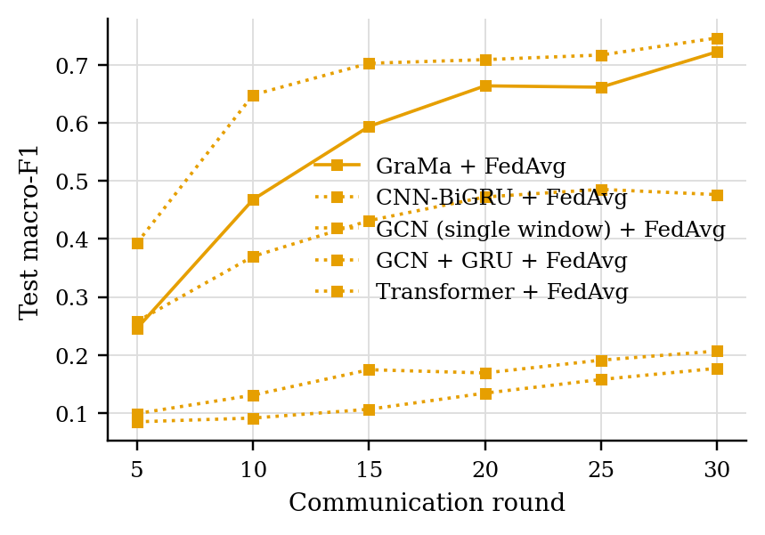
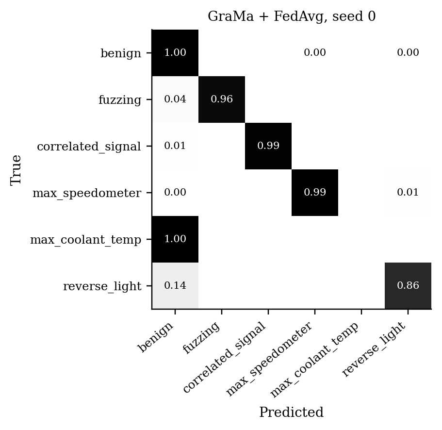
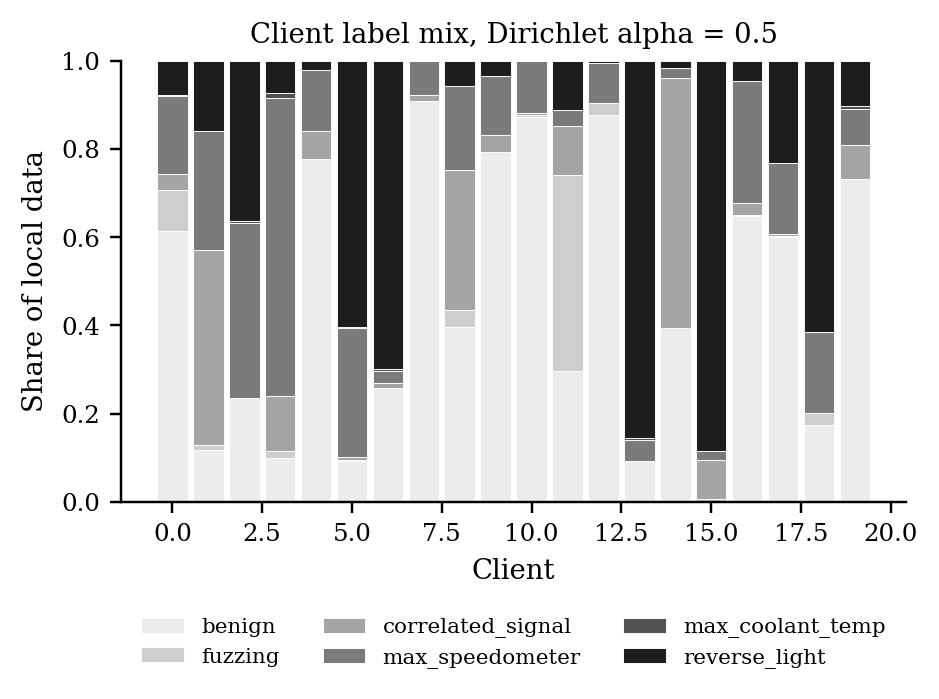

# GraMa results: `det_road_fedavg` profile

Generated 2026-10-09 01:27 from 25 runs.

- Data: ROAD (`road_0bc0ca64.pt`), 107 CAN-ID nodes, windows of 64 frames (stride 32), sequences of 8 windows, edges: transition.
- Federated setting: 20 clients, 10 per round, 30 rounds, 2 local epoch(s), batch 64, lr 0.001, Dirichlet alpha 0.5 unless stated.
- Hardware: NVIDIA A100 80GB PCIe (79 GB).
- Seeds: [0, 1, 2, 3, 4]. Cells are mean ± std over seeds where there is more than one.

Sequences per class:

| Split | benign | fuzzing | correlated_signal | max_speedometer | max_coolant_temp | reverse_light |
|---|---|---|---|---|---|---|
| train | 15570 | 215 | 3225 | 4275 | 42 | 6662 |
| test | 4795 | 27 | 965 | 4659 | 42 | 3651 |
| masquerade | 1383 | 0 | 472 | 2282 | 21 | 1788 |

## 1. Main comparison, no attack (Sec 6.2.1)

| Method | Accuracy | Macro-P | Macro-R | Macro-F1 | ROC-AUC | Detection rate | False alarm rate | Params | Train time (s) |
|---|---|---|---|---|---|---|---|---|---|
| GraMa + FedAvg | 0.8873 ± 0.1097 | 0.7392 ± 0.1207 | 0.7247 ± 0.1349 | 0.7231 ± 0.1409 | 0.9746 ± 0.0197 | 0.9292 ± 0.0442 | 0.0085 ± 0.0145 | 78,819 | 599 |
| CNN-BiGRU + FedAvg | 0.6356 ± 0.1133 | 0.5191 ± 0.1877 | 0.5353 ± 0.1505 | 0.4767 ± 0.1855 | 0.8888 ± 0.0770 | 0.8420 ± 0.0515 | 0.0229 ± 0.0190 | 39,895 | 147 |
| GCN (single window) + FedAvg | 0.4076 ± 0.0536 | 0.1977 ± 0.0512 | 0.2207 ± 0.0219 | 0.1767 ± 0.0344 | 0.5962 ± 0.0383 | 0.4119 ± 0.1593 | 0.1221 ± 0.0975 | 8,510 | 142 |
| GCN + GRU + FedAvg | 0.4391 ± 0.0454 | 0.2166 ± 0.0289 | 0.2468 ± 0.0168 | 0.2065 ± 0.0221 | 0.6525 ± 0.0687 | 0.5465 ± 0.1110 | 0.1331 ± 0.0821 | 33,470 | 275 |
| Transformer + FedAvg | 0.8692 ± 0.0326 | 0.7804 ± 0.0081 | 0.7433 ± 0.0207 | 0.7471 ± 0.0254 | 0.9715 ± 0.0133 | 0.8157 ± 0.0553 | 0.0266 ± 0.0198 | 106,646 | 571 |

Detection rate = attack sequences flagged as any attack; false alarm rate = benign sequences flagged as an attack.

### Other test sets

The same models, tested on the extra sets. Macro scores are averaged over the classes each set contains. Frames with a CAN ID training never saw: test 0%, masquerade attacks only 0%.

| Method | Masquerade attacks only: Macro-F1 | Masquerade attacks only: Detection rate | Masquerade attacks only: False alarm rate |
|---|---|---|---|
| GraMa + FedAvg | 0.7219 ± 0.0988 | 0.9414 ± 0.0456 | 0.0129 ± 0.0218 |
| CNN-BiGRU + FedAvg | 0.4755 ± 0.1309 | 0.8838 ± 0.0484 | 0.0341 ± 0.0260 |
| GCN (single window) + FedAvg | 0.1936 ± 0.0469 | 0.4311 ± 0.1700 | 0.1358 ± 0.1023 |
| GCN + GRU + FedAvg | 0.2295 ± 0.0204 | 0.5506 ± 0.1177 | 0.1604 ± 0.0872 |
| Transformer + FedAvg | 0.5829 ± 0.0478 | 0.6760 ± 0.0589 | 0.0385 ± 0.0283 |

### Per-class F1

| Method | benign | fuzzing | correlated_signal | max_speedometer | max_coolant_temp | reverse_light |
|---|---|---|---|---|---|---|
| GraMa + FedAvg | 0.9327 | 0.7815 | 0.9270 | 0.8625 | 0.0000 | 0.8349 |
| CNN-BiGRU + FedAvg | 0.8569 | 0.4961 | 0.5450 | 0.4367 | 0.0000 | 0.5252 |
| GCN (single window) + FedAvg | 0.5831 | 0.0000 | 0.0397 | 0.1362 | 0.0000 | 0.3015 |
| GCN + GRU + FedAvg | 0.6315 | 0.0000 | 0.0628 | 0.2185 | 0.0000 | 0.3265 |
| Transformer + FedAvg | 0.8362 | 0.9733 | 0.9984 | 0.9993 | 0.0000 | 0.6754 |

## 5. Efficiency (Sec 6.1, 8.1)

One sequence covers 288 CAN frames. Latency is for one sequence at a time; throughput is for batches of 256 on the run's device.

| Model | Params | Size (KB) | Upload per client per round (KB) | CPU latency, 1 thread (ms/sequence) | GPU latency (ms/sequence) | Throughput (sequences/s) |
|---|---|---|---|---|---|---|
| GraMa | 78,819 | 307.9 | 307.9 | 5.48 | 2.92 | 2,050 |
| CNN-BiGRU | 39,895 | 155.8 | 155.8 | 1.18 | 1.02 | 173,615 |
| GCN (single window) | 8,510 | 33.2 | 33.2 | 0.34 | 1.30 | 131,856 |
| GCN + GRU | 33,470 | 130.7 | 130.7 | 1.14 | 0.93 | 14,740 |
| Transformer | 106,646 | 416.6 | 416.6 | 1.62 | 1.22 | 9,420 |

## Figures

PNG to look at, PDF with the same name for LaTeX.

**Test macro-F1 per round, no attack**

**Confusion matrix (row-normalised)**

**Label mix per client**

## Notes

- Split: by capture: attack instances 1-2 train, instance 3 tests (with its masquerade version); the coolant attack, recorded once, is cut in the middle of the injection; ambient captures are held out whole.
- The CNN-BiGRU baseline is our implementation of that model family on the same sequences, trained with FedAvg; the original adaptive weighting (AWI) is not reproduced.
- The centralised row trains one model on all the training data with the same number of passes over the data as a federated run. It is a reference, not a federated method.
