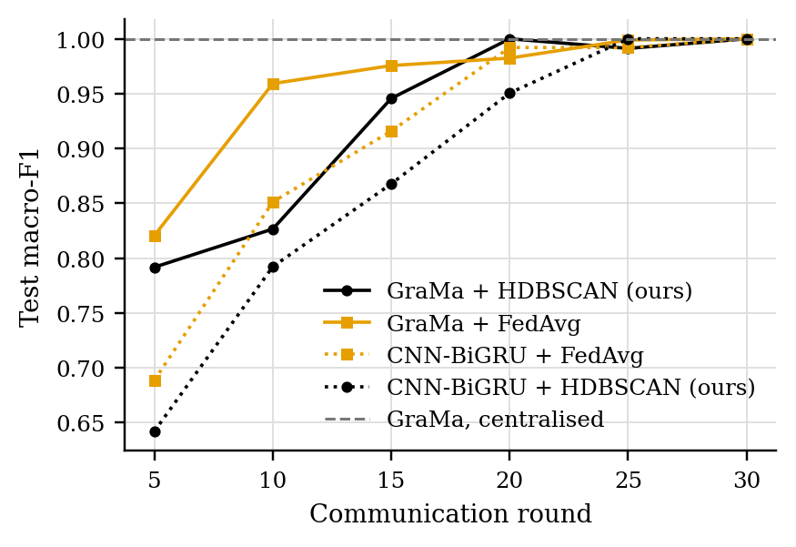
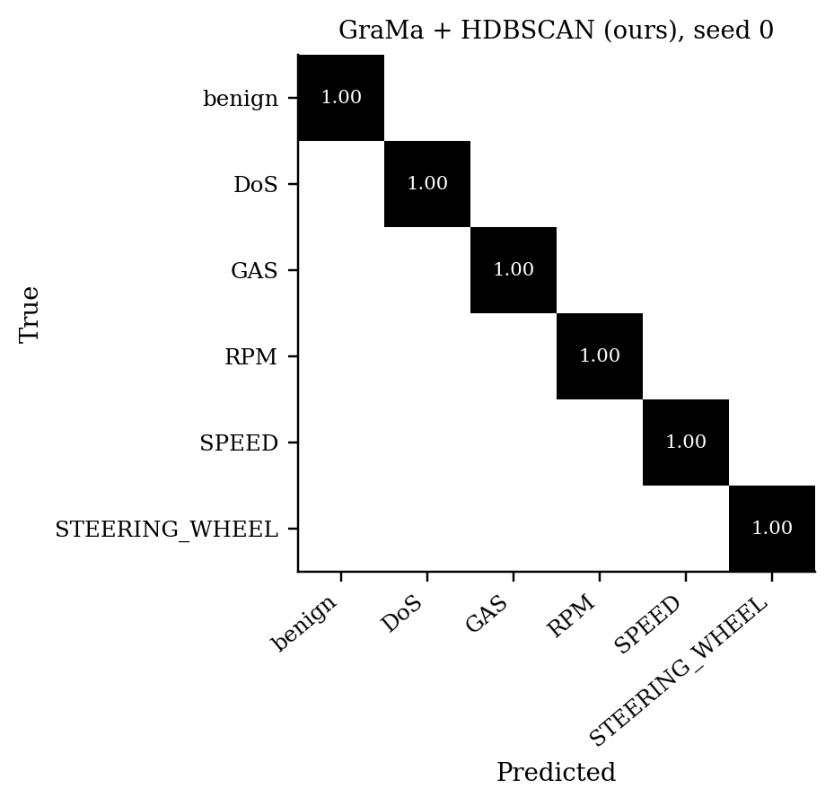
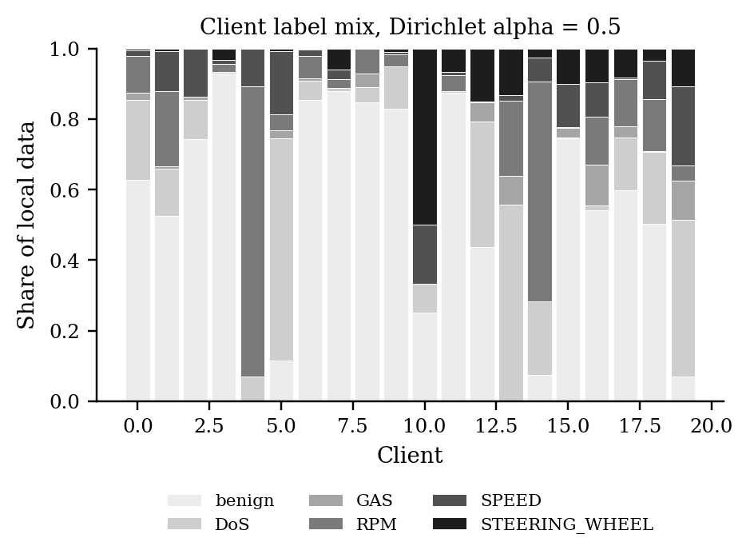
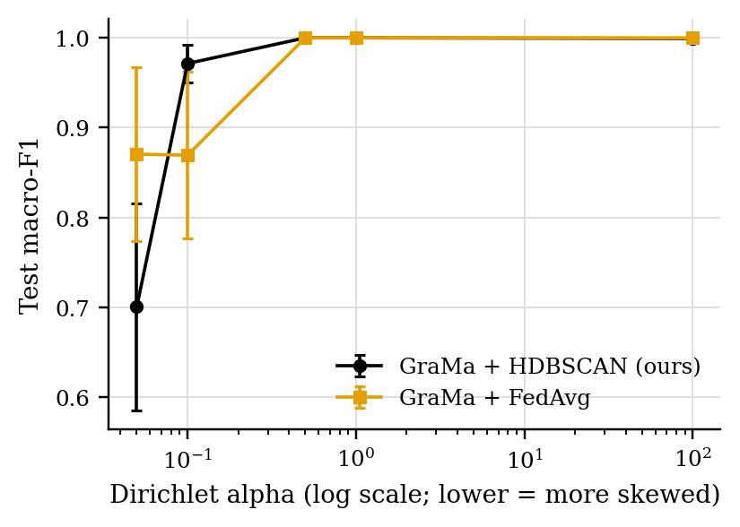
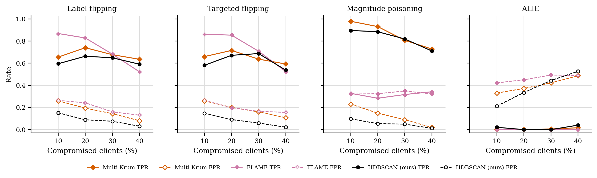

# GraMa results: `full` profile

Generated 2026-10-03 23:01 from 291 runs.

- Data: real (`cic_iov2024_1427a6ad.pt`), 78 CAN-ID nodes, windows of 64 frames (stride 32), sequences of 8 windows, edges: transition.
- Federated setting: 20 clients, 10 per round, 30 rounds, 2 local epoch(s), batch 64, lr 0.001, Dirichlet alpha 0.5 unless stated.
- Hardware: NVIDIA A100 80GB PCIe (79 GB).
- Seeds: [0, 1, 2]. Cells are mean ± std over seeds where there is more than one.

Sequences per class:

| Split | benign | DoS | spoofing-GAS | spoofing-RPM | spoofing-SPEED | spoofing-STEERING_WHEEL |
|---|---|---|---|---|---|---|
| train | 4720 | 885 | 118 | 649 | 295 | 236 |
| test | 960 | 174 | 23 | 130 | 59 | 47 |

## 1. Main comparison, no attack (Sec 6.2.1)

| Method | Accuracy | Macro-P | Macro-R | Macro-F1 | ROC-AUC | Detection rate | False alarm rate | Params | Train time (s) |
|---|---|---|---|---|---|---|---|---|---|
| GraMa + HDBSCAN (ours) | 1.0000 ± 0.0000 | 1.0000 ± 0.0000 | 1.0000 ± 0.0000 | 1.0000 ± 0.0000 | 1.0000 ± 0.0000 | 1.0000 ± 0.0000 | 0.0000 ± 0.0000 | 78,587 | 134 |
| GraMa + FedAvg | 1.0000 ± 0.0000 | 1.0000 ± 0.0000 | 1.0000 ± 0.0000 | 1.0000 ± 0.0000 | 1.0000 ± 0.0000 | 1.0000 ± 0.0000 | 0.0000 ± 0.0000 | 78,587 | 124 |
| CNN-BiGRU + FedAvg | 1.0000 ± 0.0000 | 1.0000 ± 0.0000 | 1.0000 ± 0.0000 | 1.0000 ± 0.0000 | 1.0000 ± 0.0000 | 1.0000 ± 0.0000 | 0.0000 ± 0.0000 | 39,431 | 15 |
| CNN-BiGRU + HDBSCAN (ours) | 1.0000 ± 0.0000 | 1.0000 ± 0.0000 | 1.0000 ± 0.0000 | 1.0000 ± 0.0000 | 1.0000 ± 0.0000 | 1.0000 ± 0.0000 | 0.0000 ± 0.0000 | 39,431 | 35 |
| GraMa, centralised | 0.9998 ± 0.0003 | 0.9996 ± 0.0006 | 0.9991 ± 0.0013 | 0.9993 ± 0.0010 | 1.0000 ± 0.0000 | 1.0000 ± 0.0000 | 0.0000 ± 0.0000 | 78,587 | 108 |

Detection rate = attack sequences flagged as any attack; false alarm rate = benign sequences flagged as an attack.

### Per-class F1

| Method | benign | DoS | spoofing-GAS | spoofing-RPM | spoofing-SPEED | spoofing-STEERING_WHEEL |
|---|---|---|---|---|---|---|
| GraMa + HDBSCAN (ours) | 1.0000 | 1.0000 | 1.0000 | 1.0000 | 1.0000 | 1.0000 |
| GraMa + FedAvg | 1.0000 | 1.0000 | 1.0000 | 1.0000 | 1.0000 | 1.0000 |
| CNN-BiGRU + FedAvg | 1.0000 | 1.0000 | 1.0000 | 1.0000 | 1.0000 | 1.0000 |
| CNN-BiGRU + HDBSCAN (ours) | 1.0000 | 1.0000 | 1.0000 | 1.0000 | 1.0000 | 1.0000 |
| GraMa, centralised | 1.0000 | 1.0000 | 1.0000 | 0.9987 | 0.9972 | 1.0000 |

## 2. Non-IID data (Sec 6.2.2)

GraMa, no attack. Lower alpha means more skewed clients; alpha = 100 is close to IID.

| Dirichlet alpha | HDBSCAN (ours) macro-F1 | FedAvg macro-F1 | HDBSCAN (ours) accuracy | FedAvg accuracy |
|---|---|---|---|---|
| 0.05 | 0.7006 ± 0.1151 | 0.8706 ± 0.0971 | 0.8756 ± 0.0591 | 0.9749 ± 0.0141 |
| 0.1 | 0.9714 ± 0.0209 | 0.8694 ± 0.0926 | 0.9950 ± 0.0036 | 0.9864 ± 0.0102 |
| 0.5 | 1.0000 ± 0.0000 | 1.0000 ± 0.0000 | 1.0000 ± 0.0000 | 1.0000 ± 0.0000 |
| 1 | 1.0000 ± 0.0000 | 1.0000 ± 0.0000 | 1.0000 ± 0.0000 | 1.0000 ± 0.0000 |
| 100 | 0.9993 ± 0.0010 | 1.0000 ± 0.0000 | 0.9998 ± 0.0003 | 1.0000 ± 0.0000 |

## 3. Poisoning (Sec 6.2.3)

GraMa, Dirichlet alpha 0.5. Columns are the share of compromised clients; 0 is the clean run.

### Label flipping: Macro-F1

| Aggregator | 0% | 10% | 20% | 30% | 40% |
|---|---|---|---|---|---|
| FedAvg | 1.0000 ± 0.0000 | 1.0000 ± 0.0000 | 1.0000 ± 0.0000 | 0.8425 ± 0.1575 | 0.8032 ± 0.0922 |
| Median | 1.0000 ± 0.0000 | 1.0000 ± 0.0000 | 1.0000 ± 0.0000 | 1.0000 ± 0.0000 | 0.9992 ± 0.0008 |
| Trimmed mean | 1.0000 ± 0.0000 | 1.0000 ± 0.0000 | 1.0000 ± 0.0000 | 0.9892 ± 0.0108 | 0.8508 ± 0.1492 |
| Multi-Krum | 1.0000 ± 0.0000 | 1.0000 ± 0.0000 | 1.0000 ± 0.0000 | 1.0000 ± 0.0000 | 1.0000 ± 0.0000 |
| Norm clipping | 1.0000 ± 0.0000 | 1.0000 ± 0.0000 | 1.0000 ± 0.0000 | 1.0000 ± 0.0000 | 0.9902 ± 0.0098 |
| FLAME | 1.0000 ± 0.0000 | 1.0000 ± 0.0000 | 1.0000 ± 0.0000 | 1.0000 ± 0.0000 | 1.0000 ± 0.0000 |
| HDBSCAN (ours) | 1.0000 ± 0.0000 | 1.0000 ± 0.0000 | 1.0000 ± 0.0000 | 1.0000 ± 0.0000 | 1.0000 ± 0.0000 |

### Label flipping: Detection rate

| Aggregator | 0% | 10% | 20% | 30% | 40% |
|---|---|---|---|---|---|
| FedAvg | 1.0000 ± 0.0000 | 1.0000 ± 0.0000 | 1.0000 ± 0.0000 | 1.0000 ± 0.0000 | 1.0000 ± 0.0000 |
| Median | 1.0000 ± 0.0000 | 1.0000 ± 0.0000 | 1.0000 ± 0.0000 | 1.0000 ± 0.0000 | 0.9988 ± 0.0012 |
| Trimmed mean | 1.0000 ± 0.0000 | 1.0000 ± 0.0000 | 1.0000 ± 0.0000 | 1.0000 ± 0.0000 | 1.0000 ± 0.0000 |
| Multi-Krum | 1.0000 ± 0.0000 | 1.0000 ± 0.0000 | 1.0000 ± 0.0000 | 1.0000 ± 0.0000 | 1.0000 ± 0.0000 |
| Norm clipping | 1.0000 ± 0.0000 | 1.0000 ± 0.0000 | 1.0000 ± 0.0000 | 1.0000 ± 0.0000 | 1.0000 ± 0.0000 |
| FLAME | 1.0000 ± 0.0000 | 1.0000 ± 0.0000 | 1.0000 ± 0.0000 | 1.0000 ± 0.0000 | 1.0000 ± 0.0000 |
| HDBSCAN (ours) | 1.0000 ± 0.0000 | 1.0000 ± 0.0000 | 1.0000 ± 0.0000 | 1.0000 ± 0.0000 | 1.0000 ± 0.0000 |

### Targeted flipping (attack -> benign): Macro-F1

| Aggregator | 0% | 10% | 20% | 30% | 40% |
|---|---|---|---|---|---|
| FedAvg | 1.0000 ± 0.0000 | 1.0000 ± 0.0000 | 1.0000 ± 0.0000 | 0.8296 ± 0.1516 | 0.7627 ± 0.0480 |
| Median | 1.0000 ± 0.0000 | 1.0000 ± 0.0000 | 1.0000 ± 0.0000 | 0.9906 ± 0.0094 | 0.8008 ± 0.1733 |
| Trimmed mean | 1.0000 ± 0.0000 | 1.0000 ± 0.0000 | 1.0000 ± 0.0000 | 0.9076 ± 0.0924 | 0.7847 ± 0.1954 |
| Multi-Krum | 1.0000 ± 0.0000 | 1.0000 ± 0.0000 | 1.0000 ± 0.0000 | 0.9777 ± 0.0223 | 0.9890 ± 0.0086 |
| Norm clipping | 1.0000 ± 0.0000 | 1.0000 ± 0.0000 | 1.0000 ± 0.0000 | 0.8829 ± 0.1171 | 0.7817 ± 0.1143 |
| FLAME | 1.0000 ± 0.0000 | 1.0000 ± 0.0000 | 1.0000 ± 0.0000 | 0.9988 ± 0.0012 | 0.9743 ± 0.0257 |
| HDBSCAN (ours) | 1.0000 ± 0.0000 | 1.0000 ± 0.0000 | 1.0000 ± 0.0000 | 0.9988 ± 0.0012 | 0.9988 ± 0.0012 |

### Targeted flipping (attack -> benign): Detection rate

| Aggregator | 0% | 10% | 20% | 30% | 40% |
|---|---|---|---|---|---|
| FedAvg | 1.0000 ± 0.0000 | 1.0000 ± 0.0000 | 1.0000 ± 0.0000 | 0.8383 ± 0.1085 | 0.8360 ± 0.0808 |
| Median | 1.0000 ± 0.0000 | 1.0000 ± 0.0000 | 1.0000 ± 0.0000 | 0.9734 ± 0.0266 | 0.8487 ± 0.1513 |
| Trimmed mean | 1.0000 ± 0.0000 | 1.0000 ± 0.0000 | 1.0000 ± 0.0000 | 0.7806 ± 0.2194 | 0.6212 ± 0.3510 |
| Multi-Krum | 1.0000 ± 0.0000 | 1.0000 ± 0.0000 | 1.0000 ± 0.0000 | 0.9723 ± 0.0277 | 0.9723 ± 0.0277 |
| Norm clipping | 1.0000 ± 0.0000 | 1.0000 ± 0.0000 | 1.0000 ± 0.0000 | 0.7252 ± 0.2748 | 0.8487 ± 0.1490 |
| FLAME | 1.0000 ± 0.0000 | 1.0000 ± 0.0000 | 1.0000 ± 0.0000 | 1.0000 ± 0.0000 | 1.0000 ± 0.0000 |
| HDBSCAN (ours) | 1.0000 ± 0.0000 | 1.0000 ± 0.0000 | 1.0000 ± 0.0000 | 1.0000 ± 0.0000 | 1.0000 ± 0.0000 |

### Magnitude poisoning: Macro-F1

| Aggregator | 0% | 10% | 20% | 30% | 40% |
|---|---|---|---|---|---|
| FedAvg | 1.0000 ± 0.0000 | 1.0000 ± 0.0000 | 0.8668 ± 0.1093 | 0.3575 ± 0.0162 | 0.3149 ± 0.0090 |
| Median | 1.0000 ± 0.0000 | 1.0000 ± 0.0000 | 1.0000 ± 0.0000 | 1.0000 ± 0.0000 | 0.9056 ± 0.0944 |
| Trimmed mean | 1.0000 ± 0.0000 | 1.0000 ± 0.0000 | 1.0000 ± 0.0000 | 1.0000 ± 0.0000 | 0.8685 ± 0.0804 |
| Multi-Krum | 1.0000 ± 0.0000 | 1.0000 ± 0.0000 | 1.0000 ± 0.0000 | 1.0000 ± 0.0000 | 0.8852 ± 0.1148 |
| Norm clipping | 1.0000 ± 0.0000 | 1.0000 ± 0.0000 | 1.0000 ± 0.0000 | 1.0000 ± 0.0000 | 1.0000 ± 0.0000 |
| FLAME | 1.0000 ± 0.0000 | 1.0000 ± 0.0000 | 1.0000 ± 0.0000 | 1.0000 ± 0.0000 | 0.9792 ± 0.0208 |
| HDBSCAN (ours) | 1.0000 ± 0.0000 | 1.0000 ± 0.0000 | 1.0000 ± 0.0000 | 0.9992 ± 0.0008 | 0.9583 ± 0.0195 |

### Magnitude poisoning: Detection rate

| Aggregator | 0% | 10% | 20% | 30% | 40% |
|---|---|---|---|---|---|
| FedAvg | 1.0000 ± 0.0000 | 1.0000 ± 0.0000 | 0.9861 ± 0.0139 | 1.0000 ± 0.0000 | 0.6917 ± 0.1212 |
| Median | 1.0000 ± 0.0000 | 1.0000 ± 0.0000 | 1.0000 ± 0.0000 | 1.0000 ± 0.0000 | 1.0000 ± 0.0000 |
| Trimmed mean | 1.0000 ± 0.0000 | 1.0000 ± 0.0000 | 1.0000 ± 0.0000 | 1.0000 ± 0.0000 | 0.9988 ± 0.0012 |
| Multi-Krum | 1.0000 ± 0.0000 | 1.0000 ± 0.0000 | 1.0000 ± 0.0000 | 1.0000 ± 0.0000 | 1.0000 ± 0.0000 |
| Norm clipping | 1.0000 ± 0.0000 | 1.0000 ± 0.0000 | 1.0000 ± 0.0000 | 1.0000 ± 0.0000 | 1.0000 ± 0.0000 |
| FLAME | 1.0000 ± 0.0000 | 1.0000 ± 0.0000 | 1.0000 ± 0.0000 | 1.0000 ± 0.0000 | 1.0000 ± 0.0000 |
| HDBSCAN (ours) | 1.0000 ± 0.0000 | 1.0000 ± 0.0000 | 1.0000 ± 0.0000 | 0.9988 ± 0.0012 | 1.0000 ± 0.0000 |

### ALIE (crafted to look honest): Macro-F1

| Aggregator | 0% | 10% | 20% | 30% | 40% |
|---|---|---|---|---|---|
| FedAvg | 1.0000 ± 0.0000 | 1.0000 ± 0.0000 | 1.0000 ± 0.0000 | 0.9992 ± 0.0008 | 0.8307 ± 0.1693 |
| Median | 1.0000 ± 0.0000 | 1.0000 ± 0.0000 | 1.0000 ± 0.0000 | 0.8140 ± 0.0940 | 0.4588 ± 0.1189 |
| Trimmed mean | 1.0000 ± 0.0000 | 1.0000 ± 0.0000 | 1.0000 ± 0.0000 | 0.9975 ± 0.0025 | 0.8039 ± 0.1961 |
| Multi-Krum | 1.0000 ± 0.0000 | 1.0000 ± 0.0000 | 1.0000 ± 0.0000 | 0.9963 ± 0.0037 | 0.7563 ± 0.1578 |
| Norm clipping | 1.0000 ± 0.0000 | 1.0000 ± 0.0000 | 1.0000 ± 0.0000 | 0.9992 ± 0.0008 | 0.9254 ± 0.0746 |
| FLAME | 1.0000 ± 0.0000 | 1.0000 ± 0.0000 | 1.0000 ± 0.0000 | 0.9384 ± 0.0616 | 0.5972 ± 0.0820 |
| HDBSCAN (ours) | 1.0000 ± 0.0000 | 1.0000 ± 0.0000 | 1.0000 ± 0.0000 | 0.9595 ± 0.0405 | 0.7132 ± 0.1475 |

### ALIE (crafted to look honest): Detection rate

| Aggregator | 0% | 10% | 20% | 30% | 40% |
|---|---|---|---|---|---|
| FedAvg | 1.0000 ± 0.0000 | 1.0000 ± 0.0000 | 1.0000 ± 0.0000 | 0.9988 ± 0.0012 | 1.0000 ± 0.0000 |
| Median | 1.0000 ± 0.0000 | 1.0000 ± 0.0000 | 1.0000 ± 0.0000 | 0.9988 ± 0.0012 | 1.0000 ± 0.0000 |
| Trimmed mean | 1.0000 ± 0.0000 | 1.0000 ± 0.0000 | 1.0000 ± 0.0000 | 1.0000 ± 0.0000 | 1.0000 ± 0.0000 |
| Multi-Krum | 1.0000 ± 0.0000 | 1.0000 ± 0.0000 | 1.0000 ± 0.0000 | 1.0000 ± 0.0000 | 1.0000 ± 0.0000 |
| Norm clipping | 1.0000 ± 0.0000 | 1.0000 ± 0.0000 | 1.0000 ± 0.0000 | 0.9988 ± 0.0012 | 1.0000 ± 0.0000 |
| FLAME | 1.0000 ± 0.0000 | 1.0000 ± 0.0000 | 1.0000 ± 0.0000 | 1.0000 ± 0.0000 | 1.0000 ± 0.0000 |
| HDBSCAN (ours) | 1.0000 ± 0.0000 | 1.0000 ± 0.0000 | 1.0000 ± 0.0000 | 1.0000 ± 0.0000 | 1.0000 ± 0.0000 |

### Rejected updates

TPR: share of compromised clients' updates rejected. FPR: share of honest clients' updates rejected. Median, trimmed mean and norm clipping reject no client as a whole, so they are not listed.

| Attack | Aggregator | 10% TPR / FPR | 20% TPR / FPR | 30% TPR / FPR | 40% TPR / FPR |
|---|---|---|---|---|---|
| Label flipping | Multi-Krum | 0.66 / 0.26 | 0.74 / 0.19 | 0.68 / 0.14 | 0.64 / 0.08 |
| Label flipping | FLAME | 0.87 / 0.26 | 0.83 / 0.24 | 0.68 / 0.16 | 0.52 / 0.13 |
| Label flipping | HDBSCAN (ours) | 0.60 / 0.15 | 0.66 / 0.09 | 0.65 / 0.08 | 0.59 / 0.03 |
| Targeted flipping | Multi-Krum | 0.66 / 0.26 | 0.72 / 0.20 | 0.64 / 0.16 | 0.59 / 0.11 |
| Targeted flipping | FLAME | 0.86 / 0.26 | 0.85 / 0.20 | 0.71 / 0.16 | 0.53 / 0.16 |
| Targeted flipping | HDBSCAN (ours) | 0.58 / 0.15 | 0.67 / 0.09 | 0.69 / 0.06 | 0.54 / 0.02 |
| Magnitude poisoning | Multi-Krum | 0.98 / 0.23 | 0.93 / 0.15 | 0.81 / 0.09 | 0.73 / 0.02 |
| Magnitude poisoning | FLAME | 0.33 / 0.32 | 0.28 / 0.32 | 0.32 / 0.35 | 0.34 / 0.32 |
| Magnitude poisoning | HDBSCAN (ours) | 0.90 / 0.10 | 0.88 / 0.05 | 0.82 / 0.05 | 0.71 / 0.01 |
| ALIE | Multi-Krum | 0.00 / 0.33 | 0.00 / 0.37 | 0.01 / 0.42 | 0.02 / 0.49 |
| ALIE | FLAME | 0.00 / 0.42 | 0.00 / 0.45 | 0.00 / 0.49 | 0.00 / 0.49 |
| ALIE | HDBSCAN (ours) | 0.02 / 0.21 | 0.00 / 0.34 | 0.00 / 0.44 | 0.04 / 0.53 |

## 4. Ablation

GraMa + FedAvg, no attack, alpha 0.5. Default edges: transition. Each row changes one thing.

| Variant | Macro-F1 | Change in macro-F1 | Accuracy | Detection rate | False alarm rate | Params |
|---|---|---|---|---|---|---|
| GraMa (full) | 1.0000 ± 0.0000 | – | 1.0000 ± 0.0000 | 1.0000 ± 0.0000 | 0.0000 ± 0.0000 | 78,587 |
| without residual connections in the GAT | 0.9354 ± 0.0914 | -0.0646 | 0.9945 ± 0.0078 | 1.0000 ± 0.0000 | 0.0000 ± 0.0000 | 57,595 |
| without CAN-ID embeddings | 0.9645 ± 0.0150 | -0.0355 | 0.9885 ± 0.0041 | 1.0000 ± 0.0000 | 0.0000 ± 0.0000 | 73,867 |
| mean pooling instead of attention pooling | 0.9995 ± 0.0007 | -0.0005 | 0.9998 ± 0.0003 | 0.9992 ± 0.0011 | 0.0000 ± 0.0000 | 78,522 |
| co-occurrence edges instead of transition edges | 1.0000 ± 0.0000 | +0.0000 | 1.0000 ± 0.0000 | 1.0000 ± 0.0000 | 0.0000 ± 0.0000 | 78,587 |
| GRU instead of Mamba | 1.0000 ± 0.0000 | +0.0000 | 1.0000 ± 0.0000 | 1.0000 ± 0.0000 | 0.0000 ± 0.0000 | 70,551 |
| no temporal model (last window only) | 0.9995 ± 0.0007 | -0.0005 | 0.9998 ± 0.0003 | 0.9992 ± 0.0011 | 0.0000 ± 0.0000 | 45,591 |

## 5. Efficiency (Sec 6.1, 8.1)

One sequence covers 288 CAN frames. Latency is for one sequence at a time; throughput is for batches of 256 on the run's device.

| Model | Params | Size (KB) | Upload per client per round (KB) | CPU latency, 1 thread (ms/sequence) | GPU latency (ms/sequence) | Throughput (sequences/s) |
|---|---|---|---|---|---|---|
| GraMa | 78,587 | 307.0 | 307.0 | 3.92 | 4.81 | 9,439 |
| CNN-BiGRU | 39,431 | 154.0 | 154.0 | 1.30 | 4.64 | 336,366 |

## Figures

PNG to look at, PDF with the same name for LaTeX.

**Test macro-F1 per round, no attack**

**Confusion matrix (row-normalised)**

**Label mix per client**

**Macro-F1 against data skew**

**Macro-F1 under poisoning**

**How often compromised (TPR) and honest (FPR) updates were rejected**

## Notes

- Split: every fifth block of 1000 rows in each file tests, the rest trains; windows never cross a block boundary.
- The CNN-BiGRU baseline is our implementation of that model family on the same sequences, trained with FedAvg; the original adaptive weighting (AWI) is not reproduced.
- The centralised row trains one model on all the training data with the same number of passes over the data as a federated run. It is a reference, not a federated method.
