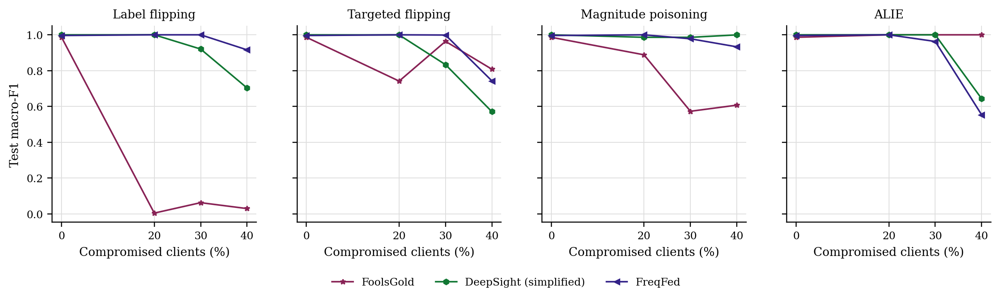
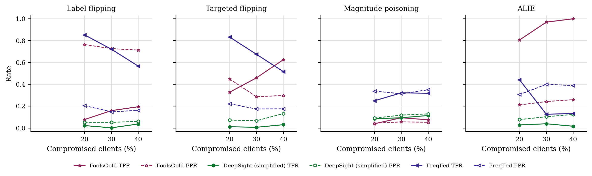

# GraMa results: `new_baselines` profile

Generated 2026-10-08 21:13 from 171 runs.

- Data: real (`cic_iov2024_1427a6ad.pt`), 78 CAN-ID nodes, windows of 64 frames (stride 32), sequences of 8 windows, edges: transition.
- Federated setting: 20 clients, 10 per round, 30 rounds, 2 local epoch(s), batch 64, lr 0.001, Dirichlet alpha 0.5 unless stated.
- Hardware: NVIDIA A100 80GB PCIe (79 GB).
- Seeds: [0, 1, 2, 3, 4]. Cells are mean ± std over seeds where there is more than one.

Sequences per class:

| Split | benign | DoS | spoofing-GAS | spoofing-RPM | spoofing-SPEED | spoofing-STEERING_WHEEL |
|---|---|---|---|---|---|---|
| train | 4720 | 885 | 118 | 649 | 295 | 236 |
| test | 960 | 174 | 23 | 130 | 59 | 47 |

## 3. Poisoning (Sec 6.2.3)

GraMa, Dirichlet alpha 0.5. Columns are the share of compromised clients; 0 is the clean run.

### Label flipping: Macro-F1

| Aggregator | 0% | 20% | 30% | 40% |
|---|---|---|---|---|
| FoolsGold | 0.9862 ± 0.0193 | 0.0048 ± 0.0068 | 0.0630 ± 0.1173 | 0.0300 ± 0.0213 |
| DeepSight (simplified) | 1.0000 ± 0.0000 | 1.0000 ± 0.0000 | 0.9204 ± 0.1233 | 0.7034 ± 0.2940 |
| FreqFed | 0.9961 ± 0.0079 | 1.0000 ± 0.0000 | 1.0000 ± 0.0000 | 0.9161 ± 0.1679 |

### Label flipping: Detection rate

| Aggregator | 0% | 20% | 30% | 40% |
|---|---|---|---|---|
| FoolsGold | 1.0000 ± 0.0000 | 0.7675 ± 0.1425 | 0.8859 ± 0.1404 | 0.8115 ± 0.1685 |
| DeepSight (simplified) | 1.0000 ± 0.0000 | 1.0000 ± 0.0000 | 1.0000 ± 0.0000 | 1.0000 ± 0.0000 |
| FreqFed | 1.0000 ± 0.0000 | 1.0000 ± 0.0000 | 1.0000 ± 0.0000 | 1.0000 ± 0.0000 |

### Targeted flipping (attack -> benign): Macro-F1

| Aggregator | 0% | 20% | 30% | 40% |
|---|---|---|---|---|
| FoolsGold | 0.9862 ± 0.0193 | 0.7416 ± 0.3101 | 0.9635 ± 0.0320 | 0.8079 ± 0.2701 |
| DeepSight (simplified) | 1.0000 ± 0.0000 | 0.9993 ± 0.0010 | 0.8333 ± 0.0840 | 0.5708 ± 0.2948 |
| FreqFed | 0.9961 ± 0.0079 | 1.0000 ± 0.0000 | 0.9987 ± 0.0011 | 0.7429 ± 0.3287 |

### Targeted flipping (attack -> benign): Detection rate

| Aggregator | 0% | 20% | 30% | 40% |
|---|---|---|---|---|
| FoolsGold | 1.0000 ± 0.0000 | 0.7028 ± 0.4202 | 0.9991 ± 0.0011 | 0.8212 ± 0.3564 |
| DeepSight (simplified) | 1.0000 ± 0.0000 | 1.0000 ± 0.0000 | 0.8915 ± 0.0966 | 0.6162 ± 0.3824 |
| FreqFed | 1.0000 ± 0.0000 | 1.0000 ± 0.0000 | 0.9995 ± 0.0009 | 0.7561 ± 0.3875 |

### Magnitude poisoning: Macro-F1

| Aggregator | 0% | 20% | 30% | 40% |
|---|---|---|---|---|
| FoolsGold | 0.9862 ± 0.0193 | 0.8883 ± 0.0713 | 0.5731 ± 0.1209 | 0.6073 ± 0.1292 |
| DeepSight (simplified) | 1.0000 ± 0.0000 | 0.9861 ± 0.0196 | 0.9859 ± 0.0282 | 0.9996 ± 0.0008 |
| FreqFed | 0.9961 ± 0.0079 | 1.0000 ± 0.0000 | 0.9779 ± 0.0264 | 0.9330 ± 0.0845 |

### Magnitude poisoning: Detection rate

| Aggregator | 0% | 20% | 30% | 40% |
|---|---|---|---|---|
| FoolsGold | 1.0000 ± 0.0000 | 1.0000 ± 0.0000 | 0.8928 ± 0.0973 | 0.9501 ± 0.0998 |
| DeepSight (simplified) | 1.0000 ± 0.0000 | 1.0000 ± 0.0000 | 1.0000 ± 0.0000 | 1.0000 ± 0.0000 |
| FreqFed | 1.0000 ± 0.0000 | 1.0000 ± 0.0000 | 1.0000 ± 0.0000 | 1.0000 ± 0.0000 |

### ALIE (crafted to look honest): Macro-F1

| Aggregator | 0% | 20% | 30% | 40% |
|---|---|---|---|---|
| FoolsGold | 0.9862 ± 0.0193 | 1.0000 ± 0.0000 | 1.0000 ± 0.0000 | 1.0000 ± 0.0000 |
| DeepSight (simplified) | 1.0000 ± 0.0000 | 1.0000 ± 0.0000 | 0.9997 ± 0.0006 | 0.6432 ± 0.2325 |
| FreqFed | 0.9961 ± 0.0079 | 1.0000 ± 0.0000 | 0.9628 ± 0.0207 | 0.5536 ± 0.2728 |

### ALIE (crafted to look honest): Detection rate

| Aggregator | 0% | 20% | 30% | 40% |
|---|---|---|---|---|
| FoolsGold | 1.0000 ± 0.0000 | 1.0000 ± 0.0000 | 1.0000 ± 0.0000 | 1.0000 ± 0.0000 |
| DeepSight (simplified) | 1.0000 ± 0.0000 | 1.0000 ± 0.0000 | 0.9995 ± 0.0009 | 1.0000 ± 0.0000 |
| FreqFed | 1.0000 ± 0.0000 | 1.0000 ± 0.0000 | 1.0000 ± 0.0000 | 1.0000 ± 0.0000 |

### Rejected updates

TPR: share of compromised clients' updates rejected. FPR: share of honest clients' updates rejected. Median, trimmed mean and norm clipping reject no client as a whole, so they are not listed.

| Attack | Aggregator | 20% TPR / FPR | 30% TPR / FPR | 40% TPR / FPR |
|---|---|---|---|---|
| Label flipping | FoolsGold | 0.08 / 0.76 | 0.16 / 0.73 | 0.20 / 0.71 |
| Label flipping | DeepSight (simplified) | 0.02 / 0.05 | 0.00 / 0.05 | 0.04 / 0.06 |
| Label flipping | FreqFed | 0.85 / 0.20 | 0.72 / 0.15 | 0.57 / 0.16 |
| Targeted flipping | FoolsGold | 0.33 / 0.45 | 0.46 / 0.29 | 0.63 / 0.30 |
| Targeted flipping | DeepSight (simplified) | 0.01 / 0.07 | 0.01 / 0.07 | 0.03 / 0.13 |
| Targeted flipping | FreqFed | 0.83 / 0.22 | 0.68 / 0.17 | 0.52 / 0.18 |
| Magnitude poisoning | FoolsGold | 0.04 / 0.04 | 0.09 / 0.06 | 0.08 / 0.05 |
| Magnitude poisoning | DeepSight (simplified) | 0.08 / 0.09 | 0.09 / 0.12 | 0.11 / 0.13 |
| Magnitude poisoning | FreqFed | 0.25 / 0.34 | 0.32 / 0.31 | 0.32 / 0.35 |
| ALIE | FoolsGold | 0.81 / 0.21 | 0.97 / 0.24 | 1.00 / 0.26 |
| ALIE | DeepSight (simplified) | 0.03 / 0.08 | 0.04 / 0.10 | 0.02 / 0.12 |
| ALIE | FreqFed | 0.44 / 0.31 | 0.13 / 0.40 | 0.13 / 0.39 |

## 5. Efficiency (Sec 6.1, 8.1)

One sequence covers 288 CAN frames. Latency is for one sequence at a time; throughput is for batches of 256 on the run's device.

| Model | Params | Size (KB) | Upload per client per round (KB) | CPU latency, 1 thread (ms/sequence) | GPU latency (ms/sequence) | Throughput (sequences/s) |
|---|---|---|---|---|---|---|
| GraMa | 78,587 | 307.0 | 307.0 | 3.98 | 4.33 | 2,998 |
| CNN-BiGRU | 39,431 | 154.0 | 154.0 | 1.15 | 3.65 | 32,375 |

## Figures

PNG to look at, PDF with the same name for LaTeX.

**Macro-F1 under poisoning**

**How often compromised (TPR) and honest (FPR) updates were rejected**

## Notes

- Split: every fifth block of 1000 rows in each file tests, the rest trains; windows never cross a block boundary.
- The CNN-BiGRU baseline is our implementation of that model family on the same sequences, trained with FedAvg; the original adaptive weighting (AWI) is not reproduced.
- The centralised row trains one model on all the training data with the same number of passes over the data as a federated run. It is a reference, not a federated method.
