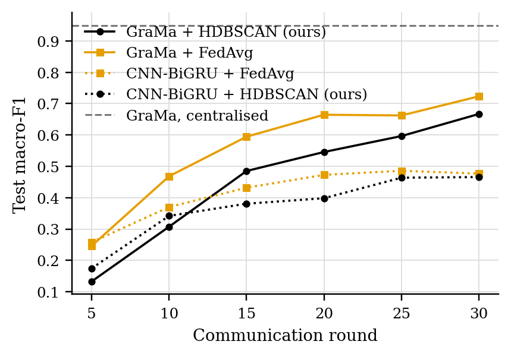
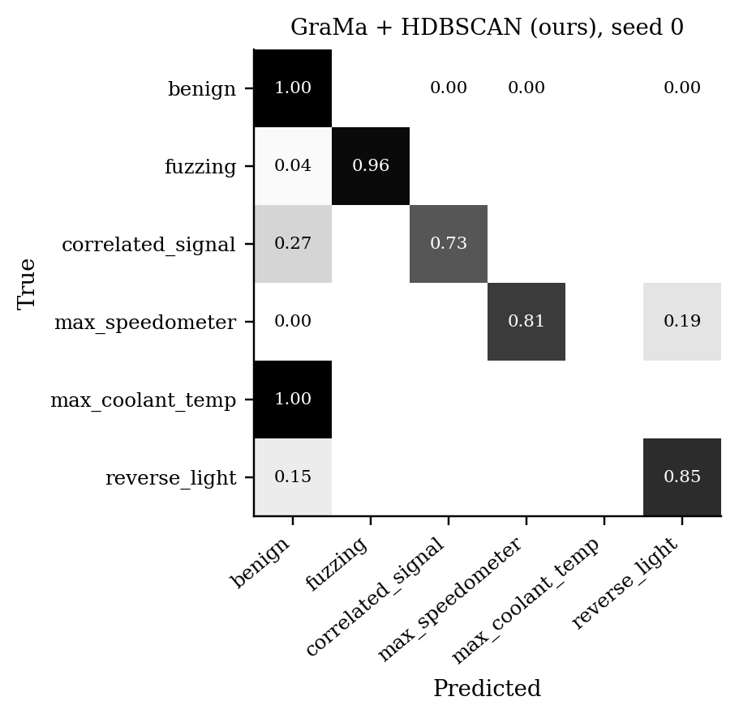
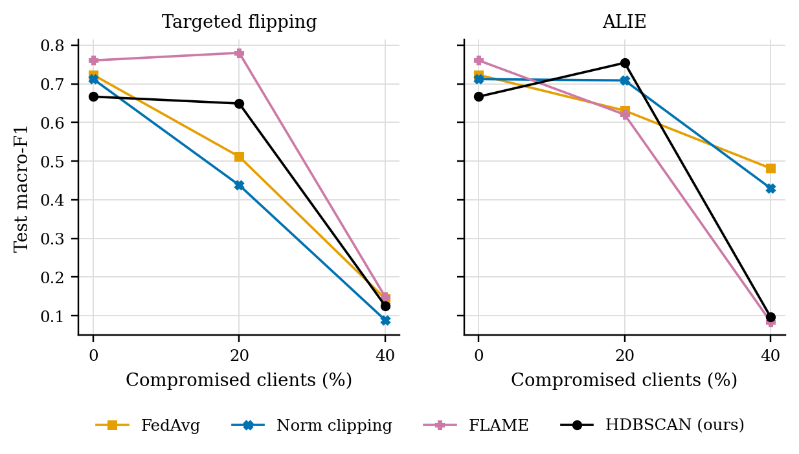
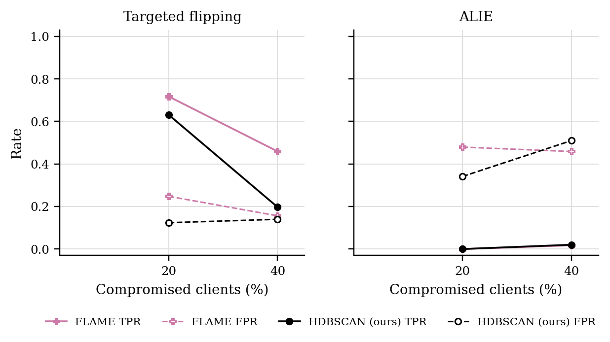

# GraMa results: `road` profile

Generated 2026-10-05 11:35 from 61 runs.

- Data: ROAD (`road_0bc0ca64.pt`), 107 CAN-ID nodes, windows of 64 frames (stride 32), sequences of 8 windows, edges: transition.
- Federated setting: 20 clients, 10 per round, 30 rounds, 2 local epoch(s), batch 64, lr 0.001, Dirichlet alpha 0.5 unless stated.
- Hardware: NVIDIA A100 80GB PCIe (79 GB).
- Seeds: [0, 1, 2, 3, 4]. Cells are mean ± std over seeds where there is more than one.

Sequences per class:

| Split | benign | fuzzing | correlated_signal | max_speedometer | max_coolant_temp | reverse_light |
|---|---|---|---|---|---|---|
| train | 15570 | 215 | 3225 | 4275 | 42 | 6662 |
| test | 4795 | 27 | 965 | 4659 | 42 | 3651 |
| masquerade | 1383 | 0 | 472 | 2282 | 21 | 1788 |

## 1. Main comparison, no attack (Sec 6.2.1)

| Method | Accuracy | Macro-P | Macro-R | Macro-F1 | ROC-AUC | Detection rate | False alarm rate | Params | Train time (s) |
|---|---|---|---|---|---|---|---|---|---|
| GraMa + HDBSCAN (ours) | 0.8966 ± 0.1057 | 0.6811 ± 0.0939 | 0.6673 ± 0.0893 | 0.6668 ± 0.0978 | 0.9782 ± 0.0120 | 0.9217 ± 0.0914 | 0.0226 ± 0.0336 | 78,819 | 573 |
| GraMa + FedAvg | 0.8873 ± 0.1097 | 0.7392 ± 0.1207 | 0.7247 ± 0.1349 | 0.7231 ± 0.1409 | 0.9746 ± 0.0197 | 0.9292 ± 0.0442 | 0.0085 ± 0.0145 | 78,819 | 599 |
| CNN-BiGRU + FedAvg | 0.6356 ± 0.1133 | 0.5191 ± 0.1877 | 0.5353 ± 0.1505 | 0.4767 ± 0.1855 | 0.8888 ± 0.0770 | 0.8420 ± 0.0515 | 0.0229 ± 0.0190 | 39,895 | 147 |
| CNN-BiGRU + HDBSCAN (ours) | 0.6662 ± 0.1423 | 0.5330 ± 0.2135 | 0.5135 ± 0.1753 | 0.4657 ± 0.1977 | 0.8744 ± 0.0819 | 0.8741 ± 0.1309 | 0.0337 ± 0.0293 | 39,895 | 191 |
| GraMa, centralised | 0.9899 ± 0.0056 | 0.9925 ± 0.0066 | 0.9299 ± 0.0510 | 0.9495 ± 0.0387 | 0.9983 ± 0.0018 | 0.9860 ± 0.0083 | 0.0014 ± 0.0006 | 78,819 | 620 |

Detection rate = attack sequences flagged as any attack; false alarm rate = benign sequences flagged as an attack.

### Other test sets

The same models, tested on the extra sets. Macro scores are averaged over the classes each set contains. Frames with a CAN ID training never saw: test 0%, masquerade attacks only 0%.

| Method | Masquerade attacks only: Macro-F1 | Masquerade attacks only: Detection rate | Masquerade attacks only: False alarm rate |
|---|---|---|---|
| GraMa + HDBSCAN (ours) | 0.7144 ± 0.1114 | 0.9283 ± 0.0928 | 0.0330 ± 0.0555 |
| GraMa + FedAvg | 0.7219 ± 0.0988 | 0.9414 ± 0.0456 | 0.0129 ± 0.0218 |
| CNN-BiGRU + FedAvg | 0.4755 ± 0.1309 | 0.8838 ± 0.0484 | 0.0341 ± 0.0260 |
| CNN-BiGRU + HDBSCAN (ours) | 0.4846 ± 0.1678 | 0.9236 ± 0.0648 | 0.0453 ± 0.0478 |
| GraMa, centralised | 0.9402 ± 0.0476 | 0.9870 ± 0.0079 | 0.0022 ± 0.0009 |

### Per-class F1

| Method | benign | fuzzing | correlated_signal | max_speedometer | max_coolant_temp | reverse_light |
|---|---|---|---|---|---|---|
| GraMa + HDBSCAN (ours) | 0.9233 | 0.5689 | 0.7233 | 0.9203 | 0.0000 | 0.8650 |
| GraMa + FedAvg | 0.9327 | 0.7815 | 0.9270 | 0.8625 | 0.0000 | 0.8349 |
| CNN-BiGRU + FedAvg | 0.8569 | 0.4961 | 0.5450 | 0.4367 | 0.0000 | 0.5252 |
| CNN-BiGRU + HDBSCAN (ours) | 0.8838 | 0.4283 | 0.4869 | 0.3622 | 0.0000 | 0.6327 |
| GraMa, centralised | 0.9859 | 0.9887 | 0.9974 | 0.9960 | 0.7420 | 0.9873 |

## 3. Poisoning (Sec 6.2.3)

GraMa, Dirichlet alpha 0.5. Columns are the share of compromised clients; 0 is the clean run.

### Targeted flipping (attack -> benign): Macro-F1

| Aggregator | 0% | 20% | 40% |
|---|---|---|---|
| FedAvg | 0.7231 ± 0.1409 | 0.5116 ± 0.1452 | 0.1441 ± 0.0488 |
| Norm clipping | 0.7121 ± 0.0680 | 0.4378 ± 0.0488 | 0.0887 ± 0.0043 |
| FLAME | 0.7606 ± 0.0283 | 0.7801 ± 0.0037 | 0.1487 ± 0.0643 |
| HDBSCAN (ours) | 0.6668 ± 0.0978 | 0.6491 ± 0.0670 | 0.1256 ± 0.0410 |

### Targeted flipping (attack -> benign): Detection rate

| Aggregator | 0% | 20% | 40% |
|---|---|---|---|
| FedAvg | 0.9292 ± 0.0442 | 0.3953 ± 0.2913 | 0.0363 ± 0.0206 |
| Norm clipping | 0.8642 ± 0.0523 | 0.5957 ± 0.0081 | 0.0049 ± 0.0049 |
| FLAME | 0.9563 ± 0.0033 | 0.9648 ± 0.0105 | 0.3753 ± 0.3746 |
| HDBSCAN (ours) | 0.9217 ± 0.0914 | 0.9004 ± 0.0043 | 0.2862 ± 0.2825 |

### ALIE (crafted to look honest): Macro-F1

| Aggregator | 0% | 20% | 40% |
|---|---|---|---|
| FedAvg | 0.7231 ± 0.1409 | 0.6307 ± 0.1739 | 0.4815 ± 0.1859 |
| Norm clipping | 0.7121 ± 0.0680 | 0.7088 ± 0.0836 | 0.4298 ± 0.1395 |
| FLAME | 0.7606 ± 0.0283 | 0.6204 ± 0.1089 | 0.0844 ± 0.0054 |
| HDBSCAN (ours) | 0.6668 ± 0.0978 | 0.7543 ± 0.0302 | 0.0967 ± 0.0017 |

### ALIE (crafted to look honest): Detection rate

| Aggregator | 0% | 20% | 40% |
|---|---|---|---|
| FedAvg | 0.9292 ± 0.0442 | 0.7190 ± 0.2230 | 0.7810 ± 0.1417 |
| Norm clipping | 0.8642 ± 0.0523 | 0.8447 ± 0.1306 | 0.7608 ± 0.2151 |
| FLAME | 0.9563 ± 0.0033 | 0.7946 ± 0.1222 | 0.5638 ± 0.4361 |
| HDBSCAN (ours) | 0.9217 ± 0.0914 | 0.9021 ± 0.0502 | 0.5586 ± 0.4394 |

### Rejected updates

TPR: share of compromised clients' updates rejected. FPR: share of honest clients' updates rejected. Median, trimmed mean and norm clipping reject no client as a whole, so they are not listed.

| Attack | Aggregator | 20% TPR / FPR | 40% TPR / FPR |
|---|---|---|---|
| Targeted flipping | FLAME | 0.72 / 0.25 | 0.46 / 0.16 |
| Targeted flipping | HDBSCAN (ours) | 0.63 / 0.12 | 0.20 / 0.14 |
| ALIE | FLAME | 0.00 / 0.48 | 0.02 / 0.46 |
| ALIE | HDBSCAN (ours) | 0.00 / 0.34 | 0.02 / 0.51 |

## 5. Efficiency (Sec 6.1, 8.1)

One sequence covers 288 CAN frames. Latency is for one sequence at a time; throughput is for batches of 256 on the run's device.

| Model | Params | Size (KB) | Upload per client per round (KB) | CPU latency, 1 thread (ms/sequence) | GPU latency (ms/sequence) | Throughput (sequences/s) |
|---|---|---|---|---|---|---|
| GraMa | 78,819 | 307.9 | 307.9 | 5.60 | 6.82 | 5,231 |
| CNN-BiGRU | 39,895 | 155.8 | 155.8 | 1.36 | 2.57 | 115,249 |

## Figures

PNG to look at, PDF with the same name for LaTeX.

**Test macro-F1 per round, no attack**

**Confusion matrix (row-normalised)**

**Label mix per client**

**Macro-F1 under poisoning**

**How often compromised (TPR) and honest (FPR) updates were rejected**

## Notes

- Split: by capture: attack instances 1-2 train, instance 3 tests (with its masquerade version); the coolant attack, recorded once, is cut in the middle of the injection; ambient captures are held out whole.
- The CNN-BiGRU baseline is our implementation of that model family on the same sequences, trained with FedAvg; the original adaptive weighting (AWI) is not reproduced.
- The centralised row trains one model on all the training data with the same number of passes over the data as a federated run. It is a reference, not a federated method.
