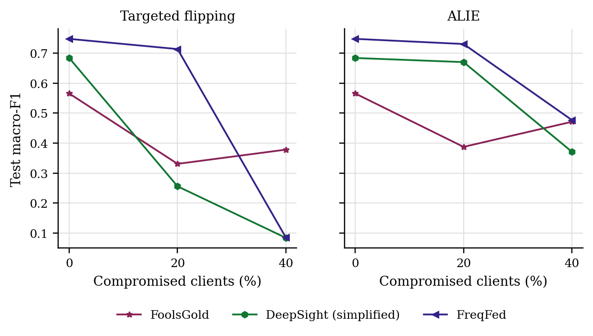
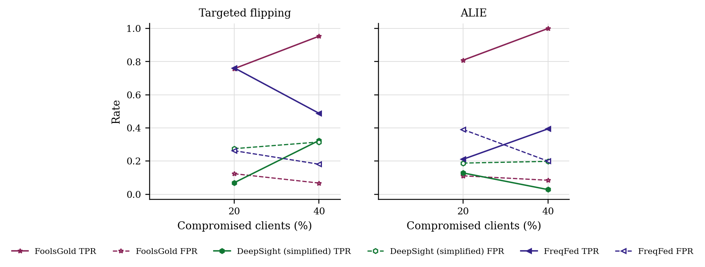

# GraMa results: `road_new_baselines` profile

Generated 2026-10-10 04:11 from 30 runs.

- Data: ROAD (`road_0bc0ca64.pt`), 107 CAN-ID nodes, windows of 64 frames (stride 32), sequences of 8 windows, edges: transition.
- Federated setting: 20 clients, 10 per round, 30 rounds, 2 local epoch(s), batch 64, lr 0.001, Dirichlet alpha 0.5 unless stated.
- Hardware: NVIDIA A100 80GB PCIe (79 GB).
- Seeds: [0, 1]. Cells are mean ± std over seeds where there is more than one.

Sequences per class:

| Split | benign | fuzzing | correlated_signal | max_speedometer | max_coolant_temp | reverse_light |
|---|---|---|---|---|---|---|
| train | 15570 | 215 | 3225 | 4275 | 42 | 6662 |
| test | 4795 | 27 | 965 | 4659 | 42 | 3651 |
| masquerade | 1383 | 0 | 472 | 2282 | 21 | 1788 |

## 3. Poisoning (Sec 6.2.3)

GraMa, Dirichlet alpha 0.5. Columns are the share of compromised clients; 0 is the clean run.

### Targeted flipping (attack -> benign): Macro-F1

| Aggregator | 0% | 20% | 40% |
|---|---|---|---|
| FoolsGold | 0.5654 ± 0.0127 | 0.3310 ± 0.0809 | 0.3784 ± 0.0408 |
| DeepSight (simplified) | 0.6836 ± 0.1021 | 0.2561 ± 0.0364 | 0.0844 ± 0.0000 |
| FreqFed | 0.7474 ± 0.0427 | 0.7133 ± 0.0667 | 0.0855 ± 0.0011 |

### Targeted flipping (attack -> benign): Detection rate

| Aggregator | 0% | 20% | 40% |
|---|---|---|---|
| FoolsGold | 0.8482 ± 0.1386 | 0.5071 ± 0.3559 | 0.6751 ± 0.3144 |
| DeepSight (simplified) | 0.9326 ± 0.0235 | 0.3608 ± 0.0043 | 0.0000 ± 0.0000 |
| FreqFed | 0.8837 ± 0.0551 | 0.9445 ± 0.0044 | 0.0099 ± 0.0099 |

### ALIE (crafted to look honest): Macro-F1

| Aggregator | 0% | 20% | 40% |
|---|---|---|---|
| FoolsGold | 0.5654 ± 0.0127 | 0.3876 ± 0.0316 | 0.4711 ± 0.3285 |
| DeepSight (simplified) | 0.6836 ± 0.1021 | 0.6699 ± 0.0948 | 0.3712 ± 0.1184 |
| FreqFed | 0.7474 ± 0.0427 | 0.7302 ± 0.0274 | 0.4769 ± 0.0929 |

### ALIE (crafted to look honest): Detection rate

| Aggregator | 0% | 20% | 40% |
|---|---|---|---|
| FoolsGold | 0.8482 ± 0.1386 | 0.7460 ± 0.1720 | 0.7896 ± 0.1453 |
| DeepSight (simplified) | 0.9326 ± 0.0235 | 0.8412 ± 0.0472 | 0.6967 ± 0.2418 |
| FreqFed | 0.8837 ± 0.0551 | 0.8474 ± 0.0075 | 0.7898 ± 0.1640 |

### Rejected updates

TPR: share of compromised clients' updates rejected. FPR: share of honest clients' updates rejected. Median, trimmed mean and norm clipping reject no client as a whole, so they are not listed.

| Attack | Aggregator | 20% TPR / FPR | 40% TPR / FPR |
|---|---|---|---|
| Targeted flipping | FoolsGold | 0.76 / 0.12 | 0.95 / 0.07 |
| Targeted flipping | DeepSight (simplified) | 0.07 / 0.28 | 0.32 / 0.32 |
| Targeted flipping | FreqFed | 0.76 / 0.26 | 0.49 / 0.18 |
| ALIE | FoolsGold | 0.81 / 0.11 | 1.00 / 0.08 |
| ALIE | DeepSight (simplified) | 0.13 / 0.19 | 0.03 / 0.20 |
| ALIE | FreqFed | 0.21 / 0.39 | 0.39 / 0.20 |

## 5. Efficiency (Sec 6.1, 8.1)

One sequence covers 288 CAN frames. Latency is for one sequence at a time; throughput is for batches of 256 on the run's device.

| Model | Params | Size (KB) | Upload per client per round (KB) | CPU latency, 1 thread (ms/sequence) | GPU latency (ms/sequence) | Throughput (sequences/s) |
|---|---|---|---|---|---|---|
| GraMa | 78,819 | 307.9 | 307.9 | 6.13 | 3.10 | 3,485 |
| CNN-BiGRU | 39,895 | 155.8 | 155.8 | 1.42 | 0.77 | 90,972 |

## Figures

PNG to look at, PDF with the same name for LaTeX.

**Macro-F1 under poisoning**

**How often compromised (TPR) and honest (FPR) updates were rejected**

## Notes

- Split: by capture: attack instances 1-2 train, instance 3 tests (with its masquerade version); the coolant attack, recorded once, is cut in the middle of the injection; ambient captures are held out whole.
- The CNN-BiGRU baseline is our implementation of that model family on the same sequences, trained with FedAvg; the original adaptive weighting (AWI) is not reproduced.
- The centralised row trains one model on all the training data with the same number of passes over the data as a federated run. It is a reference, not a federated method.
